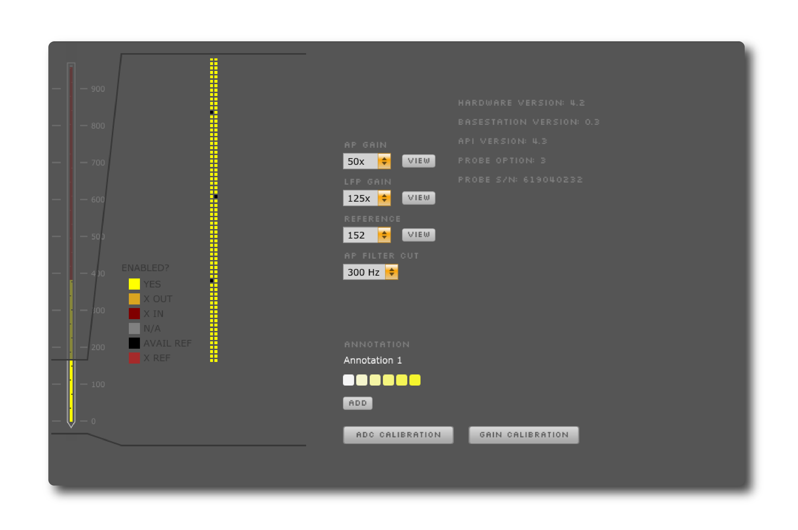

.. _neuropixels3a:
.. role:: raw-html-m2r(raw)
   :format: html

################
Neuropixels 3a
################

.. image:: ../../_static/images/plugins/neuropixels3a/neuropixels3a-01.png
  :alt: Annotated Neuropixels 3a editor

|

.. csv-table:: Streams data from one Neuropixels "Phase 3a" probe from IMEC (Options 1-4). It's possible to use up to 3 probes per computer by running multiple instances of the Open Ephys GUI.
   :widths: 18, 80

   "*Plugin Type*", "Source"
   "*Platforms*", "Windows only"
   "*Built in?*", "No"
   "*Key Developers*", "Josh Siegle"
   "*Source Code*", "https://github.com/open-ephys-plugins/neuropixels-3a"

Hardware Requirements
######################

* Xilinx KC705 FPGA evaluation board (configured with Neuropixels firmware)

* Gigabit Ethernet card

* Ethernet cable

* Neuropixels Phase 3a basestation card

* Neuropixels Phase 3a cable (white dual coax, Omnetics-to-Omnetics)

* Neuropixels Phase 3a headstage

* Neuropixels Phase 3a probe

Connecting to the hardware
###########################

This guide assumes you’ve read IMEC’s Phase IIIA System User Manual and followed the steps required to configure the FPGA. Also be sure to check that your gigabit Ethernet card has its IP address set to :code:`10.2.0.123`, or :code:`10.2.X.123` if you're using multiple probes on one computer (see `this page <https://github.com/cortex-lab/neuropixels/wiki/Multiprobe_acquisition>`__ for more information).

Once your hardware is configured and plugged in, you can drag and drop the Neuropix-3a module from the Processor List type onto the signal chain. It will take a few seconds to connect to the basestation. Once it’s ready, an orange editor will appear. With this simple signal chain (a single processor), you’ll be able to record data, but not visualize it.

.. note:: If no basestation is connected, the GUI will search for ~20 s, then display a grayed-out processor.

Setting probe parameters 
#########################

The parameters of the probe are set through a graphical interface. This can be accessed by clicking the “tab” button at the top of the Neuropix processor (to open it in the main GUI window) or the “window” button (to open it in a separate window).

Within this interface, you can update the following settings:

* **AP Gain** (amplifier gain for AP channels, 50x-2500x, default = 500x)

* **LFP Gain** (amplifier gain for LFP channels, 50x-2500x, default = 250x)

* **Reference** (External, plus channels 37, 76, 113, 152, 189, 228, 265, 304, 341, or 380, default = External)

* **AP Filter Cut** (300 Hz, 500 Hz, or 1000 Hz high pass, default = 300 Hz)

For Option 3 and 4 probes, you can select which channels to acquire data from by clicking on those channels and pressing the ENABLE button. For every channel that is enabled (yellow), another channel will be disabled (red).

Probe calibration
###################

Gain calibration settings must be loaded manually from the physical EEPROM chip on the probe. To do this, press the **ADC CALIBRATION** and **GAIN CALIBRATION** buttons. This must be done every time the probe is powered on, and can take up to 10 minutes. The GUI will be frozen during this time, so please be patient! You’ll know it’s finished when the button icon changes color.

Saving and loading settings
############################

The Neuropixels module writes the following information into the settings.xml file (saved each time recording is started)

* probe option and serial number

* probe AP gain, LFP gain, reference channel, and filter cutoff

* basestation version and API version

When loading a previously saved signal chain, the AP gain, LFP gain, reference channel, and filter cutoff will be restored to the previous settings. However, if you have enabled alternate channel configurations for an Option 3 and 4 probe, these are not currently saved or loaded.

.. note:: Connecting to and configuring the Neuropix probe takes a few seconds, so please be patient when loading saved signal chains that contain a Neuropix source module.
