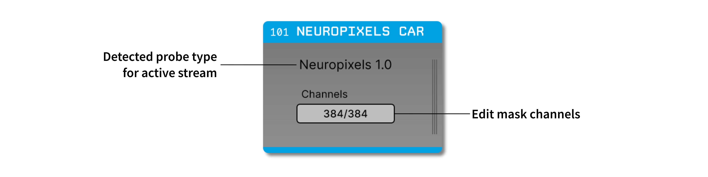
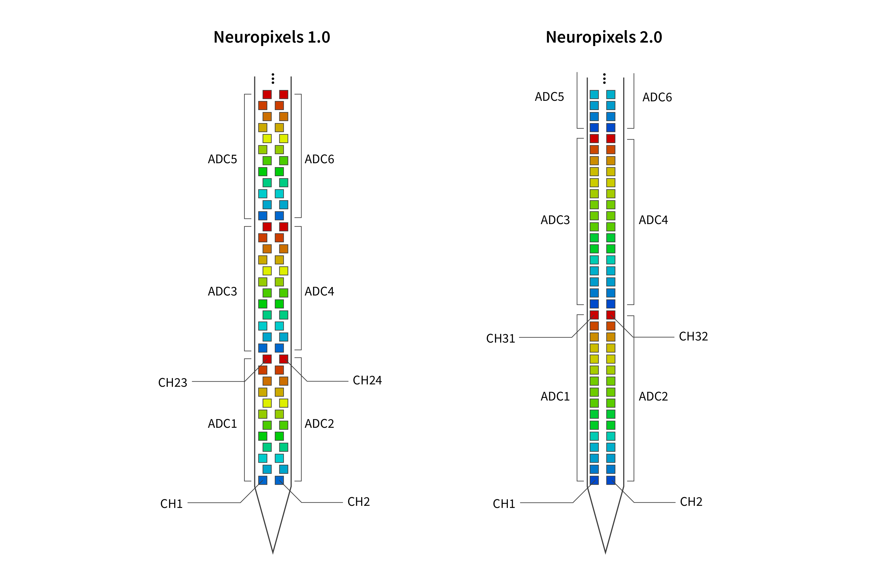

.. _neuropixelscar:
.. role:: raw-html-m2r(raw)
   :format: html

################
Neuropixels CAR
################

.. csv-table:: A common average reference optimized for use with Neuropixels probes.
   :widths: 18, 80

   "*Plugin Type*", "Filter"
   "*Platforms*", "Windows, Linux, macOS"
   "*Built in?*", "No"
   "*Key Developers*", "Josh Siegle"
   "*Source Code*", "https://github.com/open-ephys-plugins/neuropixels-car"

Installing and upgrading
############################

The Neuropixels CAR plugin is not included by default in the Open Ephys GUI. To install, use **ctrl-P** or **⌘P** to open the Plugin Installer, browse to the "Neuropixels CAR" plugin, and click the "Install" button.

The Plugin Installer also allows you to upgrade to the latest version of this plugin, if it's already installed.

Plugin usage
############################

The Neuropixels CAR plugin automatically detects which data streams are generated by Neuropixels probes. Therefore, it will only work with data generated by the :ref:`neuropixelspxi` plugin. Data streams from other plugins will pass through unchanged.

If a Neuropixels data stream is detected, the Neuropixels probe type will be displayed in the plugin editor. The Neuropixels CAR plugin will use information about the Neuropixels ADC layout to perform common average referencing only on channels that are sampled simultaneously. This removes noise more effectively than the :ref:`commonaveragereference`, which is typically applied across all channels at once.

The **Channels** button can be used to mask out particular channels from the averaging operation, for example if there are any channels that are in the air (i.e., not in a solution that is conductive with the brain).

.. note:: This plugin uses an *averaging* operation, rather than a *median* operation, because the average across channels is much faster to calculate in real time. However, because averaging is more sensitive to outliers, it is recommended to save data prior to applying the Neuropixels CAR, and to use median subtraction to remove noise *offline*, prior to spike sorting (for example using `SpikeInterface <https://spikeinterface.readthedocs.io/en/latest/modules/preprocessing/plot_1_preprocessing.html#sphx-glr-modules-preprocessing-plot-1-preprocessing-py>`__).

Neuropixels sampling pattern
##############################

All Neuropixels probes have fewer ADCs (analog-to-digital converters) than channels, so data from multiple channels is temporally *multiplexed* across each ADC. Because common noise is more likely to be shared across channels that are sampled simultaneously, using information about the Neuropixels ADC sampling pattern can remove noise more effectively.

Neuropixels 1.0 probes have 16 ADCs, each of which digitizes 12 channels (for a total of 384). Neuropixels 2.0 probes have 12 ADCs, each of which digitizes 16 channels (for a total of 384). The following diagrams show the sampling pattern for each probe type (simultaneously sampled channels have the same color):

|

