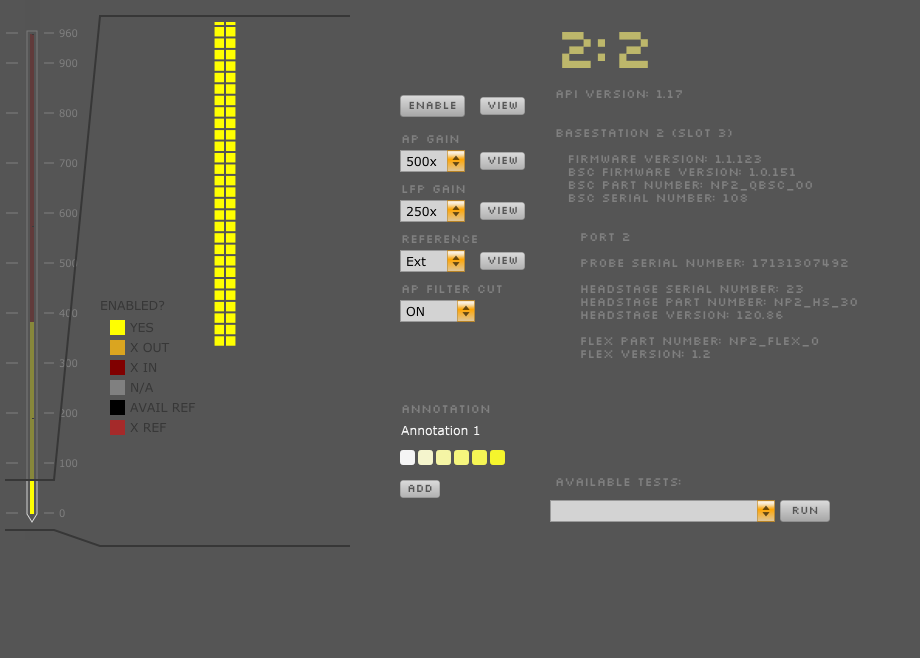

.. _neuropixelspxi:
.. role:: raw-html-m2r(raw)
   :format: html

################
Neuropixels PXI
################

.. image:: ../../_static/images/plugins/neuropix-pxi/neuropix-pxi-01.png
  :alt: Annotated Neuropixels PXI editor

|

.. csv-table:: Streams data from a PXI-based data acquisition system for Neuropixels 1.0 probes. It can acquire data from up to 16 probes simultaneously.
   :widths: 18, 80

   "*Plugin Type*", "Source"
   "*Platforms*", "Windows only"
   "*Built in?*", "No"
   "*Key Developers*", "Josh Siegle, Pavel Kulik"
   "*Source Code*", "https://github.com/open-ephys-plugins/neuropixels-pxi"

Hardware requirements
######################

* One PXI chassis (so far we've tested National Instruments PXIe-1071 and PXIe-1082)

* One PXI remote control module, housed in the PXI chassis (we've tested National Instruments PXIe-8381 and PXIe-8398) – requires NIDAQmx driver

* One PCIe interface card, housed in the computer (we've tested National Instruments PCIe-8381 and PCIe-8398)

* *(optional)* One PXI-based analog and digital I/O module (we've tested National Instruments PXI-6133)

* Cables to connect the remote control module to the PCIe card (e.g., National Instruments MXI-Express Cables, Gen 3 x8)

* 1 or 2 Neuropixels PXIe modules (available from IMEC) – requires Enclustra driver, available when downloading the GUI

* 1 to 8 Neuropixels 1.0 cables (black + yellow twisted pair, USB-C to Omnetics, available from IMEC)

* 1 to 8 Neuropixels 1.0 headstages (available from IMEC)

* 1 to 8 Neuropixels 1.0 probes (available from IMEC)

If you've tested the GUI with PXI hardware from a manufacturer other than National Instruments, please let us know. Other possible hardware configurations can be found on the `SpikeGLX GitHub <https://github.com/billkarsh/SpikeGLX/blob/master/Markdown/SystemRequirements_PXI.md>`__ – we plan on testing these with Open Ephys as soon as possible.

Connecting to the PXI system
##############################

Before using this module, make sure you've followed all of the steps in the `Neuropixels User Manual <https://docs.wixstatic.com/ugd/832f20_d2e8866f7a98448d90faf83d3df56140.pdf>`__ to set up and configure your hardware.

Once your PXI system is up and running, you can drag and drop the "Neuropix-PXI" module from the Processor List onto the Editor Viewport. The GUI will freeze while it searches for available probes. After that, the module will be grayed out while the probes are initialized and calibrated.

The editor will automatically create a probe selection interface for each basestation that's available. Each basestation can communicate with up to 4 probes, indicated by circles. When the probes are initially detected, they show up as orange. Unconnected probes appear gray. Once they are initialized, connected probes become filled in with green. When the currently selected probe turns light green, it means that all settings have been properly loaded, and the plugin is ready to begin data acquisition. In this example, there are 6 probes connected, and the probe on basestation 2, port 1 is selected.

Besides the circles representing the four probes, each basestation column has a button to select a folder for writing data (if using the compressed NPX format), and a monitor to indicate buffer filling (from 0-100%).

On the right-hand side of the editor, there's an interface for updating sync settings (more information below).

Configuring probes
###################

To open the probe settings interface, press the "window" or "tab" button in the upper-right corner of the editor.

|

Each probe has its own interface for updating settings. Selecting one of the buttons in the module's editor allows you to access the parameters for a particular probe.

The available settings are:

* **AP Gain** (amplifier gain for AP channels, 50x-3000x, default = 500x)

* **LFP Gain** (amplifier gain for LFP channels, 50x-3000x, default = 250x)

* **Reference** (External, Tip, plus channels 192, 576, or 959, default = External)

* **AP Filter Cut** (ON = 300 Hz high-pass filter active, OFF = filter inactive)

* You can also select/deselect electrodes from different banks. By default, the bottom 384 eleectrodes are selected. To select electrodes farther up the probe, use the interface on the left to scroll to the electrodes you want to activate and click the "ENABLE" button. Selecting electrodes on one bank will deactivate the associated electrodes on the other two banks.

.. caution:: Saved configurations associate settings with particular probe serial numbers, rather than PXI ports. If you've changed the order in which probes are connected to the PXI basestation, please be aware that the settings will be loaded based on probe serial number.

Calibrating probes
#####################

Probes will be calibrated automatically when the plugin is loaded, provided that calibration files are stored in the correct location:

:code:`<open-ephys-executable-folder>\CalibrationInfo\<probe_serial_number>`

These files can be obtained from IMEC for every probe that you've purchased. There should be two for each probe:

* :code:`<probe_serial_number>_ADCCalibration.csv`

* :code:`<probe_serial_number>_gainCalValues.csv`

If these files cannot be found, the following warning will pop up:

.. image:: ../../_static/images/plugins/neuropix-pxi/calibration-files-missing-warning.png
  :alt: Calibration files missing warning
  :width: 500

Selecting individual data streams
######################################

By default, the Neuropix plugin will send data from all probes through the GUI signal chain. Because each probe generates 384 channels of AP-band and 384 channels of LFP-band data, the number of channels being pushed through the signal chain is 768 x *N*, where *N* is the number of connected probes. This adds up quickly, and can lead to heavy CPU usage when recording from many probes simultaneously (as indicated by the CPU monitor, which measures the fraction time of each buffer callback spent processing data, and by the Windows Task Manager CPU meter, which measures overall CPU usage).

To save CPU cycles during acquisition, it's recommended to use a :ref:`streammuxer` (stream multiplexer) plugin immediately to the right of the Record Node that's saving data from the Neuropixels plugin. This will allow you to select one probe to send through the signal chain. All channels will still be recorded, but you'll only be filtering, referencing, visualizing, etc. one probe at a time.

Built-in self tests
#####################

If you have a probe that's not working properly, these tests can be used to help pinpoint where the problem lies.

To run each test, select one from the drop-down menu, and click the "RUN" button. After the test completes, the name of the test will be updated to indicated whether it passed or failed.

.. csv-table:: Built-in self tests
   :header: "Name", "Duration", "Purpose"
   :widths: 20, 20, 70

   "Test probe signal",	"30 s", "Analyzes if the probe performance falls within a specified tolerance range, based on a signal generated by the headstage"
   "Test probe noise", "30 s", "Calculates probe noise levels when electrode inputs are shorted to ground"
   "Test PSB bus", "<1 s", "Verifies whether signals are transmitted accurately to the headstage"
   "Test shift registers", "1 s", "Verifies the functionality of the shank and base shift registers"
   "Test EEPROM", "1 s", "Tests the EEPROM memory storage on the flex, headstage, and BSC"
   "Test I2C", "<1 s", "Verifies the functionality of the I2C memory map"
   "Test Serdes", "<1 s", "Tests the integrity of the serial communication over the probe cable"
   "Test Heartbeat", "3 s", "Tests whether the heartbeat signal between the headstage and BSC is working properly"
   "Test Basestation", "<1 s", "Tests the BSC board"

Headstage tests
#################

If you have a headstage test module, you can run a suite of tests to ensure the headstage is functioning properly. When the Neuropix plugin is dropped into the signal chain and at least one headstage test module is connected to the PXI system, the GUI will automatically run all headstage tests and output the results in a popup window:

.. image:: ../../_static/images/plugins/neuropix-pxi/HST.png
  :alt: Headstage test board popup window

