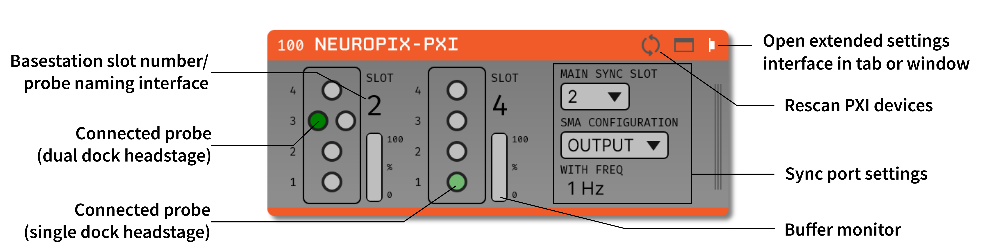
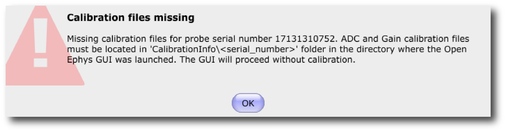
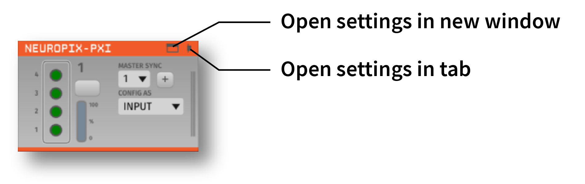
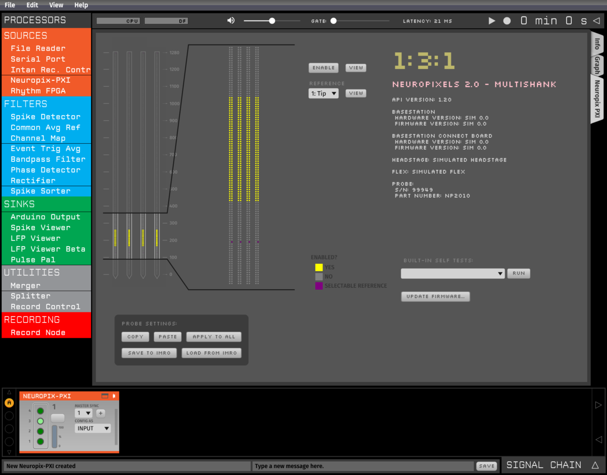
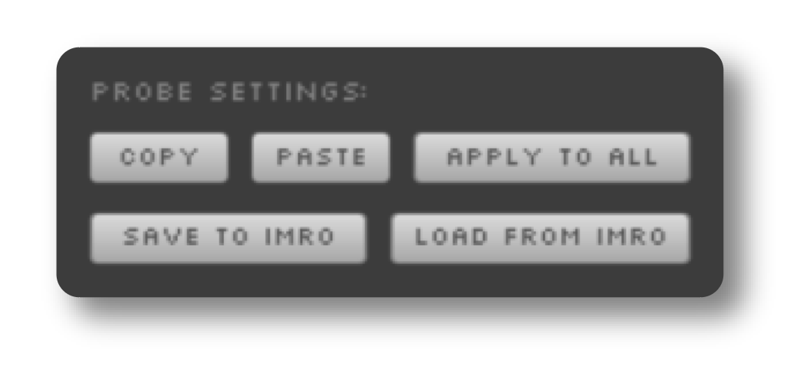
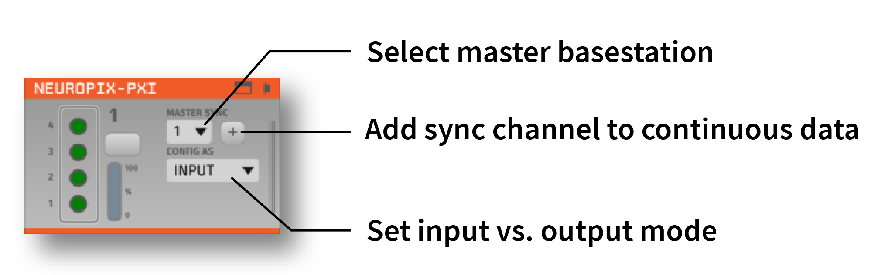
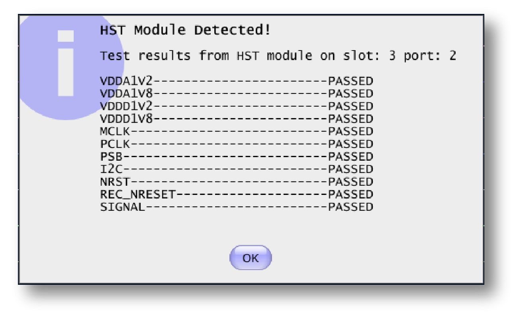
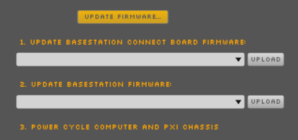

.. _neuropixelspxi:
.. role:: raw-html-m2r(raw)
   :format: html

################
Neuropixels PXI
################

|

.. csv-table:: Streams data from a PXI-based Neuropixels data acquisition system. It can acquire data from up to 16 probes simultaneously.
   :widths: 18, 80

   "*Plugin Type*", "Source"
   "*Platforms*", "Windows only"
   "*Built in?*", "No"
   "*Key Developers*", "Josh Siegle, Pavel Kulik"
   "*Source Code*", "https://github.com/open-ephys-plugins/neuropixels-pxi"

Installing and upgrading
###########################

The Neuropixels PXI plugin is not included by default in the Open Ephys GUI. To install, use **ctrl-P** to access the Plugin Installer, browse to the "Neuropix-PXI" plugin, and click the "Install" button.

|

The Plugin Installer also allows you to upgrade to the latest version. If you're upgrading your plugin to version 0.2.0 (release on 11/23/2020), you'll need to close and reopen the GUI following the upgrade.

Hardware requirements
######################

* One desktop computer with an **Intel processor** (the Enclustra driver is not compatible with AMD processors)

* One PXI chassis (so far we've tested National Instruments PXIe-1071 and PXIe-1082)

* One PXI remote control module, housed in the PXI chassis (we've tested National Instruments PXIe-8381 and PXIe-8398) – requires NIDAQmx driver

* One PCIe interface card, housed in the computer (we've tested National Instruments PCIe-8381 and PCIe-8398)

* *(optional)* One PXI-based analog and digital I/O module (see the :ref:`nidaqmx` page for a list of hardware we've tested)

* Cables to connect the remote control module to the PCIe card (e.g., National Instruments MXI-Express Cables, Gen 3 x8)

* One or more Neuropixels PXIe modules (available from IMEC)

* One or more Neuropixels cables (black + yellow twisted pair, USB-C to Omnetics, available from IMEC)

* One or more Neuropixels headstages (available from IMEC)

* One or more Neuropixels probes (available from IMEC)

.. warning:: In order to work properly, your PCIe card *must* be connected to an **x8**-compatible PCIe slot. Some motherboards only have x16 slots, which will not be able to communicate with the PXI hardware. If you are unsure whether your computer has the appropriate PCIe slots, please get in touch.

Compatible probes
######################

This plugin can stream data from the following Neuropixels probe types:

|

.. csv-table::
   :widths: 50, 40, 80

   "**Probe**", "**Channels**", "**Notes**"
   "Neuropixels 1.0", "384 AP, 384 LFP", ""
   "Neuropixels NHP Active", "384 AP, 384 LFP", ""
   "Neuropixels NHP Passive", "128 AP, 128 LFP", "May require firmware update (see below)"
   "Neuropixels Ultra", "384 AP, 384 LFP", ""
   "Neuropixels 2.0 Single Shank", "384 wideband", "May require firmware update (see below)"
   "Neuropixels 2.0 Four Shank", "384 wideband", "May require firmware update (see below)"

Connecting to the PXI system
##############################

Before using this plugin, make sure you've followed all of the steps in the `Neuropixels User Manual <https://docs.wixstatic.com/ugd/832f20_d2e8866f7a98448d90faf83d3df56140.pdf>`__ to set up and configure your hardware. Prior to using your Neuropixels PXI basestation, you must install the Enclustra drivers (available for `Windows 7/8 <https://github.com/open-ephys-plugins/neuropixels-pxi/raw/master/Resources/Enclustra_Win7%268.zip>`__ and `Windows 10 <https://github.com/open-ephys-plugins/neuropixels-pxi/raw/master/Resources/Enclustra_Win10.zip>`__). See section 4.2.2 of the User Manual for installation instructions.

|

Once your PXI system is up and running, you can drag and drop the "Neuropix-PXI" module from the Processor List onto the Editor Viewport. The GUI will automatically connect to any available basestations in your connected PXI chassis. If no PXI basestations are found, the plugin can be run in "simulation" mode.

|

The editor will automatically create a probe selection interface for each basestation that's available. Each basestation can communicate with up to 4 probes (for Neuropixels 1.0, NHP, and Ultra) or 8 probes (for 2.0). When the probes are initially detected, they show up as orange circles. Once they are initialized, connected probes become green. When the currently selected probe turns light green, it means that all settings have been properly loaded, and the plugin is ready to begin data acquisition. In the example at the top of this page, there are 6 probes connected, and the probe on basestation 2, port 1 is selected.

|

Besides the circles representing the four probes, each basestation column has a button to select a folder for writing data (if using the compressed NPX format), and a monitor to indicate buffer filling (from 0-100%).

|

On the right-hand side of the editor, there's an interface for updating sync settings (more information below).

Calibrating probes
#####################

Probes will be calibrated automatically when the plugin is loaded, provided that calibration files are stored in one of the following locations:

* :code:`C:\ProgramData\Open Ephys\CalibrationInfo\<probe_serial_number>` (recommended)

* :code:`<open-ephys-executable-folder>\CalibrationInfo\<probe_serial_number>` (if you used the Open Ephys installer, the executable will be located in :code:`C:\Program Files\Open Ephys`)

These files can be obtained from IMEC for every probe that you've purchased. There should be two for each probe:

* :code:`<probe_serial_number>_ADCCalibration.csv`

* :code:`<probe_serial_number>_gainCalValues.csv`

If these files cannot be found, the following warning will pop up:

Configuring probes
###################

To open the probe settings interface, press the "window" or "tab" button in the upper-right corner of the editor:

|

|

Each probe has its own interface for updating settings, which will be customized for each probe type. Selecting the green button corresponding to the probe's basestation and port in the plugin editor allows you to access the parameters for a particular probe:

|

|

The interface on the left allows you to select/deselect electrodes from different banks. Use the mini probe overview visualization to scroll to the electrodes you want to activate, click or drag to select them in the zoomed visualization, and then click the "ENABLE" button. Selecting electrodes on one bank will automatically deactivate the electrodes on all other banks that are connected to the same set of channels.

|

In addition, for 1.0, NHP, and Ultra probes, you can change the following settings:

* **AP Gain** (amplifier gain for AP channels, 50x-3000x; default = 500x)

* **LFP Gain** (amplifier gain for LFP channels, 50x-3000x; default = 250x)

* **AP Filter Cut** (ON = 300 Hz high-pass filter active, OFF = filter inactive; default = ON)

For all probe types, you can change the following setting:

* **Reference** (External, Tip, Internal Electrodes; default = External)

Settings are applied globally to all channels (i.e., you can't have a different gain for a subset of channels).

.. caution:: When using multiple PXI basestations in the same chassis, some users have reported problems with the External reference. This manifests as randomly occurring saturating events on the LFP channels, combined with a sudden drop in gain on the AP channels. Such events are not seen when using the Tip reference.

Saving, loading, and copying settings
######################################

Default loading and saving
---------------------------

Any changes made to the probe settings will be automatically re-applied when you re-start the GUI, provided you have checked **Reload on startup** from the "File" menu. Settings will first by transferred by probe serial number. If no matching serial number is found, settings will be inherited from a probe of the same type. Settings cannot be transferred between probes of different types (e.g. Neuropixels 1.0 to Neuropixels 2.0).

Copying settings between probes
--------------------------------
Settings can be transferred between probes using the "COPY", "PASTE", and "APPLY TO ALL" buttons:

|

|

Settings can only be applied to probes of matching types (e.g. 1.0, NHP, Ultra, 2.0).

IMRO files
--------------------------------
Settings for individual probes can also be loaded using SpikeGLX "IMec Read Out" (IMRO) tables, using the "LOAD FROM IMRO" button. 

The IMRO format is specified `here <https://billkarsh.github.io/SpikeGLX/help/imroTables/>`__. If you've saved a probe configuration using SpikeGLX or some other software, you can apply that configuration to a probe in the Open Ephys GUI by reading in an IMRO file. The only caveat is that Open Ephys does not allow individual channels to have different gain or reference settings, so those will be inherited from the last channel in the file.

You can save the configuration for a particular probe into IMRO format using the "SAVE TO IMRO" button.

Plugin data streams
######################################

The Neuropix-PXI plugin streams data from all connected probes through the GUI signal chain. To disable data transmission, a probe needs to be physically disconnected from the basestation. The plugin should be deleted and re-loaded any time a probe is connected or disconnected from the hardware.

|

If you're using Neuropixels 1.0, NHP, or Ultra probes, each probe will have two data streams: 

* 384 channels of AP band data, sampled at 30 kHz

* 384 channels of LFP band data, sampled at 2.5 kHz. 

Each data stream is represented by a separate "subprocessor" within the GUI. Even-numbered subprocessors correspond to AP band data, while odd-numbered subprocessors correspond to LFP band data.

|

If you're using Neuropixels 2.0 probes, each probe will have only one data stream:

* 384 channels of wide-band data, sampled at 30 kHz.

Because each probe generates 384 or 768 channels of data, this can lead to heavy CPU usage when acquiring from many probes simultaneously (as indicated by the CPU monitor, which measures the fraction time of each buffer callback spent processing data, and by the Windows Task Manager CPU meter, which measures overall CPU usage).

For processing Neuropixels data, the recommended signal chain is:

1. Neuropix-PXI
2. Record Node
3. LFP Viewer

If you need to add plugins downstream of the LFP Viewer, it's recommended to use a :ref:`streammuxer` (stream multiplexer) plugin immediately to the right of the LFP Viewer. This will allow you to select one subprocessor at a time to send through the signal chain. All channels will still be recorded, but you'll only be processing one probe at a time with subsequent plugins.

Synchronization
######################################

Properly configuring your synchronization signals is critical for Neuropixels recordings. Each probe will have a slightly different sample rate between 29999.9 and 30000.1 Hz, so you cannot simply count samples to figure out how much time has elapsed. Therefore, every data source (including individual basestations, NI hardware, etc.) must share a hardware sync line in order for the data to be accurately aligned offline.

Each Neuropixels basestation contains one SMA connector for sync input. The behavior of these connectors is configured using the synchronization interface within the plugin editor:

|

|

* The top drop-down menu allows you to select one basestation's SMA connector to serve as the "master" sync. The signal on this line will be copied to the sync inputs of all other basestations.

* The "+" button allows you to toggle whether or not the sync line is appended to the data stream as a continuous channel. When this button is orange, each subprocessor will include a 385th data channel containing the state of the sync line. This will make the Binary format data files saved by the Record Node compatible with a variety of SpikeGLX offline processing tools. Regardless of whether or not this option is enabled, the sync rising and falling edges will be transmitted as events to downstream processors.

* The second drop-down menu allows you to configure the master sync SMA as **INPUT** or **OUTPUT**. In **INPUT** mode, an external digital input must be connected to the SMA. In **OUTPUT** mode, the master basestation will generate its own sync signal at 1 Hz or 10 Hz. 

Built-in self tests
#####################

If you have a probe that's not working properly, these tests can be used to help pinpoint where the problem lies.

To run each test, select one from the drop-down menu, and click the "RUN" button. After the test completes, the name of the test will be updated to indicated whether it passed or failed.

.. csv-table:: Built-in self tests
   :header: "Name", "Duration", "Purpose"
   :widths: 20, 20, 70

   "Test probe signal",	"30 s", "Analyzes if the probe performance falls within a specified tolerance range, based on a signal generated by the headstage"
   "Test probe noise", "30 s", "Calculates probe noise levels when electrode inputs are shorted to ground"
   "Test PSB bus", "<1 s", "Verifies whether signals are transmitted accurately to the headstage"
   "Test shift registers", "1 s", "Verifies the functionality of the shank and base shift registers"
   "Test EEPROM", "1 s", "Tests the EEPROM memory storage on the flex, headstage, and BSC"
   "Test I2C", "<1 s", "Verifies the functionality of the I2C memory map"
   "Test Serdes", "<1 s", "Tests the integrity of the serial communication over the probe cable"
   "Test Heartbeat", "3 s", "Tests whether the heartbeat signal between the headstage and BSC is working properly"
   "Test Basestation", "<1 s", "Tests the BSC board"

Headstage tests
#################

If you have a headstage test module, you can run a suite of tests to ensure the headstage is functioning properly. When the Neuropix plugin is dropped into the signal chain and at least one headstage test module is connected to the PXI system, the GUI will automatically run all headstage tests and output the results in a popup window:

|

Updating basestation firmware
######################################

This plugin is compatible with any recent basestation firmware version. However, if you're using Neuropixels 2.0 or NHP Passive probes, you'll need to upgrade to the latest firmware (available `here <https://github.com/open-ephys-plugins/neuropixels-pxi/raw/master/Resources/Neuropixels_PXI_APIv3_Firmware.zip>`__).

The currently installed firmware version will appear in the info section of the Neuropixels settings interface (upper right text block). If your basesation firmware version is "2.0137" and your basestation connect board firmware version is "3.2176", you already have the latest firmware installed.

If you need to update your firmware, first click the "UPDATE FIRMWARE" button to open the firmware update interface:

|

|

Next, select a :code:`.bin` file for the basestation connect board (:code:`QBSC*.bin`), and click "UPLOAD". The upload process can take anywhere from 10-15 minutes, so please be patient.

Immediately after the basestation connect board firmware upload finished, use the lower drop-down menu to select a :code:`.bin` file for the basestation (:code:`BS*.bin`), and click "UPLOAD". 

Finally, once the basestation firmware is finished uploading, restart your computer and power cycle the PXI chassis for the changes to take effect.

.. note:: If you need to update the firmware for multiple basestations in one chassis, please perform all firmware updates prior to restarting your chassis/computer. Alternatively, you can update each basestation separately if only one basestation at a time is inserted into the chassis. The Neuropixels plugin can only communicate with sets of basestations that are running the same firmware.