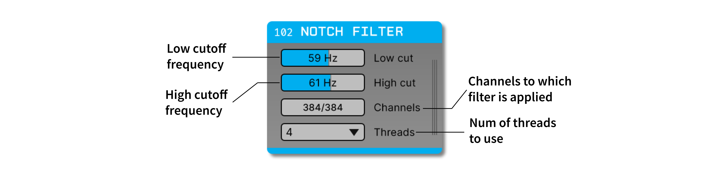
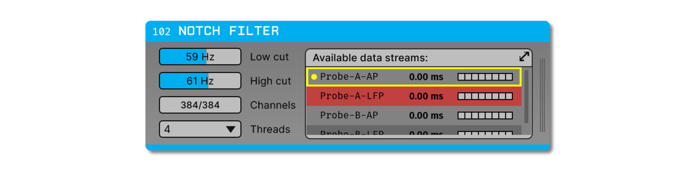

.. _notchfilter:
.. role:: raw-html-m2r(raw)
   :format: html

################
Notch Filter
################

.. csv-table:: Filters incoming continuous data between the specified low cutoff and high cutoff frequencies (Hz) using a 4th-order Butterworth bandstop filter (attenuate a specific range of frequencies).
   :widths: 18, 80

   "*Plugin Type*", "Filter"
   "*Platforms*", "Windows, Linux, macOS"
   "*Built in?*", "No"
   "*Key Developers*", "Florent Pollet, Anjal Doshi"
   "*Source Code*", "https://github.com/open-ephys-plugins/notch-filter"

Plugin configuration
###################################

Filter parameters
------------------

The notch filter has two parameters, **Low cut** and **High cut**. These parameters define the upper and lower cutoff frequencies of the filter, respectively. To change these values, simply drag the slider to adjust the frequency or type a different number in the text box.

**Acceptable parameter range:** The minimum value for both parameters is 1 Hz, and the maximum value is 100 Hz. The low cut cannot be set to a value that's higher than the high cut, and the high cut cannot be set to a value that's lower than the low cut.

.. note:: Filter parameters can be changed during recording, but these changes will not be logged. The parameters that are active at the start of recording will be stored in the :code:`settings.xml` file.

Selecting channels
-------------------

The filtering operation can be restricted to a subset of channels, if desired. For example, if a data stream includes ADC channels, these can be deactivated in the "Channels" interface. In the following example, the filter will be applied to channels 1-12, and channels 13-16 will be ignored.

.. image:: ../../_static/images/plugins/bandpassfilter/bandpassfilter-03.png
  :alt: Annotated Notch Filter channel selector

Using multiple threads
-----------------------

The Notch Filter plugin can be run on multiple threads to improve performance. This is particularly useful when filtering high-channel count data streams, such as those from Neuropixels probes. To enable multi-threading, select the desired number of threads from the drop-down menu in the "Threads" parameter. The number of threads to use should be chosen by experimenting with different values to find the best performance for your system.

Filter details
###################################

To obtain the same filter in MATLAB, you can use the following commands from the Signal Processing Toolbox:

.. code-block:: matlab

  d = designfilt('bandstopiir', 'FilterOrder', 4, ...
          'HalfPowerFrequency1', lowcut, 'HalfPowerFrequency2', highcut, ...
          'DesignMethod', 'butter', 'SampleRate', samplerate);

  y = filter(d, x); % only filters in the forward direction

To obtain the same filter in Python, you can use:

.. code-block:: python

  import numpy as np
  from scipy.signal import butter, lfilter

  # Design a notch (bandstop) filter
  b, a = butter(4, np.array([lowcut, highcut]) / (samplerate / 2), btype='bandstop')

  y = lfilter(b, a, x)

In both examples, :code:`lowcut` and :code:`highcut` are low and high cutoff frequencies (Hz), :code:`samplerate` is the data sample rate (Hz), :code:`x` is the unfiltered data, and :code:`y` is the filtered data.

Working with multiple data streams
###################################

If the Notch Filter plugin receives data from multiple incoming streams, a subset of these streams can be bypassed to conserve CPU cycles. For example, this can be helpful for Neuropixels probes if you only want to filter the LFP band channels, and not the AP band channels. Bypassing a stream is more efficient than deselecting all of its channels, as the plugin only needs to perform one check for the whole stream, rather than checking every channel.

To bypass a stream in the Notch Filter, click the vertical lines on the right-hand side of the plugin to bring up the Stream Selector, browse to the appropriate stream, and right-click on the row to select "Disable stream". The bypassed stream will be red in color, as shown in the following image:

