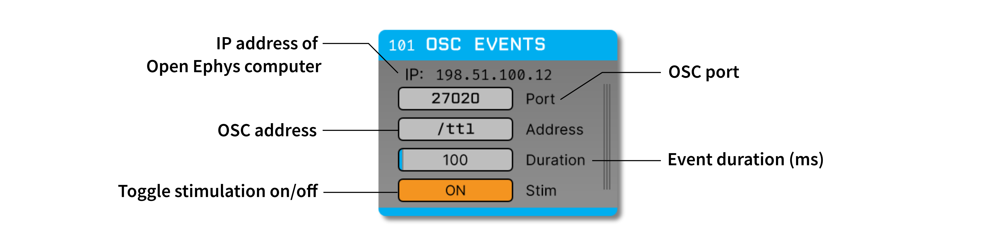

.. _oscevents:
.. role:: raw-html-m2r(raw)
   :format: html

################
OSC Events
################

.. csv-table:: Converts Open Sound Control (OSC) messages into TTL events. This plugin was designed to provide a simple way to send information from Bonsai to the Open Ephys GUI, but it will work with any application that can send OSC messages.
   :widths: 18, 80

   "*Plugin Type*", "Filter"
   "*Platforms*", "Windows, Linux, macOS"
   "*Built in?*", "No"
   "*Key Developers*", "Gonçalo Lopes, Josh Siegle, Anjal Doshi"
   "*Source Code*", "https://github.com/open-ephys-plugins/osc-io"

Installing and upgrading
###########################

The OSC Events plugin is not included by default in the Open Ephys GUI. To install, use **ctrl-P** or **⌘P** to open the Plugin Installer, browse to the "OSC IO" plugin, and click the "Install" button.

The Plugin Installer also allows you to upgrade to the latest version of this plugin, if it's already installed.

Plugin configuration
########################

Since the OSC Events module sends events, and not continuous data, it cannot be placed at the beginning of a signal chain. The plugin will add events to all data streams that pass through it.

The following parameters can be modified via the plugin editor:

- **OSC address** - the OSC endpoint for communicating with this plugin (default = :code:`/ttl`). It must start with a forward slash.
- **Port** - the network port for communicating with this plugin. 
- **Duration** - the duration of events triggered by this plugin. If duration is set to a value greater than 0, incoming messages will trigger "on" events followed by an "off" event on the same line *duration* milliseconds later. If the duration is 0, only one event will be triggered by each message, which must also specify the event state (0 or 1).
- **Stim** - toggles stimulation on or off. When set to "off," incoming OSC messages will no longer trigger events.

Bonsai configuration
#######################

The Bonsai workflow must include one :code:`CreateUdpClient` operator to initialize the OSC connection. The IP address and port must match that used by the Open Ephys plugin. If Bonsai and Open Ephys GUI are running on the same machine, it's fine to use "127.0.0.1" as the IP address on the Bonsai side. The :code:`SendMessage` operator must specify the OSC endpoint, which must match the address used on the Open Ephys side.

The OSC Events plugin expects messages with or one two integer values:

- **Value 1:** the TTL line to trigger (1-256)
- **Value 2:** the state of the event (0 = off, 1 = on)

If the OSC Events duration is set to zero, then each message must contain both values. If the duration is greater than 0, then the second value will be ignored.

The following is a simple example of a workflow that could be used to trigger "on" and "off" events at regular intervals:

|

