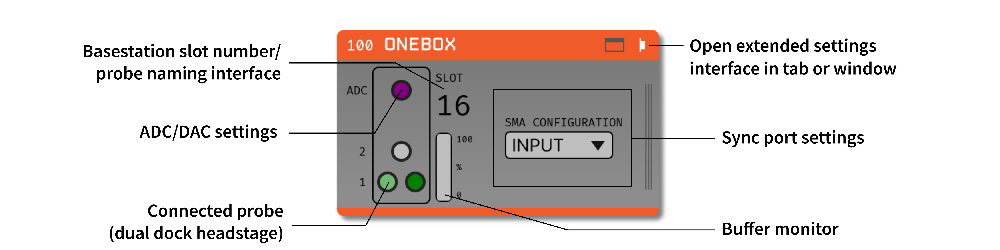
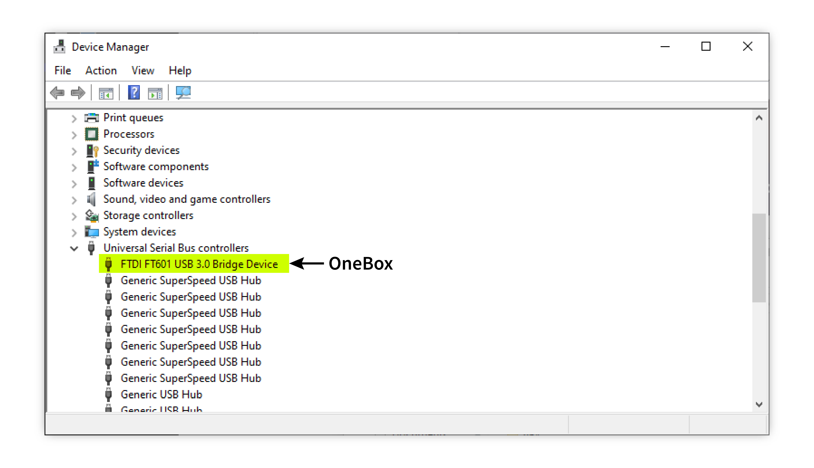
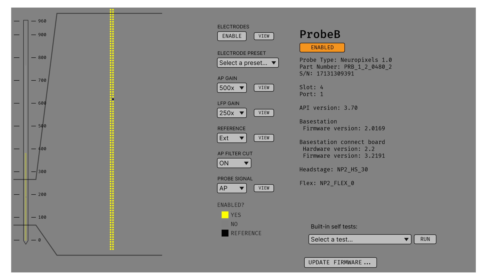
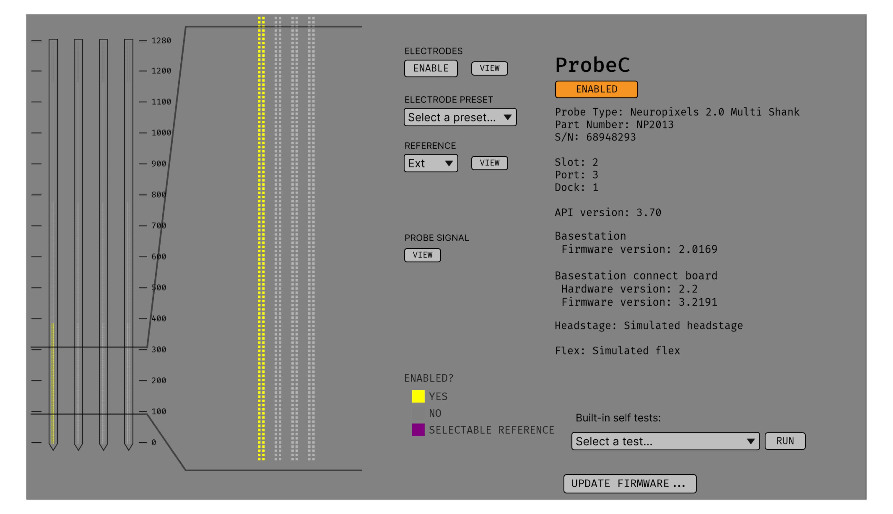
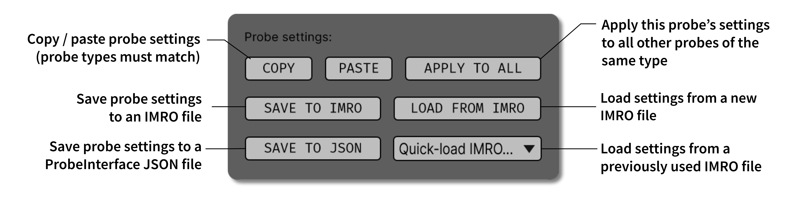
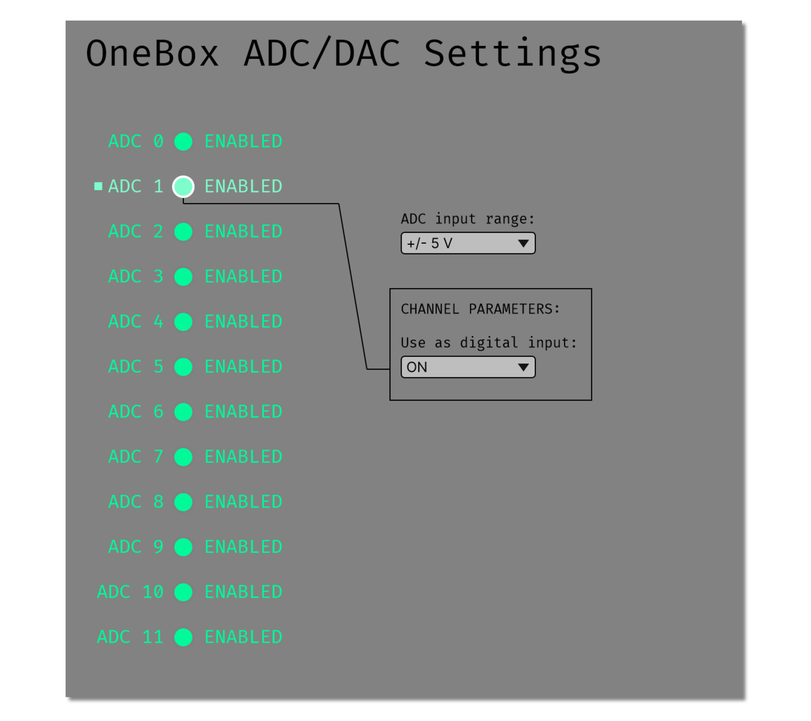
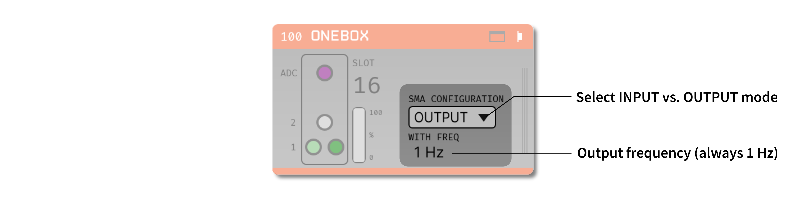

.. _onebox:
.. role:: raw-html-m2r(raw)
   :format: html

.. _onebox-plugin:

################
OneBox
################

.. csv-table:: Streams Neuropixels data from imec's OneBox.
   :widths: 18, 80

   "*Plugin Type*", "Source"
   "*Platforms*", "Windows only"
   "*Built in?*", "No"
   "*Key Developers*", "Josh Siegle, Pavel Kulik, Anjal Doshi"
   "*Source Code*", "https://github.com/open-ephys-plugins/neuropixels-pxi"

Installing and upgrading
############################

The OneBox plugin is not included by default in the Open Ephys GUI. To install, use **ctrl-P** or **⌘P** to open the Plugin Installer, browse to the "Neuropixels PXI" plugin, and click the "Install" button. This will install both the :ref:`neuropixelspxi` and OneBox plugins.

The Plugin Installer also allows you to upgrade to the latest version of this plugin, if it's already installed.

Hardware requirements
######################

Ordered via `neuropixels.org <https://www.neuropixels.org/>`__:

* One **OneBox** (with included power supply and USB 3.0 cable)

* One **breakout board** and SDR cable (for auxiliary I/O)

* One or more **Neuropixels cables** (black + yellow twisted pair, USB-C to Omnetics)

* One or more **Neuropixels headstages** 

* One or more **Neuropixels probes**

Compatible probes
######################

This plugin can stream data from any of the following Neuropixels probes:

.. csv-table::
   :widths: 70, 40

   "**Probe**", "**Channels**"
   "Neuropixels 1.0", "384 AP, 384 LFP"
   "Neuropixels NHP Prototype (10 mm, 25 mm, and 45 mm)", "384 AP, 384 LFP"
   "Neuropixels NHP 128 CH Passive", "128 AP, 128 LFP"
   "Neuropixels NHP Commercial (10 mm)", "384 AP, 384 LFP"
   "Neuropixels UHD", "384 AP, 384 LFP"
   "Neuropixels 2.0", "384 wideband"
   "Neuropixels Quad Base", "1536 wideband"

OneBox Quickstart Guide
##############################

Driver installation
-------------------- 

The OneBox requires a specific version of the FTDI D3XX drivers to be installed on your computer (version 1.3.0.10). These drivers can be downloaded from the `FTDI website <https://ftdichip.com/drivers/d3xx-drivers/>`__. It's recommended to run the Setup Executable and follow the instructions provided by the installer.

.. note:: The latest FTDI D3XX driver (1.4.0.0) is not compatible with the OneBox and will lead to the device not being recognized. Be sure to downgrade to version 1.3.0.10 before attempting to use the OneBox plugin.

Once the drivers are installed, verify whether the OneBox is correctly recognized:

1. Plug in the OneBox power supply
2. Switch on the OneBox using the power button
3. Conect the OneBox to your computer using the included USB 3.0 cable
4. Open Device Manager and confirm that the OneBox appears as a "FT601 USB 3.0 Bridge Device"

OneBox status light
---------------------------

The status light on the front of the OneBox can take the following states:

- **Off:** system is powered off

- **Soft-blinking green:** OneBox is powered on and plugged into a USB port

- **Soft-blinking red:** OneBox is on but not plugged in to a PC, or OneBox is plugged in but no software connection is made within 5 seconds.

- **Green:** OneBox has successfully connected to the control software 

- **Red:** OneBox has become unplugged from the PC

- **Blue:** OneBox is trasmitting data to the PC 

Loading the OneBox plugin
---------------------------

Drag and drop the "OneBox" plugin from the Processor List onto the Editor Viewport. The GUI will automatically connect to the first available OneBox connected to your computer. 

- If multiple OneBoxes are connected, you can use multiple OneBox plugins in parallel.
- If no OneBoxes are found, the plugin can be run in simulation mode. 
- If no probes are connected to the OneBox, data can be acquired from the 12 OneBox ADCs.

The first connected OneBox plugin will be automatically assigned to slot 16, followed by 17, etc. This is so the slot number does not interfere with any PXI basestations that are being used in parallel.

The editor will automatically create a probe selection interface for the OneBox. Each OneBox can communicate with up to 2 probes (Neuropixels 1.0, NHP, and Ultra) or 4 probes (Neuropixels 2.0 with dual dock headstages). When the probes are initially detected, they show up as orange circles. Once they are initialized, connected probes become green. After the probes turn green, the plugin is ready to begin data acquisition.

.. tip:: If the probe icons do not turn green, the OneBox needs to be power cycled. Close the Open Ephys GUI, turn the OneBox off and on, and then re-open the GUI. The probe icons should be green after relaunch.

Calibrating probes
#####################

Neuropixels probes require calibration in order to function properly. These files can be obtained from IMEC for every probe that you've purchased. There should be two files for each 1.0 probe:

* :code:`<probe_serial_number>_ADCCalibration.csv`

* :code:`<probe_serial_number>_gainCalValues.csv`

and one file for each 2.0 probe:

* :code:`<probe_serial_number>_gainCalValues.csv`

Any probes detected by the OneBox plugin will be calibrated automatically when the plugin is loaded, provided that calibration files are stored in one of the following locations:

For GUI versions prior to v1.0.0:

* :code:`C:\\ProgramData\\Open Ephys\\CalibrationInfo\\<probe_serial_number>` (recommended - note that **ProgramData** may be a hidden folder on your system, so you'll need to change the File Explorer options to show hidden files)

For GUI versions 1.0.0 and later:

* :code:`C:\\Users\\<username>\\AppData\\Local\\Open Ephys\\CalibrationInfo\\<probe_serial_number>` (recommended - note that **AppData** may be a hidden folder on your system, so you'll need to change the File Explorer options to show hidden files)

For any version of the GUI:

* :code:`<open-ephys-executable-folder>\\CalibrationInfo\\<probe_serial_number>` (if you used the Open Ephys installer, the executable will be located in :code:`C:\\Program Files\\Open Ephys`)

If these files cannot be found, a warning message will appear. It's still possible to acquire data from uncalibrated probes, but this data should be used for testing purposes only. The calibration files must copied to the correct location prior to running any actual experiments.

Configuring probe settings
###########################

To open the probe settings interface, press the "window" or "tab" button in the upper-right corner of the editor:

.. image:: ../../_static/images/plugins/onebox/onebox-04.png
  :alt: How to open the Neuropixels settings interface

Each probe has its own interface for updating settings, which is customized for each probe type. Selecting the green button corresponding to the probe's basestation and port in the plugin editor allows you to access the parameters for a particular probe. The button that is highlighted in light green indicates the probe whose settings are currently being viewed.

Here is an example of the settings interface for a Neuropixels 1.0 probe:

And for a Neuropixels 2.0 (4-shank) probe:

Electrode selection
---------------------

The interface on the left allows you to select/deselect electrodes from different banks. Use the mini probe overview visualization to scroll to the electrodes you want to activate, click or drag to select them in the zoomed visualization, and then click the "ENABLE" button. Selecting electrodes on one bank will automatically deactivate the electrodes on all other banks that are connected to the same set of channels.

You can also select pre-defined electrode configurations from the "Electrode Preset" drop-down menu. This is a much faster way to switch between commonly used electrode layouts.

Gain and filter settings
--------------------------

For 1.0, NHP, and Ultra probes, you can change the following settings:

* **AP Gain** (amplifier gain for AP channels, 50x-3000x; default = 500x)

* **LFP Gain** (amplifier gain for LFP channels, 50x-3000x; default = 250x)

* **AP Filter Cut** (ON = 300 Hz high-pass filter active, OFF = filter inactive; default = ON)

Reference selection
--------------------

All probe types include a **Reference** drop-down menu that can be used to select one of the following reference types:

* **External** (default) - references signals to the dedicated reference pad on the probe/flex cable. This pad can be connected to a wire immersed in saline above the brain (for acute recordings) or a screw embedded in the skull (for chronic recordings). It's common to use a wire to bridge the reference pad to the ground pad, to avoid the need for a separate reference wire.

* **Tip** - references signals to the large pad at the tip of the probe (or the tip of a particular shank, in the case of the 4-shank Neuropixels 2.0). The tip reference will likely reduce your overall noise levels, but it will also lead to leakage of low-frequency signals across all channels. If you want to do any analysis of the local field potential, you need to be sure to keep at least a few channels outside the brain, in order to subtract their signals offline.

Neuropixels 2.0 probes have an additional reference option:

* **Ground** - same as External, but with the ground and reference connected internally, so no wire bridge is needed.

Activity view
###########################

Pressing the "VIEW" button in the "Probe Signal" area will toggle a live display of the amplitude range of each channel whenever acquisition is active. For Neuropixels 1.0 probes, activity can be viewed for the AP band or LFP band.

Saving, loading, and copying settings
######################################

Default loading and saving
---------------------------

Any changes made to the probe settings will be automatically re-applied when you re-start the GUI, provided you have checked **Reload on startup** from the "File" menu. Settings will first be transferred by probe serial number. If no matching serial number is found, settings will be inherited from a probe of the same type. Settings cannot be transferred between probes of different types (e.g. Neuropixels 1.0 to Neuropixels 2.0).

Copying settings between probes
--------------------------------
Settings can be transferred between probes using the "COPY", "PASTE", and "APPLY TO ALL" buttons:

Settings can only be applied to probes of matching types (e.g. 1.0, NHP, Ultra, 2.0).

IMRO files
--------------------------------
Settings for individual probes can also be loaded using SpikeGLX "IMec Read Out" (IMRO) tables, using the "LOAD FROM IMRO" button. 

The IMRO format is specified `here <https://billkarsh.github.io/SpikeGLX/help/imroTables/>`__. If you've saved a probe configuration using SpikeGLX or some other software, you can apply that configuration to a probe in the Open Ephys GUI by reading in an IMRO file. The only caveat is that Open Ephys does not allow individual channels to have different gain or reference settings, so those will be inherited from the last channel in the file.

You can save the configuration for a particular probe into IMRO format using the "SAVE TO IMRO" button. These files can be used in SpikeGLX or any other software that can read the IMRO format.

Any IMRO files that have been loaded previously will appear in the drop-down menu below the "LOAD FROM IMRO" button, so they can be accessed more easily.

ProbeInterface JSON files
--------------------------------

If you're performing offline analysis with `SpikeInterface <https://github.com/spikeinterface/spikeinterface>`__, it may be helpful to have information about your probe's channel configuration stored in a JSON file that conforms to the `ProbeInterface <https://github.com/spikeinterface/probeinterface>`__ specification. To export a ProbeInterface JSON file, simply press the "SAVE TO JSON" button.

OneBox ADCs
######################################

The OneBox ADCs use 0-based indexing. ADC 0 can be accessed via the "ADC" SMA connector on the OneBox, while ADCs 1-11 require the BNC breakout board to be attached via the SDR connector.

The OneBox ADC settings can be accessed by clicking on the purple circle in the OneBox plugin editor, or by browsing to the "ADC" tab in the OneBox settings interface.

There is one global input range setting for all ADCs, which can be set to either ±2.5, ±5V (default), or ±10V. This determines the voltage range of the signals the ADCs can accept. Smaller input range will provide higher resolution for lower amplitude signals, but may clip larger signals.

**Each ADC can optionally be used as a digital input.** If the digital input option is set to "ON," the ADC will interpret any input voltage below 0.5 V as a logic low, and any input voltage above 1 V as a logic high. Each threshold crossing will generate an event that propagates through the Open Ephys signal chain. The analog data from the ADC will still be available, even if the digital input option is set to "ON."

Plugin data streams
######################################

OneBox plugin sends data from all connected probes through the GUI's signal chain unless they have been disabled. To disable data transmission, you can press the "ENABLE" button underneath the probe name. The probe's icon will turn red, and its data will not be available to downstream plugins.

Neuropixels 1.0, NHP, or Ultra probes have two data streams: 

* 384 channels of AP band data, sampled at 30 kHz (e.g. "ProbeA-AP")

* 384 channels of LFP band data, sampled at 2.5 kHz (e.g. "ProbeA-LFP")

Neuropixels 2.0 single-shank and quad-shank probes have only one data stream:

* 384 channels of wide-band data, sampled at 30 kHz.

Neuropixels 2.0 quad base probes have four data streams (one for each shank):

* 384 x 4 channels of wide-band data, sampled at 30 kHz.

In addition, the OneBox will transmit an ADC data stream with 12 channels.

As of GUI version 0.6.0, stream in downstream plugins are configured independently. This makes it much easier to apply different parameters to different streams, for example unique :ref:`bandpassfilter` settings for the AP band and LFP band. However, users should be aware that settings for one stream are not automatically applied to other streams. If you are recording from many probes simultaneously, be sure to use the Stream Selector interface in downstream plugins to confirm that the appropriate settings have taken effect for all incoming data streams.

Customizing stream names
--------------------------

Clicking on the slot number for a given basestation will open up an interface for customizing the names of the data streams generated by the OneBox. By default, each probe is assigned a name based on the order that it's detected: :code:`ProbeA`, :code:`ProbeB`, :code:`ProbeC`, etc. While this is fine for most use cases, there are some situations where other behavior is desirable. Therefore, the plugin includes four different schemes for naming data streams:

#. **Automatic naming:** Probes names are assigned automatically, based on the order in which they are detected. Any 1.0 probes will have "-AP" and "-LFP" appended to their respective streams. The naming interface displays the names that will be applied when using this scheme, but they cannot be edited.

#. **Automatic numbering:** Numeric stream names are assigned automatically, based on the order in which they are detected. This scheme will produce file names that look like those from GUI version 0.5.X and earlier, which did not have the ability to apply custom names to individual streams. The naming interface displays the names that will be applied when using this scheme, but they cannot be edited.

#. **Custom port names:** Probe names are assigned by port/dock. This is useful if you have probes placed in a particular physical configuration, and always want a probe in a certain position to have the same name, regardless of which other probes are connected.

#. **Custom probe names:** Probe names are assigned by serial number. This is useful if you have probes chronically implanted and would like to associate the subject ID with a particular probe.

.. caution:: All stream names *must* be unique for a given plugin. Currently, it's possible to inadvertently assign the same name to multiple probes, either by using the same port-specific or probe-specific names across basestations. Name conflicts must be checked manually in order to prevent crashes when starting recording.

Synchronization settings
######################################

Properly configuring your synchronization signals is critical for Neuropixels recordings. Each probe will have a slightly different sample rate between 29999.9 and 30000.1 Hz, so you cannot simply count samples to figure out how much time has elapsed for a given data stream. Therefore, every data source must share a hardware sync line in order for samples to be accurately aligned offline.

Each OneBox contains an SMA connector for sync input (labeled SMA1). The behavior of this connector is configured using the synchronization interface within the plugin editor:

* The drop-down menu allows you to configure the main sync SMA as **INPUT** or **OUTPUT**. In **INPUT** mode, an external digital input must be connected to the SMA. In **OUTPUT** mode, the OneBox will generate its own sync signal at 1 Hz, which can be used to synchronize other devices (e.g. a PXI basestation or Open Ephys Acquisition Board).

Simulation mode
##############################

When running the plugin in simulation mode, you'll have the option of selecting up two different probes to acquire data from. This is useful for familiarizing yourself with the settings interfaces for different probe types, or testing your signal chain in the absence of any Neuropixels hardware.

The simulated AP band data was designed to make the probe activity view look interesting; the simulated LFP band data is sine waves with amplitudes that vary across channels.

Built-in self tests
#####################

If you have a probe that's not working properly, these tests can be used to help pinpoint where the problem lies. It's not recommended to run the tests prior to every recording; the tests are only necessary to diagnose an issue with a probe that is not transmitting data.

To run each test, select one from the drop-down menu, and click the "RUN" button. After the test completes, the name of the test will be updated to indicated whether it passed or failed.

.. csv-table:: Built-in self tests
   :header: "Name", "Duration", "Purpose"
   :widths: 20, 20, 70

   "Test probe signal",	"30 s", "Analyzes if the probe performance falls within a specified tolerance range, based on a signal generated by the headstage. Probes that are fully functional can still fail this test, so it's not a definitive indicator of probe health."
   "Test probe noise", "30 s", "Calculates probe noise levels when electrode inputs are shorted to ground. Similar to the probe signal test, this test is not a definitive indicator of probe health, so failures can be safely ignored."
   "Test PSB bus", "<1 s", "Verifies whether signals are transmitted accurately to the headstage via the parallel serial bus. If this test fails, it usually indicates that the probe is not properly seated in the headstage."
   "Test shift registers", "1 s", "Verifies the functionality of the shank and base shift registers. If this test fails, it means the probe electronics have become critically damaged. Even if data is being transmitted, there's a possibility that it may be corrupted."
   "Test EEPROM", "1 s", "Tests the EEPROM memory storage on the flex, headstage, and BSC."
   "Test I2C", "<1 s", "Verifies the functionality of the probe's I2C interface. This interface must be intact for proper functioning of the probe."
   "Test Serdes", "<1 s", "Tests the integrity of the serial communication over the probe cable."
   "Test Heartbeat", "3 s", "Checks for a 1 Hz heartbeat signal between the headstage and BSC. This test indicates whether basic communication between the headstage and basestation is working."
   "Test Basestation", "<1 s", "Tests the connectivity between the computer and the OneBox over USB."

.. note:: If the "probe signal" and "probe noise" tests fail, it does not necessarily indicate that the probe is broken. If your probe is successfully transmitting data, the outcome of all of these tests (except the shift register test) can be safely ignored.

Headstage tests
#################

If you have a headstage test module, you can run a suite of tests to ensure the headstage is functioning properly. When the Neuropix plugin is dropped into the signal chain and at least one headstage test module is connected to the OneBox, the GUI will automatically run all headstage tests and output the results in a popup window:

.. image:: ../../_static/images/plugins/neuropix-pxi/HST.png
  :alt: Headstage test board popup window
  :width: 400

.. note:: The headstage tests have been re-enabled as of plugin version 0.5.x. However, we have also found that the headstage tests are rarely needed to accurately diagnose a problem with data transmission. If you are unsure whether your headstage is functional, swapping it out with a different headstage is usually more informative than running the headstage tests.

Remote control
######################

A number of Neuropixels probe settings can be changed via the GUI's built-in HTTP server. Commands are sent as "config messages" to the OneBox processor.

The following commands are available:

1. :code:`NP INFO` : returns a JSON string containing information about all available probes
2. :code:`NP REFERENCE <bs> <port> <dock> <EXT/TIP>` : set the reference for a specific probe
3. :code:`NP GAIN <bs> <port> <dock> <AP/LFP> <gainval>` : set the AP or LFP gain for a specific probe (Neuropixels 1.0 only)
4. :code:`NP FILTER <bs> <port> <dock> <ON/OFF>` : turn the AP filter cut on or off (Neuropixels 1.0 only)
5. :code:`NP SELECT <bs> <port> <dock> <electrode> <electrode> <electrode> ...` : select electrodes by index

Note that the :code:`bs`, :code:`port`, and :code:`dock` parameters all use 1-based indexing. The default :code:`bs` value is 16 for the OneBox and the :code:`dock` parameter is always 1 for Neuropixels 1.0 probes.

For example, the :code:`NP SELECT` command can be used to automatically cycle through different electrode banks. The following code shows how to do this using the :code:`open-ephys-python-tools` package (version 0.1.6 and higher):

.. code-block:: python

    import numpy as np
    import time

    from open_ephys.control import OpenEphysHTTPServer

    gui = OpenEphysHTTPServer()

    # configuration parameters
    processor_id = 106
    basestation = 16
    port = 3
    dock = 1 # always 1 for NP 1.0

    command = f'NP SELECT {basestation} {port} {dock} '

    electrodes = np.arange(1,385) # 1-based indexing
    electrode_string = ' '.join(electrodes.astype('str'))

    gui.config(processor_id, command + electrode_string)

    gui.record(60) # record for 60 seconds

    electrodes = np.arange(384,767) # 1-based indexing
    electrode_string = ' '.join(electrodes.astype('str'))

    gui.config(processor_id, command + electrode_string)

    gui.record(60) # record for 60 seconds
