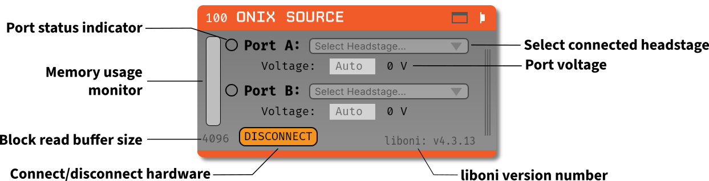
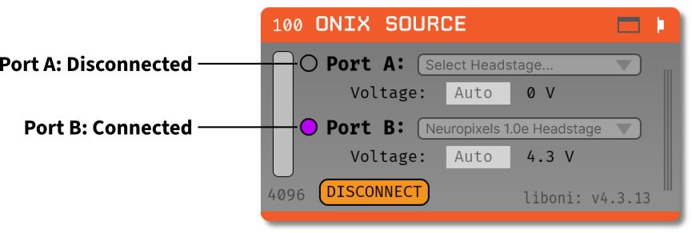
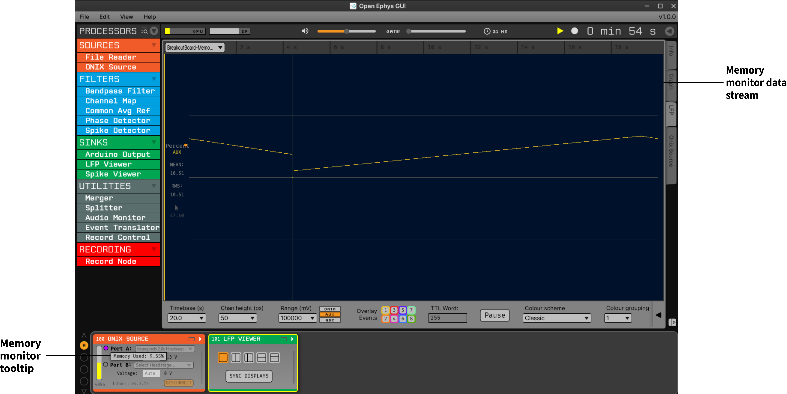
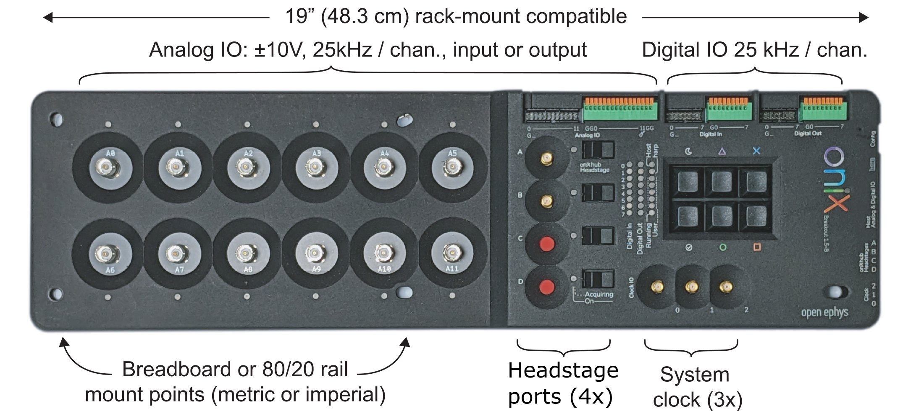
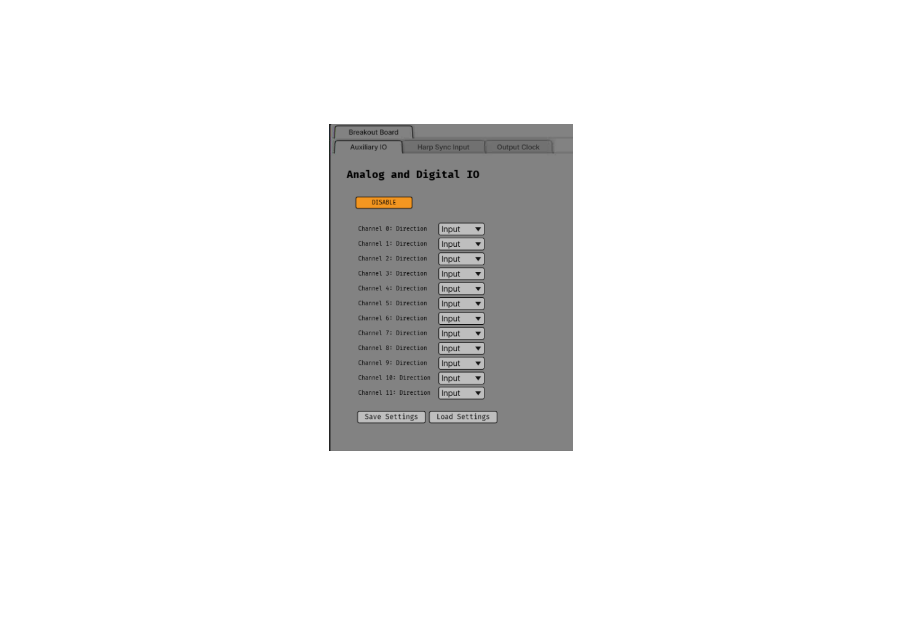
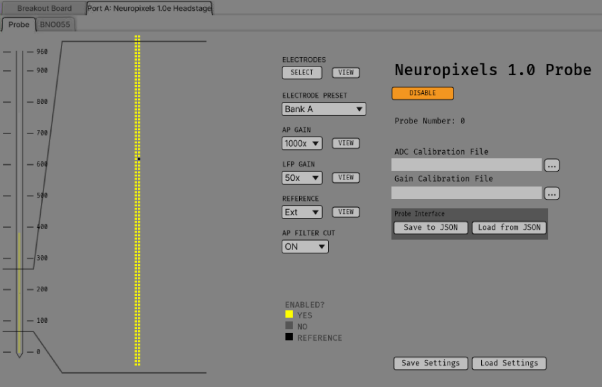
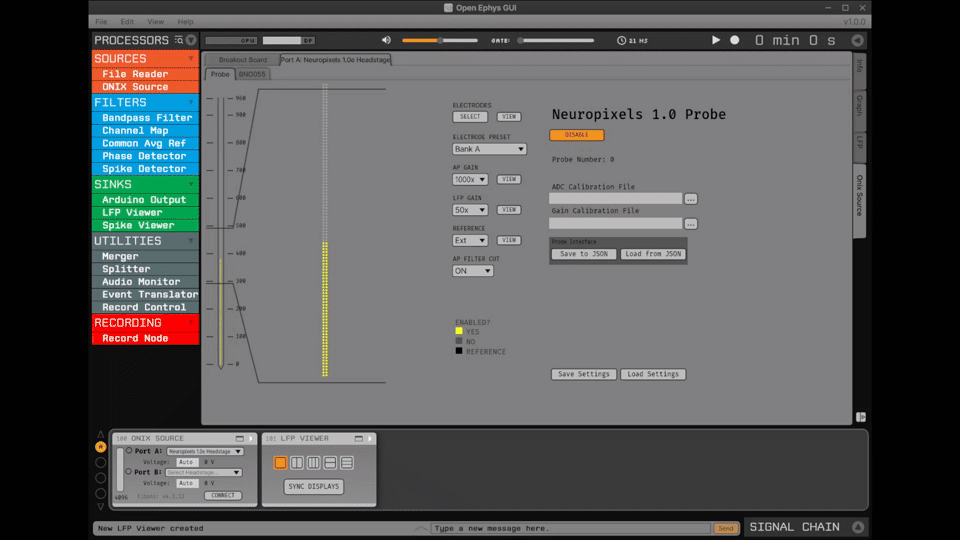

.. _onixsource:
.. role:: raw-html-m2r(raw)
   :format: html

#####################
ONIX Source
#####################

.. csv-table:: Streams data from the `ONIX <https://open-ephys.github.io/onix-docs/>`__ acquisition system, which is a high-performance, low-latency data acquisition system designed for neuroscience research.
  :widths: 18, 80

  "*Plugin Type*", "Source"
  "*Platforms*", "Windows"
  "*Built in?*", "No"
  "*Key Developers*", "Brandon Parks, Jon Newman, Aarón Cuevas López"
  "*Source Code*", "https://github.com/open-ephys-plugins/onix-source"

Installing and upgrading
===========================

The ONIX Source plugin is not included by default in the Open Ephys GUI. To install, use **ctrl-P**
or **⌘P** to access the Plugin Installer, browse to the "ONIX Source" plugin, and click the "Install"
button.

The Plugin Installer also allows you to upgrade to the latest version of this plugin, if it's
already installed.

Plugin Configuration
===========================

The ONIX Source plugin allows you to stream data from the ONIX acquisition system. This plugin
assumes that you have an ONIX Breakout Board connected and powered on before adding the plugin to
the signal chain. To install a Breakout Board, refer to the `ONIX Breakout Board documentation
<https://open-ephys.github.io/onix-docs/Getting%20Started/index.html/>`__.

To configure the plugin:

1. Add the ONIX Source plugin to your signal chain.
2. (Optional) In the plugin editor, select the ONIX headstage you want to stream from, specifying if
   the headstage is plugged into Port A or Port B.
3. (Optional) Modify the block read buffer size, which determines how much data is read from the
   ONIX system at once. 
   
   a. A larger buffer size can reduce CPU usage but may increase latency. The
      default buffer size of 4096 is recommended for most applications. If four Neuropixel probes are
      connected, monitor memory buffer usage and increase the block read buffer size to 8192 to avoid
      memory issues.

4. (Optional) Set the port voltage.

   a. Port voltage is automatically discovered based on the headstage selected. In most instances,
      the default "Auto" setting is sufficient.

6. Press "Connect" to establish a connection to the ONIX system.
7. Once connected, acquisition can be started in the GUI's main control panel.
8. For further configuration, click the plugin banner (i.e., the gray or colored portion of the
   editor showing the name of the plugin) to open the canvas and adjust settings as needed.

   a. The canvas is structured as tabs, with the first tab showing the breakout board and its
      devices, with the following tabs populating with the specific headstages selected. 
   b. Note: if the canvas is not visible, you can toggle it by clicking the "Toggle Canvas" button
      in the plugin editor. 

All options in the editor are able to be changed at any time before the "Connect" button is pressed.
Once the "Connect" button is pressed, the plugin will attempt to connect to the ONIX system using
the selected settings. If the connection is successful, the editor settings will be locked, and the
only way to change them is to disconnect from the ONIX system by pressing the "Disconnect" button.
Canvas options are able to be changed at any time, even after the "Connect" button is pressed, up
until acquisition is started in the GUI's main control panel. During acquisition, all settings in the canvas are locked, and the plugin will not allow any changes until acquisition is stopped.

Port Specific Configuration
############################

The ONIX Source plugin allows you to configure each port (A or B) independently. You can select the
headstage connected to each port, set the port voltage, and monitor the connection status. Port A
and Port B can be configured to stream data from different headstages, enabling configuration for
different experimental setups. Select the desired headstage from the dropdown menu for each port.

.. note:: 
  The ONIX Source plugin only supports Neuropixels headstages at the moment. Other headstages may be supported in future releases.

Port Voltage Configuration
-----------------------------

In the nominal case, port voltage is automatically discovered based on the headstage selected. Port
voltage is automatically set to "Auto" when the plugin is first added to the signal chain, which means
the plugin will attempt to discover the port voltage automatically when "Connect" is pressed. If a
port voltage is set manually, the plugin will use that value instead of attempting to discover it
automatically. To enable automated port voltage discovery, leave the port voltage field empty
or set it to "Auto".

When automated port voltage discovery is enabled, the plugin will attempt to determine the port
voltage when "Connect" is pressed. A progress bar will be displayed over the main GUI window showing
the status of each port as it cycles through pre-determined voltage values attempting to find a
connected headstage. If a valid port voltage cannot be determined (i.e., a headstage is not found to
be connected), an error message will be displayed in a pop-up window.

Once the ONIX system is connected, the voltage that is currently set will be displayed in the plugin
editor. When the port voltage is set to "Auto", the plugin will display the discovered voltage after
the connection is established, or if the port voltage was set manually, it will display the
configured voltage.

Port Status Indicators
-----------------------------

To the left of each Port, there is a status indicator that shows the connection status of the ONIX
system on that port. The status indicators can show the following states:

- Empty circle: No connection to the ONIX system, port voltage is zero.
- Green circle: Port power is on, but the headstage is not connected.
- Purple circle: Port power is on, and the headstage is connected.

When the "Connect" button is pressed, the plugin will attempt to connect to the ONIX system on the
selected port. If the connection is successful, the status indicator will change to purple, and the
port voltage will be updated as described above. If the connection fails, the status indicator will
remain empty, and an error message will be displayed in a pop-up window.

Block Read Size Configuration
###############################

In most cases, the default block read size of 4096 samples is sufficient for streaming data from the
ONIX system. If you only need to stream data from the Breakout Board, decreasing the block read size
to 1024 would be sufficient to minimize latency without compromising processing time. However, if
you are streaming data from multiple Neuropixels probes, you may need to increase the block read
size to avoid memory issues. Refer to the table below for recommended block read sizes based on the
number of Neuropixels probes connected:

.. list-table:: Block Read Size Recommendations
   :header-rows: 1

   * - Number of Neuropixels Probes
     - Recommended Block Read Size
   * - 0
     - 1024
   * - 1
     - 4096
   * - 2
     - 4096
   * - 3
     - 4096
   * - 4
     - 8192

The block read size can be configured by entering a value in the "Block Read Size" field. This value
determines how much data is read from the ONIX system at once. A larger block read size can reduce
CPU usage but may increase latency. A smaller block read size can provide lower latency, but it can
cause the memory monitor to fill up. The default value is 4096 samples, but this can be adjusted
based on your experimental needs.

The block read size can be set to any integer value, but this value must be greater than the size of
the largest frame received from the connected headstage. If the block read size is set to a value
smaller than the size of the largest frame, an error message will be displayed in a pop-up window
with the smallest value possible for the block read size. The plugin will not allow you to connect
to the ONIX system until the block read size is set to a valid value.

:code:`liboni` Version
#########################

The ONIX Source plugin uses the :code:`liboni` library `(link)
<https://open-ephys.github.io/ONI/v1.0/api/index.html>`__ to communicate with the ONIX acquisition
system. The version of :code:`liboni` used by the plugin is displayed in the plugin editor. This
version may be updated in future releases of the plugin.

Memory Usage Monitor
#######################

The ONIX Source plugin includes a memory usage monitor that displays the current memory usage of the
hardware buffer. This monitor tracks memory usage during acquisition and can indicate performance
issues related to the block read size. The memory usage monitor is updated in real time during
acquisition, and displays the current memory usage as a logarithmic percentage of the total memory
available for the hardware buffer. For example, if the memory buffer is approximately 1% full, the
status bar will be filled to approximately 15% of its total height. This logarithmic scale
represents memory usage, allowing small changes in memory usage to be visualized more distinctly.
Hovering over the memory usage monitor displays the current memory usage as a percentage of the
total hardware buffer memory (see image below).

The memory usage is also saved as a stream in the ONIX Source plugin, allowing you to visualize
memory usage over time in the GUI. This allows identification of trends in memory usage over longer
recordings and supports diagnosis of performance issues related to memory usage. This data stream is
always enabled, and cannot be disabled. For reference, see the image above.

Plugin Canvas
================

The ONIX Source plugin includes a canvas that allows you to change the configuration settings for
the connected headstages and their devices. The canvas is structured as tabs, with the first tab
showing the breakout board and its devices, while the following tabs are populated with the specific
headstage(s) selected. Each tab is structured similarly, with the following elements:

- **Hub Tabs**

  - *Hub Name*: The tab name shows the name of the hub, which is the headstage name in the case of
    headstages, or Breakout Board in the case of the breakout board.
  - **Device Tabs**: The devices connected to the hub are listed as tabs under the hub name.

    - *Device Name*: The tab name shows the name of the device.
    - *Device Enabled Status*: A button that allows you to enable or disable the device. If the device is
      enabled, the button will be orange, and if it is disabled, the button will be gray.
      
      - Not all devices can be disabled.

    - *Save Settings Button*: A button that allows you to save the current settings for the device.
      Clicking the button will open a dialog that allows you to save the settings to an XML file.
      
      - Not all devices have settings that can be saved.

    - *Load Settings Button*: A button that allows you to load settings from an XML file. Clicking the
      button will open a dialog that allows you to select an XML file to load the settings from.

      - Not all devices have settings that can be loaded.

.. note:: 
  While some devices allow you to save and load settings for a specific device, the plugin will automatically save all settings when the signal chain is saved. This means that when you load a signal chain, all settings for the ONIX Source plugin will be restored to their previous state, regardless of whether the device supports saving and loading settings. The purpose of these buttons is to allow flexibility in saving/loading different configurations for the same device, or to share settings with other users.

Breakout Board Configuration
###############################

The first tab in the canvas is the Breakout Board tab, which shows the connected devices on the
breakout board. The breakout board is the main hub for the ONIX system, and it is where the headstages are
connected. Certain devices on the breakout board can be enabled or disabled, and their settings can
be saved and loaded. The following devices are available for configuration on the breakout board:

- *Auxiliary IO*: This tab allows you to configure the Analog and Digital IO on the breakout board.
- *Harp Sync Input*: This tab allows you to configure the Harp Sync Input on the breakout board.
- *Output Clock*: This tab allows you to configure the Output Clock on the breakout board.

Auxiliary IO
--------------

The Auxiliary IO tab allows you to configure the Analog and Digital IO on the breakout board. The
Analog IO can be used to stream analog data from external devices, and the Digital IO can be used to
stream digital data from external devices, as well as to record digital events from button presses
on the breakout board.

Analog data is streamed as a separate data stream, and can be visualized using the "LFP Viewer"
plugin. There are twelve analog channels available, and all channels are always enabled to record data.
The analog data is streamed at 25 kHz.

Digital data is saved as events, and can be visualized using the "LFP Viewer" plugin. The digital
events are sampled at 25 kHz, and can be used to record button presses or digital inputs on the
breakout board. The first 8 digital channels record the digital inputs, and the last 6 digital
channels record the button presses.

.. note:: 
  Digital channels are pulled high by default if no connection is given to the digital input. Events are overlaid on data, meaning that if no connections are given to any digital inputs, there will be eight event overlays on the Analog data stream, potentially making it difficult to see Analog data. To avoid this, you can either connect the digital inputs to ground, or disable the event overlay in the LFP Viewer.

Neuropixels Headstage Configuration
######################################

Neuropixels headstages are configured in the canvas by selecting the Neuropixels headstage tab.
While there are multiple types of Neuropixels headstages, the configuration is similar for all of
them. The canvas will display the following elements:

- *Probe Tab(s)*: Each probe connected to the headstage will have its own tab, showing the probe
  name. Clicking on the tab will show the probe configuration options. For more information on
  configuring Neuropixels probes, refer to the Probe Configuration section below.
- *BNO055 Tab*: If the headstage has a BNO IMU, a tab will be displayed showing the BNO configuration
  options. For more information on configuring the BNO IMU, refer to the BNO Configuration section
  below.

Probe Configuration
----------------------

The Neuropixels probe configuration options are displayed in the probe tab. Each probe tab will
include a probe viewer, allowing you to visualize the probe layout and select the electrodes to
stream. Depending on the probe type, the following options, and a button to view the selected option
in the probe viewer, may be available:

- *Electrodes*: Enabled selected electrodes, or view currently enabled electrodes.
- *Electrode Preset*: Select an electrode preset for the probe.
- *Reference*: The reference channel for the probe.
- *AP Gain*: The gain for the AP channels (Neuropixels 1.0 only). 
- *LFP Gain*: The gain for the LFP channels (Neuropixels 1.0 only).
- *AP Filter Cut*: Whether or not to apply a filter to the AP channels (Neuropixels 1.0 only).

Each probe tab will also include the probe serial number (if connected). Prior to connecting the
headstage, the probe serial number will be displayed as "0". Once the headstage has been connected,
any probes discovered will have their serial number displayed. This probe serial number can be used
to identify the probe in the ONIX system, and is used to load the calibration files for the probe
(see Calibration Files section below).

Channel Constraints
^^^^^^^^^^^^^^^^^^^^^

For Neuropixels probes, there will always be 384 channels enabled across the entire probe.
Therefore, when enabling electrodes (either manually or using channel presets), some previously
enabled electrodes might be disabled. Additionally, if more than 384 electrodes are manually selected
to be enabled, only the last 384 channels will end up being enabled. Users should verify that the
correct electrodes are enabled.

In addition to the absolute number of channels, there are other restrictions in place regarding
which combinations of electrodes can be enabled at any given time. Each electrode is assigned a
particular channel number; across the entire probe, no two electrodes that share the same channel
can be simultaneously enabled.

Channel presets take this into account automatically and ensure that the rules are followed. When
manually enabling electrodes, the indexing logic is applied in the order that electrodes are
selected. If two (or more) electrodes are selected that share a channel value, the highest indexed
electrode is the only one that will be enabled.

Probe Map
^^^^^^^^^^^^^^^^^^^^^

The Probe Map will show the probe layout, with the shank(s) drawn and the electrodes displayed as
squares. Each electrode can be selected by clicking on it, or clicking and dragging to select
multiple electrodes. The selected electrodes will be highlighted, and can be enabled by clicking the
"Select" button under the *Electrodes* label to the right of the probe viewer. There are also
electrode presets available for different probe types, which can be selected from the dropdown menu
under the *Electrode Preset* label. The presets will automatically select the electrodes for the
probe following the rules described above.

On the left of the shanks, there is a graphical representation of the shank(s), with the electrode
number listed in logical groups. The window into the shank can be resized by clicking and dragging
the top or bottom of the window. The scroll wheel can be used to navigate along the shank by
hovering over the zoomed in portion of the probe, or by clicking and dragging the windowed portion
on the left.

To illustrate the channel constraints, the video below shows how choosing different electrode
presets will automatically select the correct electrodes, and how manually selecting electrodes will
apply the channel constraints. The video also shows how the probe map can be used to visualize the
probe layout and select electrodes.

Calibration Files
^^^^^^^^^^^^^^^^^^^^^

Neuropixels probes require calibration files to be loaded in order to stream data correctly. The
calibration files can be loaded by clicking the :kbd:`...` button next to the respective file. This
will open a file dialog that allows you to select the calibration file for the probe. The calibration
file must be in the format specified by the Neuropixels documentation, and the naming scheme must
match the respective calibration file for the probe. This typically follows the pattern: 
``<probe_number>_<calibration_type>.csv``, where `<probe_number>` is the serial number of the probe,
and `<calibration_type>` is the type of calibration (e.g., `ADC`, `Gain`, etc.).

.. tip:: 
  If the probe serial number is not known, try connecting to the headstage first, and then check the probe serial number in the probe tab.

BNO055 Configuration
----------------------

BNO055 is an Inertial Measurement Unit (IMU) that can be used to stream data from the ONIX
acquisition system. The BNO IMU provides 9 degrees of freedom (9-DOF) data, including orientation,
acceleration, gravity, and temperature data, which can be used for various analyses.

Currently there are no settings available for the BNO055 IMU in the ONIX Source plugin. The device can
be enabled or disabled by clicking the "Enable/Disable" button in the BNO055 tab. When enabled, the
BNO055 IMU will stream data to the GUI, and the data can be visualized in the GUI's main control panel.
The BNO055 IMU data will be streamed as a separate data stream, and can be visualized using the "LFP
Viewer" plugin.

All channels from the BNO055 IMU will be streamed, and there are no options to select which channels to
stream. The BNO055 IMU data will be streamed at 100 Hz. Each BNO IMU stream will have the following
channels:

- Euler angles (roll, pitch, yaw)
- Quaternion (x, y, z, w)
- Acceleration (x, y, z)
- Gravity (x, y, z)
- Temperature (Celsius)
- Calibration status (magnetometer, accelerometer, gyroscope, system)
  
  - Values are [0-3], where 0 means not calibrated and 3 means fully calibrated for that data type.

|
