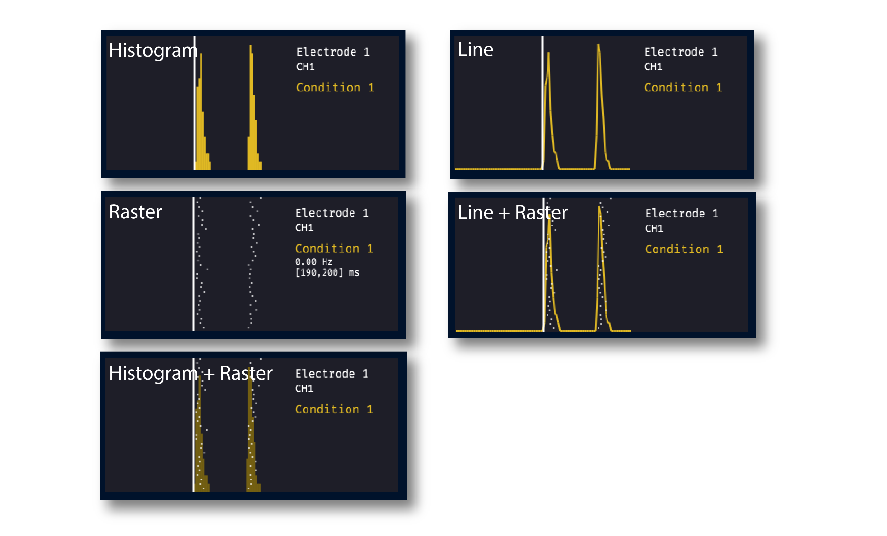

.. _onlinepsth:
.. role:: raw-html-m2r(raw)
   :format: html

#########################
Online PSTH
#########################

.. image:: ../../_static/images/plugins/onlinepsth/onlinepsth-01.png
  :alt: Annotated Event Triggered Average settings interface

.. csv-table:: Aligns spike times to incoming TTL events in order to create a peri-stimulus time histogram displays for an unlimited number of conditions.
   :widths: 18, 80

   "*Plugin Type*", "Sink"
   "*Platforms*", "Windows, Linux, macOS"
   "*Built in?*", "Yes"
   "*Key Developers*", "Clayton Barnes, Josh Siegle"
   "*Source Code*", "https://github.com/open-ephys-plugins/online-psth"

Installing and upgrading
==========================

The Online PSTH plugin is not included by default in the Open Ephys GUI. To install, use **ctrl-P** or **⌘P** to open the Plugin Installer, browse to the "Online PSTH" plugin, and click the "Install" button.

The Plugin Installer also allows you to upgrade to the latest version of this plugin, if it's already installed.

Plugin configuration
======================

The Online PSTH plugin won't work unless there is at least one event-generating plugin and one spike-generating plugin upstream from it in the signal chain. Assuming this is true, use the following steps to configure the plugin:

Define the trigger conditions
------------------------------

Click the "Configure" button to bring up the trigger condition interface:

.. image:: ../../_static/images/plugins/onlinepsth/onlinepsth-02.png
  :alt: Trigger condition interface

By default, there are no conditions defined. Click the "+" button to create a new condition. Each condition has the following parameters:

- *Name*: can be edited by double-clicking
- *TTL Line*: select from lines 1-16 by clicking once on the line name
- *Type*: click on the icon to change the trigger type (see below for details)
- *Color*: click on the colored square to modify the condition's color

The Online PSTH plugin will automatically create a separate histogram for each condition + electrode combination:

.. image:: ../../_static/images/plugins/onlinepsth/onlinepsth-03.png
  :alt: Example histograms

.. note:: When acquisition is active, all condition parameters can be modified, but conditions cannot be added or removed.

Define the window size
------------------------------

It's possible to change the the histogram bin size (default: 25 ms) and pre-event and post-event window size (default: 500 ms) at any time. Note that if the histogram display has been active for many trials without clearing the spikes, recalculating the histograms may be slow.

Display options
======================

Display type
--------------------------

The visualizer can display data as histograms, spike rasters, or lines, with the option to overlay the rasters on top of the histograms or lines:

Display layout
--------------------------

The following options are available for modifying the display layout:

- *Row height* - The height of each row in pixels
- *Num cols* - The number of histograms in each row
- *Overlay condition* - If set to "ON", all of the histograms for each electrode will be overlaid on top of one another. All overlaid histograms use the same y-axis scale.

Triggering methods
======================

The "type" of each condition defines how individual trials are triggered:

- :code:`TTL`: (default) every "ON" TTL event on the specified line triggers a new trial
- :code:`TTL + MSG`: a new trial is only triggered by the specified TTL line after receiving a broadcast message containing the condition name. Broadcast messages can be sent using the HTTP server, or by entering a string into the message center at the bottom of the GUI. This option makes it possible to define many unique conditions using only one TTL input line.
- :code:`MSG`: a new trial is triggered by broadcast messages containing the condition name. The timing of the trial start will be accurate to within one software buffer length (typically around 20 ms)

Plugin usage
=============

* Use the buttons in the upper-right of the editor to open the visualizer in a separate tab or window.

* Mouse over data points to view the corresponding time window and average firing rate in a given bin.

* Press the "clear" button in the top left of the window to reset the histograms.

* Press the "save" button to write the data for each histogram to a JSON file.

Remote control
--------------------------

Condition names and parameters can be updated using configuration messages sent via Open Ephys HTTP Server. Messages must be sent in JSON format with the following fields:

- :code:`condition_index` (required) - 0-based index of the condition to modify

- :code:`name` (optional) - new condition name

- :code:`ttl_line` (optional) - new TTL trigger line (1-based indexing)

- :code:`trigger_type` (optional) - new trigger type (1 = :code:`TTL`, 2 = :code:`TTL + MSG`, 3 = :code:`MSG`)

For example, to change the parameters for the first condition in an Online PSTH plugin with processor ID 102, send the following command to the endpoint :code:`http://localhost:37497/api/processors/102/config`:

.. code-block:: json
  
  {
    "condition_index" : 0,
    "name" : "Custom Name",
    "ttl_line" : 2,
    "trigger_type" : 2
  }

Working with the Spike Sorter
-----------------------------

If a :ref:`spikesorter` plugin is placed upstream of the Online PSTH, any electrodes with sorted units will have the option of displaying histograms for individual units. Spike counts for only one unit can be displayed in each histogram. To view histograms for different units side-by-side, you can create multiple versions of the same condition, and select a different unit for each histogram.

|

