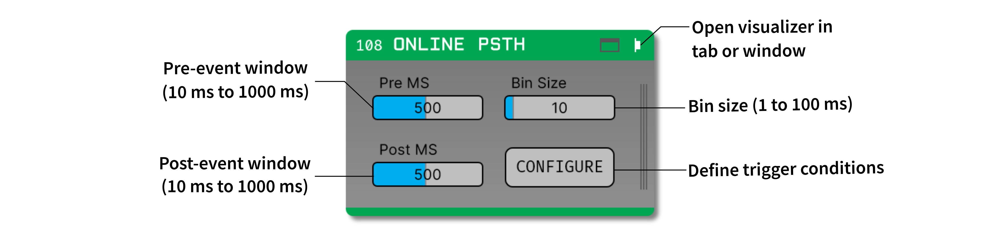

.. _onlinepsth:
.. role:: raw-html-m2r(raw)
   :format: html

#########################
Online PSTH
#########################

.. csv-table:: Aligns spike times to incoming TTL events in order to create a peri-stimulus time histogram display.
   :widths: 18, 80

   "*Plugin Type*", "Sink"
   "*Platforms*", "Windows, Linux, macOS"
   "*Built in?*", "Yes"
   "*Key Developers*", "Clayton Barnes, Josh Siegle"
   "*Source Code*", "https://github.com/open-ephys/plugin-GUI/tree/master/Plugins/EvntTrigAvg"

Plugin configuration
======================

The Event Triggered Average plugin won't work unless there is at least one event-generating plugin and one spike-generating plugin upstream from it in the signal chain. Assuming this is true, use the following steps to configure the plugin:

1. Select the event channel to use for triggered (mandatory)

2. Enter the histogram bin size (default: 10 ms).

3. Enter the histogram window size (default: 1000 ms).

Plugin usage
=============

* Use the buttons in the upper-right of the editor to open the visualizer in a separate tab or window to scroll through detected electrodes.

* Mouse over data points to view the corresponding time window and number of spikes in the bottom right of the window.

* Press the "clear" button in the top left of the window to reset the histograms

By default, the module creates histograms per detected data channel. Sort spikes in the spike sorter module to generate a histogram with the corresponding ID and spike data. These sorted ID histograms will appear beneath and in the same color as the data channels they originate from in the Event Triggered Average window.

