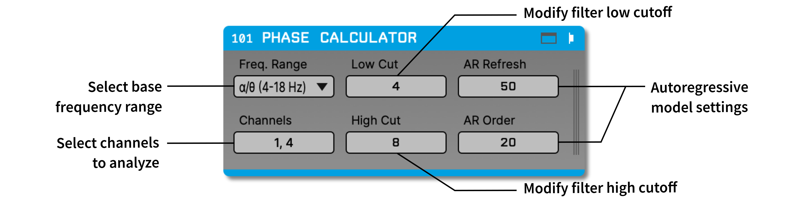

.. _phasecalculator:
.. role:: raw-html-m2r(raw)
   :format: html

################
Phase Calculator
################

.. csv-table:: Estimates the phase of a continuous input signal within a specified passband. It can be used to perform phase-specific closed-loop stimulation, typically in combination with the :ref:`crossingdetector`.
   :widths: 18, 80

   "*Plugin Type*", "Filter"
   "*Platforms*", "Windows, Linux, macOS"
   "*Built in?*", "No"
   "*Key Developers*", "Ethan Blackwood, Mark Schatza"
   "*Source Code*", "https://github.com/open-ephys-plugins/phase-calculator"

.. note:: The Phase Calculator is able to estimate phase more precisely than the :ref:`phasedetector` plugin, which uses a simple peak/trough/zero crossing detection.

Installing and upgrading
###########################

The Phase Calculator plugin is not included by default in the Open Ephys GUI. To install, use **ctrl-P** or **⌘P** to access the Plugin Installer, browse to the "Phase Calculator" plugin, and click the "Install" button.

The Plugin Installer also allows you to upgrade to the latest version of this plugin, if it's already installed.

Recommended signal chain
#########################

The input to the Phase Calculator should be a wideband, *unfiltered* signal. The Phase Calculator includes its own internal filters optimized for phase estimation.

Because the Phase Calculator overwrites incoming channels with the estimated phase, there should be a :ref:`splitter` in the signal chain if the original signals are needed for further downstream processing.

This image shows the output of the Phase Calculator with two channels (1 and 4) being analyzed.

.. image:: ../../_static/images/plugins/phasecalculator/phase_calculator_demo.png
  :alt: Phase Calculator demo

Plugin configuration
######################

.. note:: The Phase Calculator takes a few seconds to initialize, so please be patient!

Channel selection
-----------------

Since the phase estimation algorithm is somewhat processor-intensive, by default only the first input channel of each stream is enabled. Use the **Channels** button to select additional channels as needed. Each selected channel will be transformed from a continuously sampled sequence of voltages into an estimate of the frequency-specific phase between -180 to +180.

Defining the frequency band of interest
----------------------------------------

First, use the :code:`FREQ RANGE` drop-down menu to select the general frequency range to analyze.
This determines which of the pre-designed Hilbert transformer filters will be used internally. Note
that frequencies below 4 Hz (delta band) are too low to calculate an accurate phase estimate.

Next, use the :code:`LOW_CUT` and :code:`HIGH_CUT` parameters to define a more specific passband.
Changing the general frequency range will automatically set a default high and low cut, but they can
be edited to filter to any band within the specified range.

* :code:`AR_REFRESH` and :code:`AR_ORDER` control the autoregressive model used to predict the "future" portion of the Hilbert buffer. AR parameters are estimated using Burg's method. TThe default settings generally work well, but alternate values (particularly a lower order) may improve the estimate in certain cases.

Visualization
--------------

Clicking the tab or window button opens the "event phase plot" view. This will plot the phase of incoming TTL events relative to a continuous channel of interest. The continuous channel must be one that is selected for processing in the **Channels** parameter editor.

This visualization can be used to measure the actual phase of hardware TTL outputs (e.g. from the :ref:`arduinooutput` or :ref:`pulsepal`). One simply needs to connect the output events to a TTL input line on the data acquisition hardware, and then make sure the correct input is selected in the Phase Calculator visualizer.

.. image:: ../../_static/images/plugins/phasecalculator/phase_calculator_visualizer.png
  :alt: Phase Calculator visualizer

|
