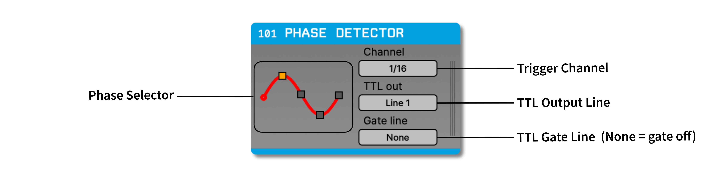
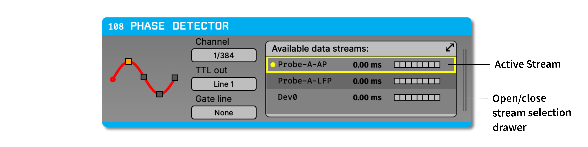

.. _phasedetector:
.. role:: raw-html-m2r(raw)
   :format: html

################
Phase Detector
################

.. csv-table:: Emits events when a continuous signal arrives at a specific "phase," which really means a peak, falling zero-crossing, trough, or rising zero-crossing. It was originally designed to trigger output at specific phases of an 8 Hz theta oscillation in mouse hippocampus. 
   :widths: 18, 80

   "*Plugin Type*", "Filter"
   "*Platforms*", "Windows, Linux, macOS"
   "*Built in?*", "Yes"
   "*Key Developers*", "Josh Siegle"
   "*Source Code*", "https://github.com/open-ephys/plugin-GUI/tree/master/Plugins/PhaseDetector"

.. note:: The Phase Detector uses the simplest possible algorithm to trigger outputs when an incoming signal reaches a peak, trough, or zero-crossing. If you would like to perform more precise phase-specific stimulation, you should use the :ref:`phasecalculator` plugin, which uses a Hilbert transform to predict the timing of each cycle with a higher degree of accuracy.

Recommended signal chain
#########################

The Phase Detector works best when triggering on relatively low-frequency signals (below 15 Hz), with very narrow :ref:`bandpassfilter` placed immediately before it. Therefore, the plugin immediately preceding the Phase Detector should be a Bandpass Filter with the high and low cut configured to be a few Hz above and below the frequency of interest (e.g. 6-10 Hz for triggering on an 8 Hz theta oscillation). 

All continuous channels pass through the Phase Detector unchanged.

Plugin configuration
######################

There are four parameters for each Phase Detector:

* :code:`TTL_OUT`: The TTL output line to use. When the Phase Detector detects a peak, trough, or zero-crossing, it will emit events on this line. If you're using the output of this plugin to trigger closed-loop feedback, be sure that this line does not overlap with those used by incoming events from your data source or other plugins.

* :code:`GATE_LINE`: The TTL input line used to gate the output of this plugin. If this is set to 0, then the gate is disable and all relevant events will be emitted. If this is set to line 1-16, then the Phase Detector will only generate outputs when the selected line is "high."

* :code:`Channel`: The continuous channel that will be analyzed. It's possible to select any incoming channel within the currently active stream (see below for details about how this plugin handles multiple incoming streams).

* :code:`Selected phase`: In the upper right of the editor, there's an interface for choosing the phase on which events will be triggered. By default, the peak is selected, but it's also possible to choose falling zero-crossings, the trough, or rising zero-crossings.

Working with multiple data streams
###################################

The Phase Detector can only process one continuous channel from one data stream at a time. If the Phase Detector has multiple data streams as input, you can specify which stream to use by clicking the vertical lines on the right of the editor to open the stream selection drawer. Click the arrow buttons or use the popup menu to select the active stream for this plugin.

To trigger outputs on several continuous channels, or at different phases, you can place multiple Phase Detectors in succession.''