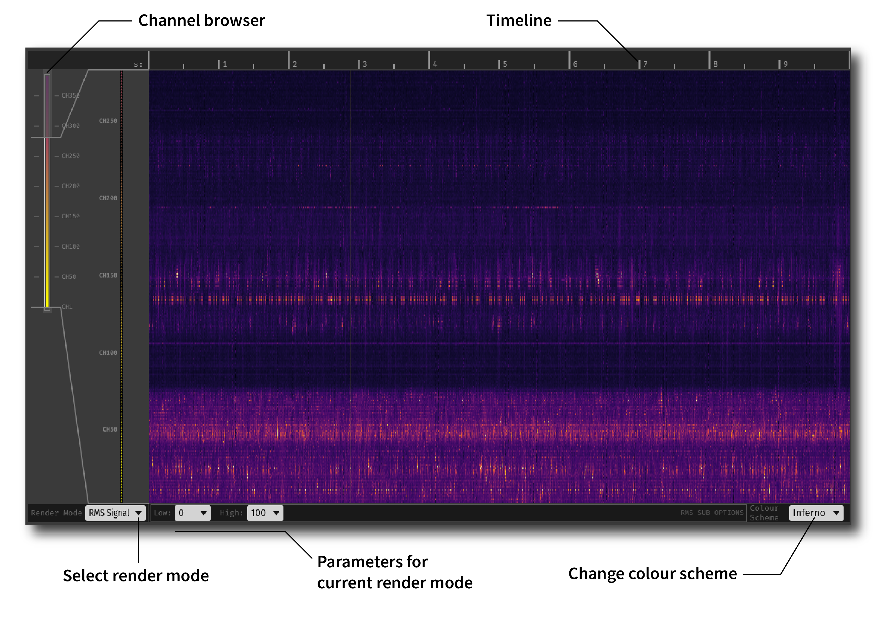

.. _probeviewer:
.. role:: raw-html-m2r(raw)
   :format: html

################
Probe Viewer
################

|

.. csv-table:: Visualizes the signal from a linear probe as a heatmap (time x channels). Can be configured to show RMS signal, spike rate, or power in different frequency bands.
   :widths: 18, 80

   "*Plugin Type*", "Sink"
   "*Platforms*", "Windows, Linux, macOS"
   "*Built in?*", "No"
   "*Key Developers*", "Josh Siegle, K. Michael Fox"
   "*Source Code*", "https://github.com/open-ephys-plugins/probe-viewer"

.. note:: The Probe Viewer plugin is not yet available for GUI version 0.6.X.

Plugin configuration
######################

|
|

