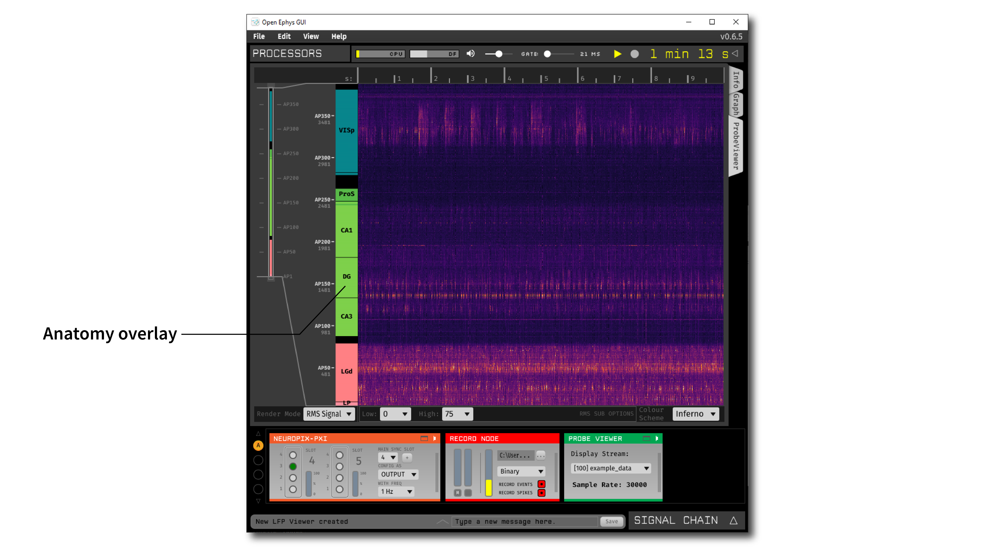
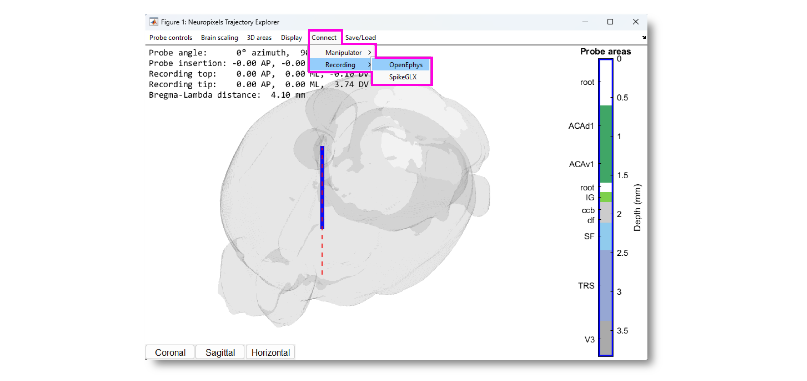

.. _probeviewer:
.. role:: raw-html-m2r(raw)
   :format: html

################
Probe Viewer
################

.. image:: ../../_static/images/plugins/probeviewer/probeviewer-01.png
  :alt: Annotated Probe Viewer editor

.. csv-table:: Visualizes the signal from a linear probe as a heatmap (time x channels). Can be configured to show RMS signal, spike rate, or power in different frequency bands.
   :widths: 18, 80

   "*Plugin Type*", "Sink"
   "*Platforms*", "Windows, Linux, macOS"
   "*Built in?*", "No"
   "*Key Developers*", "Josh Siegle, K. Michael Fox, Anjal Doshi"
   "*Source Code*", "https://github.com/open-ephys-plugins/probe-viewer"

Installing and upgrading
###########################

The Probe Viewer plugin is not included by default in the Open Ephys GUI. To install, use **ctrl-P** or **⌘P** to access the Plugin Installer, browse to the "Phase Calculator" plugin, and click the "Install" button.

The Plugin Installer also allows you to upgrade to the latest version of this plugin, if it's already installed.

Recommended signal chain
#########################

The Probe Viewer works best with data acquired by linear silicon probes (especially Neuropixels), but it can be used with any type of input source. It can only visualize data from one stream at a time, but the stream can be changed while acquisition is active (this feature is new in v0.6.x).

Plugin configuration
#####################

The Probe Viewer visualizer interface (accessed by clicking the "tab" or "window" buttons at the top right of the plugin editor) looks like this:

.. image:: ../../_static/images/plugins/probeviewer/probeviewer-02.png
  :alt: Annotated Probe Viewer visualizer

To change the subset of channels to be viewed, drag the edges of the bounding box in the channel browser interface on the left-hand side of the visualizer. The currently displayed channels are shown as circular icons in the zoomed-in view to the right.

Render modes
------------

1. **RMS Signal** - Color corresponds to the overall amplitude of the signal on each channel (computed as root-mean-squared signal amplitude within each pixel window). The minimum and maximum of the color scale can be adjusted.

2. **Freq. Band Power** - Color corresponds to the spectral power at a given center frequency. For example, this can be used to visualize theta-band (8 Hz) power across depth.

3. **Spike Rate** - Color corresponds to the number of threshold crossings per unit time within each pixel window. The threshold voltage can be adjusted.

Anatomy overlay
#####################

As of plugin version 0.3.1, the Probe Viewer can display information about the brain regions that a Neuropixels probe passes through via integration with external software. An example of this is shown in the image below:

Using this feature requires that a :ref:`neuropixelspxi` plugin is upstream of the Probe Viewer.

This information can be sent to the Probe Viewer in at least two ways:

Via Pinpoint
------------------

`Pinpoint <https://virtualbrainlab.org/index.html>`__ is open-source software for planning Neuropixels insertions. In order to send anatomical information from Pinpoint to Open Ephys, you need to use the Desktop version (not the web-based version).

1. Add at least one probe to the Pinpoint scene
2. Press Escape to open the settings menu
3. Navigate to the "API" tab
4. Make sure the "OpenEphys API" section points to the correct endpoint. This should be :code:`http://localhost:37497` if you're running Open Ephys and Pinpoint on the same machine; otherwise, replace :code:`localhost` with the IP address of the Open Ephys machine.
5. Click the checkbox to connect to the Open Ephys GUI
6. If the Probe Viewer processor ID (Viewer Processor #) is not found automatically, use the drop-down menu to select the correct one.
7. Use the interface on the right to associate probes in the Pinpoint scene to probes in the Open Ephys GUI.

After that, the anatomical information in the Probe Viewer should update every time the associated probe in moved in Pinpoint.

See `this tutorial <https://virtualbrainlab.org/pinpoint/tutorial.html#api>`__ for alternative instructions on how to send anatomical information from Pinpoint to Open Ephys.

Via Neuropixels Trajectory Explorer
------------------------------------

`Neuropixels Trajectory Explorer <https://github.com/petersaj/neuropixels_trajectory_explorer/wiki>`__ is insertion-planning software that can be run from within MATLAB or as a standalone application.

From the "Connect" menu, select "Recording" then "OpenEphys".

Assuming the Probe Viewer has a :ref:`neuropixelspxi` plugin upstream, the anatomical overlay should update every time the probe in moved in Neuropixels Trajectory explorer.

See `this tutorial <https://github.com/petersaj/neuropixels_trajectory_explorer/wiki/Recording-software-interfacing>`__ for additional information on how to send anatomical information from Neuropixels Trajectory Explorer to Open Ephys.

Via config messages
--------------------

The Probe Viewer accepts config messages in the following format:

.. code-block::

  <probe_name>;<start1>-<end1>,<region_ID_1>,<hex_color_1>;<start2>-<end2>,...

* :code:`probe_name` : the name of a Neuropixels probe in the Neuropix-PXI plugin (with no spaces)
* :code:`start1`: the index of the first electrode in region 1
* :code:`end1`: the index of the last electrode in region 1
* :code:`region_ID_1`: the abbreviated name of region 1 (e.g. "VISp")
* :code:`hex_color_1`: the 6-character hex color ID for region 1

For example, to update a probe named :code:`Probe A`` in a Probe Viewer with processor ID :code:`105`, you can send the following JSON string using the Python :code:`requests` library:

.. code-block:: Python

  r = requests.put(
      "http://localhost:37497/api/processors/105/config",
      json={"text" : "ProbeA;0-69,PT,FF909F;70-97,PVT,FF909F;98-161,-,000000;162-173,-,000000,174-185,SF,90CBED;..."})

Note that the start and end indices refer to *electrodes*, not *channels*. The Probe Viewer will automatically display the anatomical information for the electrodes that are selected. For example, for a Neuropixels 1.0 probe, you can send region info for up to 960 electrodes, but only 384 will be displayed at a time.

|
|
