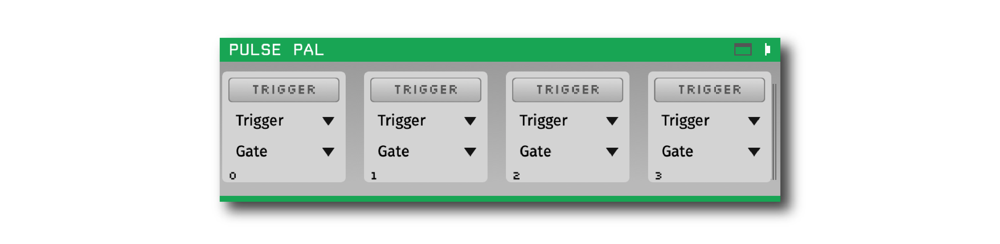
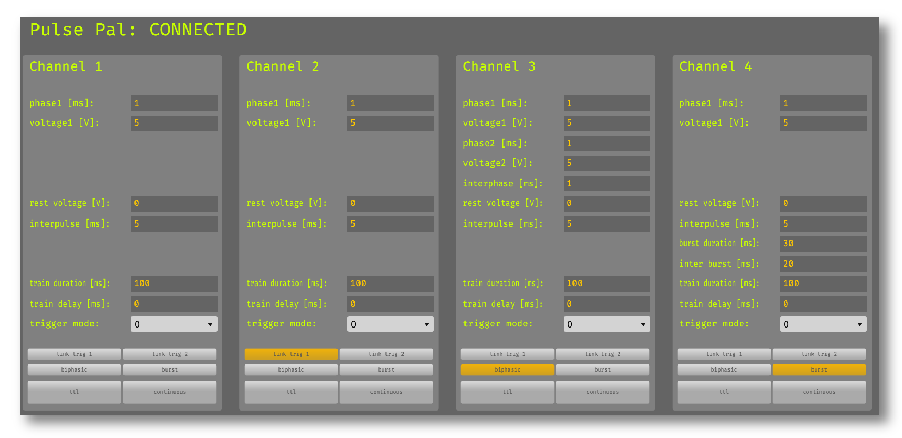

.. _pulsepal:
.. role:: raw-html-m2r(raw)
   :format: html

################
Pulse Pal
################

.. csv-table:: Triggers the outputs of a Pulse Pal, an open-source pulse train generator developed and sold by Sanworks.
   :widths: 18, 80

   "*Plugin Type*", "Sink"
   "*Platforms*", "Windows, Linux, macOS"
   "*Built in?*", "No"
   "*Key Developers*", "Josh Siegle, Michelle Fogerson, Alessio Buccino, Mikkel Lepperod, Svenn-Arne Dragly"
   "*Source Code*", "https://github.com/open-ephys-plugins/pulse-pal-output"

Installing and upgrading
###########################

The Pulse Pal plugin is not included by default in the Open Ephys GUI. To install, use **ctrl-P** or **⌘P** to open the Plugin Installer, browse to the "Pulse Pal Output" plugin, and click the "Install" button.

The Plugin Installer also allows you to upgrade to the latest version of this plugin, if it's already installed.

Hardware Requirements
######################

This plugin requires that a Pulse Pal (v1.0 or v2.0) is connected to the computer running the Open Ephys GUI via USB. Make sure the Pulse Pal is plugged in before adding the Pulse Pal plugin to the signal chain. If a Pulse Pal is not detected, the plugin will be disabled. To re-try connecting to the device, delete the plugin and add it back to the signal chain.

You can test that the plugin is working by pressing the **trigger** button for any of the four channels of the Pulse Pal. When the button is pressed, the pulse train for the corresponding channel should begin immediately.

Plugin configuration
######################

Trigger and gate channels
---------------------------

The Pulse Pal plugin can respond to incoming events in two ways:

1. Events on a particular channel can directly trigger the corresponding Pulse Pal channel (if no "Gate" is set)

2. ON and OFF events can gate the outputs that are triggered by a different channel. That is, if channel A is ON (high, 1, etc.), incoming events from channel B will be able to trigger the Pulse Pal. If channel A is OFF (low, 0, etc.), incoming events from channel B will have no effect. This can be used to activate or deactivate closed-loop feedback for different experimental conditions.

Each of the four Pulse Pal output channels can have a unique trigger and/or gate channel. Each input line that can be used for triggering and gating is defined by:

1. The ID of the source node (3-digit number)

2. The name of the associated data stream

3. The index of the TTL line

For example, an event generated by a plugin with ID of 101 on TTL line 1 of a stream called "example_data" would be listed as **101 (example_data) TTL1**. If this line is selected as the trigger for Pulse Pal output channel 1, this output will only be triggered by "ON" TTL events that match these three criteria.

Pulse train settings
---------------------------

The pulse train settings for each output channel are configured in the Pulse Pal Output's visualizer (accessed by clicking the tab or window buttons in the upper right of the plugin editor):

Refer to the `Pulse Pal wiki <https://sites.google.com/site/pulsepalwiki/parameter-guide?authuser=0>`__ for the definition of each of these parameters.

|
