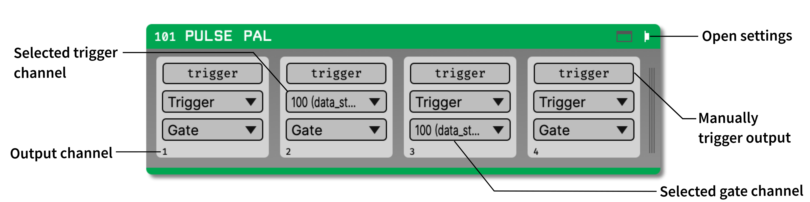

.. _pulsepal:
.. role:: raw-html-m2r(raw)
   :format: html

################
Pulse Pal
################

|

.. csv-table:: Allows the GUI to trigger the channels of a `Pulse Pal <http://www.open-ephys.org/pulsepal/>`__, an open-source pulse train generator.
   :widths: 18, 80

   "*Plugin Type*", "Sink"
   "*Platforms*", "Windows, Linux, macOS"
   "*Built in?*", "Yes"
   "*Key Developers*", "Josh Siegle, Michelle Fogerson"
   "*Source Code*", "https://github.com/open-ephys/plugin-GUI/tree/master/Plugins/PulsePalOutput"

.. note:: The Pulse Pal plugin is not yet available for GUI version 0.6.X.

Plugin configuration
######################

If a Pulse Pal is connected to the computer running the GUI, it should be automatically detected. Make sure the Pulse Pal is plugged in before you add the module to the signal chain.

You can test that the module is working by pressing the "TRIGGER" button for any of the four channels of the Pulse Pal. The button should trigger the corresponding pulse train.

The processor can respond to incoming events in two ways:

1. Events on a particular channel can directly trigger the corresponding Pulse Pal channel (if no "Gate" is set)

2. Event ON and OFF events can gate the triggers from another channel. That is, if channel A is ON (high, 1, etc.), incoming events from channel B will be able to trigger the Pulse Pal. If channel A is OFF (low, 0, etc.), incoming events from channel B will have no effect. This can be used to activate or deactivate closed-loop feedback for different experimental conditions.

