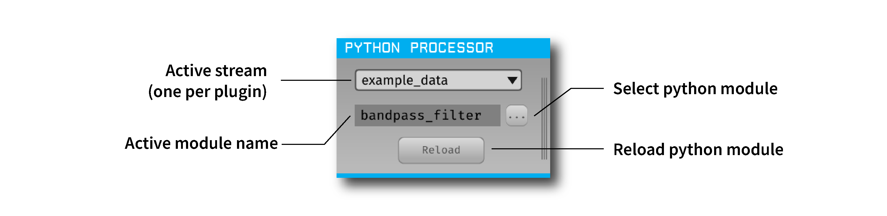

.. _pythonprocessor:
.. role:: raw-html-m2r(raw)
   :format: html

#################
Python Processor
#################

.. csv-table:: Modifies incoming continuous data and handles events and spikes using custom code written in Python.
   :widths: 18, 80

   "*Plugin Type*", "Filter"
   "*Platforms*", "Windows, Linux, macOS"
   "*Built in?*", "No"
   "*Key Developers*", "Spencer Blackwood, Anjal Doshi"
   "*Source Code*", "https://github.com/open-ephys-plugins/python-processor"

Installing and upgrading
###########################

The Python Processor plugin is not included by default in the Open Ephys GUI. To install, use ctrl-P or ⌘P to open the Plugin Installer, browse to the "Python Processor" plugin, and click the "Install" button.

The Plugin Installer also allows you to upgrade to the latest version of this plugin, if it's already installed.

Setting up a Python environment
####################################

This plugin must be able to find a local installation of Python version **3.10** with :code:`numpy` installed correctly.

To avoid conflicts with other Python installations, we recommend using `Conda <https://docs.conda.io/projects/conda/en/stable/index.html>`__ to manage your Python environments. You can install Conda either using Miniconda or Anaconda by following the instructions `here <https://docs.conda.io/projects/conda/en/stable/user-guide/install/index.html>`__. More information on how to use Conda can be found `here <https://docs.conda.io/projects/conda/en/stable/user-guide/getting-started.html>`__.

To create a new Conda environment that uses Python 3.10, enter the following :code:`conda` command in your Anaconda prompt (Windows) or Terminal (Linux and macOS):

.. code-block:: bash

   conda create -n oe-python-plugin python=3.10

This will create a new Conda environment with Python 3.10 installed. Then, activate this newly created environment like so:

.. code-block:: bash

   conda activate oe-python-plugin

After this, :code:`numpy` needs to be installed in the same environment as follows:

.. code-block:: bash

   conda install numpy

Setting the Python Interpreter Path
-------------------------------------

After creating a dedicated Python 3.10 Conda environment, you can add the plugin to any signal chain. When inserted, the plugin prompts you to select the Python Home directory—the location of the Python interpreter. Providing this path lets the plugin use libraries from a specific environment at runtime, without relying on the system PATH.

With Conda, this is typically the path to the environment's Python interpreter inside Conda's installation directory. For example, if you created an environment named :code:`oe-python-plugin`, the path would be:

* Windows: :code:`C:\\Users\\<username>\\miniconda3\\envs\\oe-python-plugin`
* macOS - :code:`~/miniconda3/envs/oe-python-plugin`
* Linux - :code:`~/miniconda3/envs/oe-python-plugin`

If you installed Anaconda instead of Miniconda, the folder may be named :code:`Anaconda` or :code:`Anaconda3`.

After you select the path, the plugin should load into the signal chain. If it cannot load the interpreter, it will prompt for the Python Home path again—this usually indicates an incorrect path or an incompatible Python version (not 3.10). If the problem persists, close and relaunch the GUI to reset the PATH variables.

Creating & loading a Python Module
####################################

After the plugin is added to the signal chain, you must load a Python module (script) into the GUI. This script should follow the structure of the `processor template <https://github.com/open-ephys-plugins/python-processor/blob/main/Modules/template/processor_template.py>`__ available in the plugin's GitHub repository. The :code:`PyProcessor` class provides the following functions to the Python module, enabling interaction with incoming data:

.. py:method:: __init__(processor, num_channels, sample_rate)

   A new processor is initialized when the module is imported/reloaded, or the plugin's settings are updated (i.e., the number of input channels changes, or a new stream is selected).
   
   :param object processor: Python Processor class object used for adding events from python.
   :param int num_channels: number of input channels from the selected stream
   :param float sample_rate: the selected stream's sample rate

.. py:method:: process(data)

   Process each incoming data buffer. Any modifications to the :code:`data` variable will be passed to downstream processors.

   :param ndarrary data: N x M numpy array, where N = num_channles, M = num of samples in the buffer.

.. py:method:: start_acquisition()

   Called before starting acquisition. Allows the script to do some setup/initialization before acquisition starts.

.. py:method:: stop_acquisition()

   Called after stopping acquisition. Allows the script to do some finalization after acquisition stops.

.. py:method:: start_recording(recording_dir)

   Called before starting recording. Informs the plugin that the GUI is now recording data, in case it needs to save any information of its own.

   :param str recording_dir: directory where recording related files are supposed to be stored

.. py:method:: stop_recording()

   Called before stopping recording. Informs the plugin that the GUI is no longer recording data.

.. py:method:: handle_ttl_event(source_node, channel, sample_number, line, state)
   
   Handle each incoming ttl event.

   :param int source_node: id of the processor this event was generated from
   :param str channel: name of the event channel
   :param int sample_number: sample number of the event
   :param int line: the line on which event was generated (0-255) 
   :param bool state: event state True (ON) or False (OFF)

.. py:method:: handle_spike(source_node, electrode_name, num_channels, num_samples, sample_number, sorted_id, spike_data)
   
   Handle each incoming spike.
   
   :param int source_node: id of the processor this spike was generated from
   :param str electrode_name: name of the electrode
   :param int num_channels: number of channels associated with the electrode type
   :param int num_samples: total number of samples in the spike waveform 
   :param int sample_number: sample number of the spike
   :param int sorted_id: the sorted ID for this spike
   :param ndarrary spike_data: waveform as N x M numpy array, where N = num_channels & M = num_samples (read-only).

Using this template, any type of data processing can be done in Python in real-time. The data buffer should be overwritten with the new processed data, which will be received by downstream processors.

.. Note:: Pay careful attention to the latency introduced by processing data in Python, especially with high-channel-count data.

----------------------

You can also send TTL events from Python back to C++. These events are added to the event buffer and can be processed by downstream plugins. This is accomplished using a C++ function exposed to Python through the embedded :code:`oe_pyprocessor` module.

.. py:method:: add_python_event(line, state)

   Sends a TTL event from Python to C++.

   :param int line: event line number [0-255]
   :param bool state: event state True (ON) or False (OFF)

To use this function, import the :code:`oe_pyprocessor` module in your script. Then, call the C++ function using the processor object provided in the :py:meth:`__init__` method, for example: :code:`self.processor.add_python_event(line, state)`

----------------------

An example script is provided in the plugin's GitHub repository in the form of a `Butterworth Bandpass filter <https://github.com/open-ephys-plugins/python-processor/blob/main/Modules/examples/bandpass_filter.py>`__. This filter is the same as the one used in the GUI's built-in :ref:`bandpassfilter` plugin.

Limitations
######################

* Unlike continuous data and events, sending spikes back from Python is not currently possible.

* With increasing channel counts, the processing latency may also increase, potentially affecting real-time performance.

* Only one instance of the plugin is allowed at a time in a signal chain. Having multiple instances of the plugin in the same signal chain will result in random crashes. 

* Creating visualizations in real-time using Python libraries such as :code:`matplotlib` is not possible.
