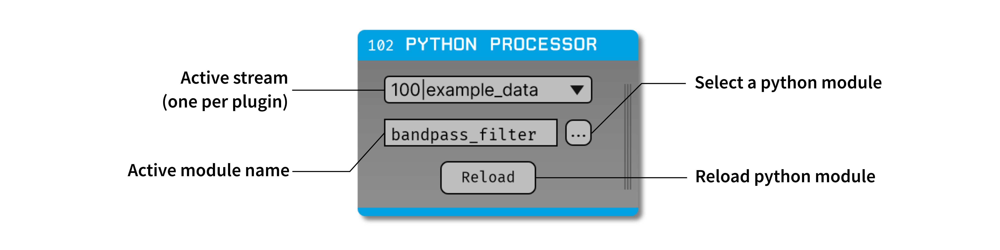

.. _pythonprocessor:
.. role:: raw-html-m2r(raw)
   :format: html

#################
Python Processor
#################

.. csv-table:: A plugin for running custom Python scripts in the Open Ephys GUI signal chain.
   :widths: 18, 80

   "*Plugin Type*", "Filter"
   "*Platforms*", "Windows, Linux, macOS"
   "*Built in?*", "No"
   "*Key Developers*", "Spencer Blackwood, Anjal Doshi"
   "*Source Code*", "https://github.com/open-ephys-plugins/python-processor"

Installing and upgrading
###########################

The Python Processor plugin is not included by default in the Open Ephys GUI. To install, use **ctrl-P** or **⌘P** to open the Plugin Installer, browse to the "Python Processor" plugin, and click the "Install" button.

The Plugin Installer also allows you to upgrade to the latest version of this plugin, if it's already installed.

Plugin configuration
######################

Before starting using the plugin, some pre-configuration is necessary. Although the plugin comes with a Python Interpreter built-in, a separate Python installation is required for the Interpreter to find the necessary library packages. 

As the plugin is complied against :code:`Python 3.10`, a Python installation of the same version is required. Along with that, :code:`numpy` needs to be installed in the same environment.

To make the process of setting up a custom Python version and to avoid conflicts with your existing & future Python installations, we recommend installing and setting up a `Conda <https://docs.conda.io/projects/conda/en/stable/index.html>`__ environment. You can install Conda either using Miniconda or Anaconda by following the instructions `here <https://docs.conda.io/projects/conda/en/stable/user-guide/install/download.html>`__. More information on how to use Conda can be found `here <https://docs.conda.io/projects/conda/en/stable/user-guide/getting-started.html>`__.

.. important:: As the GUI currently only supports x86_64 architecture on macOS, Conda needs to be installed using x86_64 version of Miniconda / Anaconda installer. 

Setting up the Conda environment
---------------------------------

To create a new Conda environment with Python 3.10, enter the following conda command in your prompt:

.. code-block:: bash

   conda create -n ENVNAME python=3.10

This will create a new Conda environment with Python 3.10 installed. Then, activate this newly created environment. 

.. code-block:: bash

   conda activate ENVNAME

After this, :code:`numpy` needs to be installed in the same environment as follows:

**Windows**

Due to some limitations, numpy needs to be installed using the :code:`pip` package manager. Using Conda's numpy package causes the script to fail to load. 

.. code-block:: bash

   pip install numpy

**Linux & macOS**

On Linux & macOS, numpy can be installed with either conda or pip. 

.. code-block:: bash

   conda install numpy

Setting the Python Interpreter Path
-------------------------------------

Once a Conda environment is setup as mentioned above, the plugin is ready to be loaded into any desired signal chain. As soon as the plugin is dropped into the signal chain, it asks for the path to Python Home directory, which is where the Python Interpreter is located. This allows the plugin to be flexible in terms of which Python libraries to use during runtime, and not rely on the system PATH to figure out Python Home location. 

When using Conda, this path is usually where the Conda environment got created. Some examples of where it may be located: 

* Windows 10 with Anaconda3 and username “jsmith” - :code:`C:\\Users\\jsmith\\miniconda3`

* macOS - :code:`~/miniconda3` or :code:`/Users/jsmith/miniconda3`

* Linux - :code:`~/miniconda3` or :code:`/home/jsmith/miniconda3`

The Python image in a conda environment called “my-env” might be in a location such as :code:`${USERHOME}\\miniconda3\\envs\\my-env`

If you have installed Anaconda instead of Miniconda, the folder might be named: :code:`Anaconda` or :code:`Anaconda3`

Once, the path is selected, if everything went well, the plugin will load into the signal chain successfully. If it fails to load the Python Interpreter, then it will ask for the PATH to Python Home again. This means, either the provided PATH was incorrect, or a wrong version of Python was installed. If this happens, it is recommended to close and relaunch the GUI to reset the PATH variables. 

Creating & Loading a Python Module
-----------------------------------

Once the plugin is loaded into the signal chain, to do the actual processing of the incoming data in Python, a python module (script) needs to be loaded into the GUI. This module needs to be generated using the `processor template <https://github.com/open-ephys-plugins/python-processor/blob/main/Modules/template/processor_template.py>`__ provided in the plugin's GitHub repository. The :code:`PyProcessor` class is designed to expose the following functions to the Python module to allow interaction with the incoming data.  

.. py:function:: __init__(self, num_channels, sample_rate)

   A new processor is initialized when the module is imported/reloaded or plugin settings are updated

   :param num_channels: number of input channels from the selected stream
   :param sample_rate: Selected stream's sample rate

.. py:function:: process(self, data)

   Process each incoming data buffer.

   :param data: incoming data buffer
   :type data: ndarray

.. py:function:: start_acquisition(self)

   Called before starting acquisition. Allows the script to do some setup/initialization before acquisition starts.

.. py:function:: stop_acquisition(self)

   Called before stopping acquisition. Allows the script to do some finalization before acquisition stops.

.. py:function:: start_recording(self, recording_dir)

   Called before starting recording. Allows the script to do some setup/initialization before recording starts.

   :param recording_dir: directory where recording related files are supposed to be stored

.. py:function:: stop_recording(self)

   Called before stopping recording. Allows the script to do some finalization before recording stops.

Using this template, any type of data processing can be done in Python in real-time and the data buffer `can` be overwritten with the new processed data which will be received by downstream processors.

.. Note:: With the processing being done in Python, there are some obvious constraints such as increased latency, especially with high-channel-count data. 

One example script is provided in the plugin's GitHub repository in the form of a `Butterworth Bandpass filter <https://github.com/open-ephys-plugins/python-processor/blob/main/Modules/examples/bandpass_filter.py>`__. This filter is the same as the one used in the Filter Node plugin.
