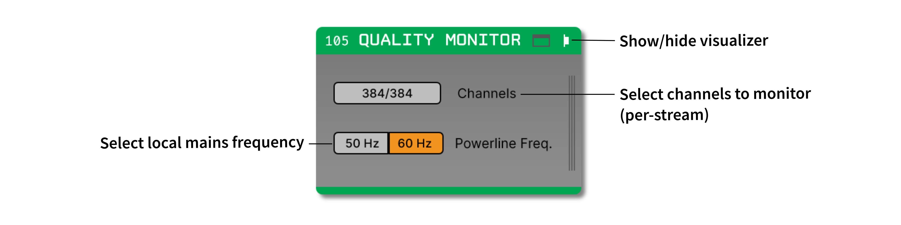
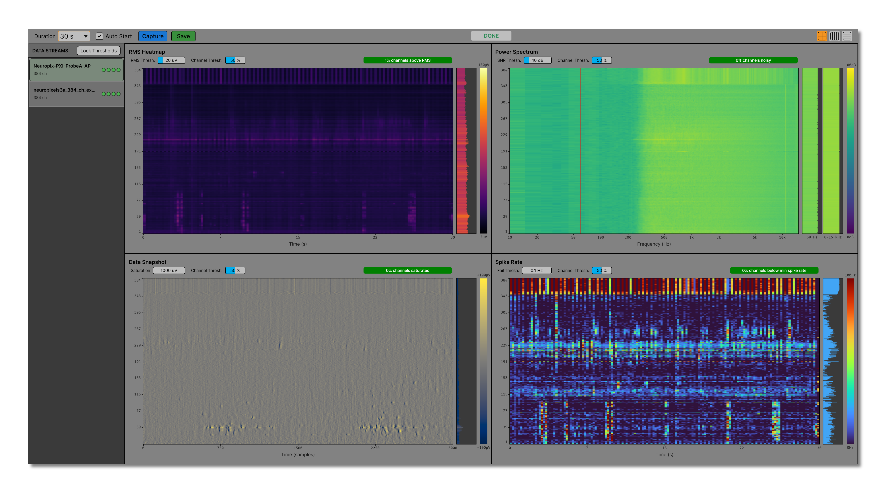

.. _qualitymonitor:
.. role:: raw-html-m2r(raw)
   :format: html

###############
Quality Monitor
###############

.. csv-table:: Monitors the health of continuous electrophysiology data in real time, with per-stream summaries for RMS noise, powerline and high-frequency noise, raw voltage snapshots, and spike-rate activity.
   :widths: 18, 80

   "*Plugin Type*", "Sink"
   "*Platforms*", "Windows, Linux, macOS"
   "*Built in?*", "No"
   "*Key Developers*", "Anjal Doshi, Josh Siegle"
   "*Source Code*", "https://github.com/open-ephys-plugins/quality-monitor"

Installing and upgrading
########################

The Quality Monitor plugin is not included by default in the Open Ephys GUI. To install, use **ctrl-P** or **⌘P** to open the Plugin Installer, browse to the "Quality Monitor" plugin, and click the "Install" button.

The Plugin Installer also allows you to upgrade to the latest version of this plugin, if it's already installed.

Recommended signal chain
########################

Quality Monitor should be placed downstream of the source or filters whose data quality you want to assess. It is intended for high-channel-count extracellular recordings, especially Neuropixels data, but it can monitor any incoming data stream that contains electrode channels.

The plugin creates one sidebar entry for each incoming data stream that contains electrode channels. The four diagnostic panels always display metrics for the data stream that is selected in this sidebar. If depth, shank, or position metadata is available from the upstream source, channels are sorted by probe geometry before being displayed. Otherwise, channels are shown in their original stream order.

Because Quality Monitor is a Sink plugin, it does not modify continuous data or event data that pass to downstream processors.

Plugin configuration
####################

The plugin editor includes two setup controls:

* **Channels** selects which electrode channels from each stream are included in quality monitoring. If no subset is selected, all electrode channels are monitored.

* **Powerline Freq.** sets the local mains frequency used by the spectrum metric. Choose **50 Hz** or **60 Hz** before starting the analysis.

Most analysis settings are adjusted in the visualizer canvas rather than in the compact editor. Open the canvas by clicking the "tab" or "window" buttons at the top right of the plugin editor.

Running an analysis
###################

The top bar of the Quality Monitor canvas contains controls for the current analysis run:

* **Duration** selects a 10 s, 30 s, or 60 s analysis window.

* **Auto Start** begins processing automatically whenever acquisition starts. When this option is off, acquisition can be running while Quality Monitor waits for a manual capture.

* **Capture / Stop** manually starts or aborts a run. The button is enabled only while acquisition is active.

* **Save** exports results after all streams have completed the selected analysis duration.

* **Layout buttons** switch the four diagnostic panels between a 2 × 2 grid, a horizontal stack, and a vertical stack.

The status indicator in the header shows whether the plugin is idle, running, or done. The **DATA STREAMS** sidebar lists all monitored input streams and shows four small status indicators for the RMS, spectrum, snapshot, and spike-rate metrics. Selecting a different stream updates all four panels and their threshold controls.

Thresholds and pass/fail status
###############################

Each diagnostic panel has two adjustable thresholds in its header for the currently selected input stream. The first threshold determines which channels are counted as problematic for that metric. The **Channel Thresh.** value determines what percentage of problematic channels is allowed before the metric fails.

For example, if the RMS threshold is set to 20 μV and the RMS channel threshold is set to 50%, the RMS metric fails only when more than half of the monitored channels exceed 20 μV RMS.

The overall stream status fails if any of the four metric statuses fail. Otherwise, the stream passes once the run has produced enough data for the metrics to be evaluated.

When **Lock Thresholds** is enabled, threshold edits for the selected stream are copied to other streams with the same device name. For Neuropixels 1.0 streams, AP thresholds are copied to matching AP streams and LFP thresholds are copied to matching LFP streams.

Diagnostic panels
#################

The four diagnostic panels are per-input-stream views. Use the **DATA STREAMS** sidebar to choose the stream to inspect; the RMS, spectrum, snapshot, and spike-rate panels then show channel-by-channel metrics for that stream only.

RMS Heatmap
-----------

The RMS panel shows the root-mean-square amplitude of each channel over time. RMS values are updated every 200 ms and displayed as a channel-by-time heatmap. The live strip on the right shows the latest RMS value for each channel.

Channels with RMS values above the **RMS Thresh.** value are counted in the panel's alert badge. This metric is useful for finding channels with high broadband noise, poor contact, or large artifacts.

Power Spectrum
--------------

The Power Spectrum panel displays spectral power for each channel on a log-frequency axis. The spectrum is computed with a 4096-sample Hanning-windowed FFT, accumulated in the background so the audio thread does not block on display work.

Two overview strips summarize per-channel noise bands:

* **50 Hz** or **60 Hz** shows power around the selected powerline fundamental.

* **8-15 kHz** shows high-frequency noise power.

Channels are counted as noisy when the powerline peak or the high-frequency band exceeds the surrounding/reference band by more than the **SNR Thresh.** value.

Data Snapshot
-------------

The Data Snapshot panel shows a 100 ms raw-voltage image for each channel. The plot uses a fixed -100 μV to +100 μV colour scale, while the overview strip shows the per-channel standard deviation over the snapshot window.

Channels are counted as saturated when any sample in the current run exceeds the **Saturation** threshold. The default saturation threshold is 1000 μV.

Spike Rate
----------

The Spike Rate panel estimates threshold-crossing activity on each channel. Spike thresholds are adaptive: after each RMS window, the detection threshold is set to five times that channel's RMS value, with a small floor for very quiet channels.

The heatmap shows live spike rate over time, and the overview strip shows the cumulative average spike rate for the run. Channels with cumulative rates below the **Fail Thresh.** value are counted as low-spike-rate channels. The default fail threshold is 0.1 Hz.

Zooming and navigation
######################

All four panels share the same channel navigation behavior:

* Use **Ctrl** (or **Cmd** on macOS) plus the mouse wheel to zoom into a smaller channel range.

* Use **Alt** (or **Option** on macOS) plus the mouse wheel to pan through channels after zooming.

* Double-click a plot, or click the reset-zoom button in the panel header, to return to the full channel range.

Saving results
##############

After a run completes, click **Save** and choose an output folder. Quality Monitor creates a timestamped folder named :code:`quality-monitor-YYYY-MM-DD_HH-MM-SS` containing:

* One PNG image per diagnostic panel for each monitored stream.

* A :code:`quality_metrics.json` file with the analysis duration, stream count, per-stream thresholds, pass/fail statuses, and alert counts.

The JSON summary includes counts for high-RMS channels, noisy channels, saturated channels, and low-spike-rate channels.

Remote control
##############

Quality Monitor accepts config messages for basic automation:

.. csv-table::
   :widths: 18, 80

   ":code:`start`", "Starts processing if acquisition is running."
   ":code:`stop`", "Stops the current processing run."
   ":code:`status`", "Returns a JSON string containing the processing state, per-stream statuses, and alert counts."

For example, to start a Quality Monitor processor with processor ID :code:`105` using the Open Ephys HTTP API:

.. code-block:: Python

  import requests

  r = requests.put(
      "http://localhost:37497/api/processors/105/config",
      json={"text": "start"})

|