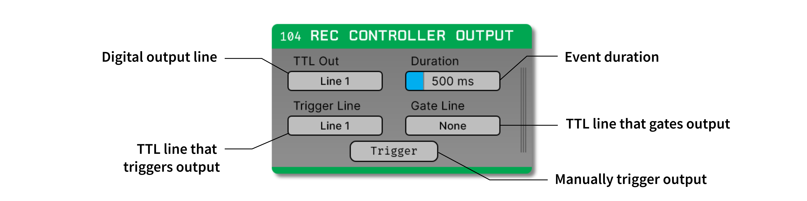

.. _reccontrolleroutput:
.. role:: raw-html-m2r(raw)
   :format: html

#####################
Rec Controller Output
#####################

.. csv-table:: Triggers the digital output lines of an `Intan RHD Recording Controller <https://intantech.com/recording_controller.html>`__.
   :widths: 18, 80

   "*Plugin Type*", "Source"
   "*Platforms*", "Windows, Linux, macOS"
   "*Built in?*", "No; install via *RHD Recording Controller*"
   "*Key Developers*", "Josh Siegle, Aarón Cuevas López"
   "*Source Code*", "https://github.com/open-ephys-plugins/rhythm-plugins/tree/recording-controller"

Installing and upgrading
==========================

The Rec Controller Output plugin is not included by default in the Open Ephys GUI. To install, use **ctrl-P** or **⌘P** to open the Plugin Installer, browse to the "RHD Recording Controller" plugin, and click the "Install" button. After installation, *Rec Controller Output* will appear in the processor list on the left side of the GUI's main window.

The Plugin Installer also allows you to upgrade to the latest version of this plugin, if it's already installed. The plugin must be removed from the signal chain prior to upgrading.

Plugin configuration
====================

If this plugin is placed downstream of the RHD Rec Controller plugin, as well as a plugin that generates TTL events (e.g., :ref:`crossingdetector` or :ref:`rippledetector`), the digital output channel specified by the :code:`TTL_OUT` parameter will be temporarily set to high each time a TTL event is received on the :code:`TRIGGER_LINE`. The approximate duration of this event (in milliseconds) is set by the :code:`EVENT_DURATION` parameter. 

This configuration can be used to perform closed-loop feedback experiments in which some feature of the neural data (such as phase of an oscillation, or the presence of a ripple event), is used to trigger stimulation.

Because the board will also be acquiring data, response times may be longer than when using a dedicated piece of hardware for generating outputs. If faster feedback is required, we recommend using the :ref:`arduinooutput` or :ref:`pulsepal` plugins instead.

|