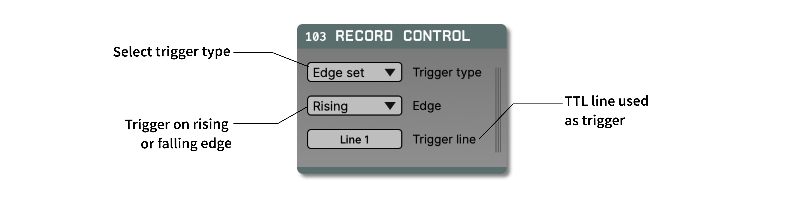

.. _recordcontrol:
.. role:: raw-html-m2r(raw)
   :format: html

################
Record Control
################

|

.. csv-table:: Allows recording to be automatically toggled on and off by event channels, instead of manually pressing the record button. It can be used to trigger recording using external TTLs, or based on events that are detected in a continuous data stream.
   :widths: 18, 80

   "*Plugin Type*", "Utility"
   "*Platforms*", "Windows, Linux, macOS"
   "*Built in?*", "Yes"
   "*Key Developers*", "Josh Siegle, Aarón Cuevas López"
   "*Source Code*", "https://github.com/open-ephys/plugin-GUI/tree/master/Plugins/RecordControl"

|

Plugin configuration
#####################

You need to select an appropriate trigger channel before it will do anything. Acquisition must be running as usual for the node to respond to TTL events.

Trigger type and edge options select how TTL events will control recording: With "Edge set" an edge event corresponding to the one selected will start recording while the opposite will stop it. That allows for recording to run as long as the TTL signal is in positive or negative state. "Edge toggle" will toggle recording each time an edge of the specified type is detected, allowing for starting recording with one pulse and disabling with the next.

Since it's a utility, a Record Control module can be dropped anywhere in the signal chain (except at the source). Data will pass through it unchanged.

.. note:: If two start/stop events are too close the recording subsystem might not properly register the state change. We recommend at least 1 second of separation between events that toggle recording state.

