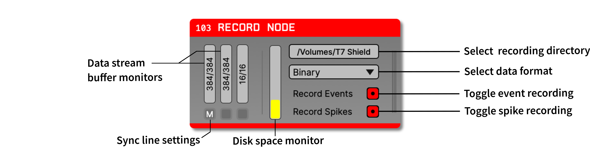

.. _recordnode:
.. role:: raw-html-m2r(raw)
   :format: html

#################
Record Node
#################

.. csv-table:: Saves incoming continuous signals, spikes, and events.
   :widths: 18, 80

   "*Plugin Type*", "Record Node"
   "*Platforms*", "Windows, Linux, macOS"
   "*Built in?*", "Yes"
   "*Key Developers*", "Pavel Kulik, Josh Siegle"
   "*Source Code*", "https://github.com/open-ephys/plugin-GUI/tree/main/Source/Processors/RecordNode"

The Record Node is the most important plugin in the GUI, because without it, no data will stored for offline analysis. We recommend placing a Record Node directly after each source node (or after a Merger that connects multiple sources), so that the data will be saved exactly as it is acquired. Additional Record Nodes can be used to write spikes from the :ref:`spikedetector`, store continuous data after it is has been filtered for closed-loop stimulation, or distribute recording across multiple drives. Before running any experiments, please read through the :ref:`recordingdata` section in addition to the documentation on this page.

.. important:: For any signal chains with more than 128 continuous channels, each Record Node must write to an SSD in order avoid filling the recording buffer, which will stop data acquisition. For signal chains with more than 1024 channels, you may need to use multiple Record Nodes in a row, each writing to a separate SSD, to prevent recording buffer overruns.  

Plugin configuration
====================

Recording directory
#####################

The ellipsis button at the top-right of the plugin editor is used to select the data directory for each Record Node. When a new Record Node is added to the signal chain, this matches the directory shown in the recording options interface at the top of the GUI's main window. Each Record Node can write to a separate directory if desired, for example to distribute recording across multiple drives.

The disk space monitor in the center of the plugin editor (vertical gray and yellow bar) displays the fraction of space remaining on the volume where the current data directory is located. This monitor will update in real-time when recording is active. Hovering the mouse over the monitor while recording will show an estimate of how many minutes remain until the volume becomes full.

Data format
#####################

A dropdown menu in the Record Node is used to select the data format for recording. The GUI ships with the :ref:`binaryformat` as the default, which is recommend for most applications. Additional formats (such as :ref:`openephysformat` and :ref:`nwbdataformat`) can be added via the Plugin Installer. Note that all Record Nodes must be removed from the signal chain in order to add a new data format.

To update the default data format for new Record Nodes, select the desired format from the recording options interface at the top of the GUI's main window.

.. note:: Due to the limitations of the HDF5 library, only one Record Node using the :ref:`nwbdataformat` can be used at a time.

Selecting channels to record
################################

.. image:: ../../_static/images/plugins/recordnode/recordnode-02.png
  :alt: Record Node channel selection interface

By default, all incoming continuous channels will be recorded. If you do not need to save all of the continuous channels for a particular stream, channels can be deselected by clicking on the buffer monitors for individual streams (the vertical bars on the left-hand side of the editor). When the channel selection buttons are red, it means those channels will be recorded.

Clicking the :code:`ALL` button will enable recording for all of the channels in the active stream. The :code:`NONE` button will disable recording for all channels in the active stream. The :code:`RANGE` button can be used select channels matching a pattern specified via Matlab-like range syntax, e.g. "1:10" for the first 10 channels, or "2:2:16" for every other channel between 2 and 16.

.. important:: If you disable continuous channels at any point, be sure to double-check that the correct channels are selected written prior to starting recording. You cannot recover data for channels that are not selected at the start of recording.

Selecting data types to record
################################

The buttons on the lower right of the Record Node editor can be used to disable saving of events and/or spikes. This should only be done in cases where event or spike data is being saved by another Record Node, or if this information is definitely not needed for offline analysis.

Synchronizer settings
################################

Each Record Node has a built-in synchronizer that can compute global timestamps (in seconds) for all streams that share a hardware input line. If your signal chain only includes one data stream, global timestamps will be computed automatically. However, if there are multiple streams (for example when using multiple Neuropixels probes), the buttons below each data stream buffer monitor can be used to select the stream to use as the main clock, as well as the TTL line where sync events are expected. See the :ref:`datasynchronization` tutorial for more in-depth information about proper hardware and software configuration.

Remote control
====================

Certain settings for each Record Node can be updated via HTTP Server commands. See the :ref:`remotecontrol` documentation for information about how to send :code:`PUT` requests in Python and Matlab. In all examples, :code:`<id>` represents the Record Node ID (visible in the Graph Viewer).

Data format
####################

To set the data format for a given Record Node, send the **index** of the recording format you want to use as it appears in the dropdown menu in the Record Node editor. For example if Binary and OpenEphys formats appear first and second in the dropdown menu, respectively, to use the :ref:`binaryformat`, send the following message to :code:`/api/recording/<id>`:

.. code-block:: console

    { 'record_engine' : '0' }

Selecting channels to record
####################

To change the recorded channels for a given stream, send the following message to :code:`/api/processors/<id>/config`:

.. code-block:: console

    { 'text' : "SELECT <stream_index> <command>"}

:code:`<stream_index>` represents the 0-based index of the data stream you wish to modify. The available commands are as follows:

- :code:`ALL` - select all channels in the specified stream
- :code:`NONE` - deselect all channels in the specified stream
- :code:`1 2 3 4 5` - list of 1-based indices of the desired channels to select. Any channels not in the list will be deselected.