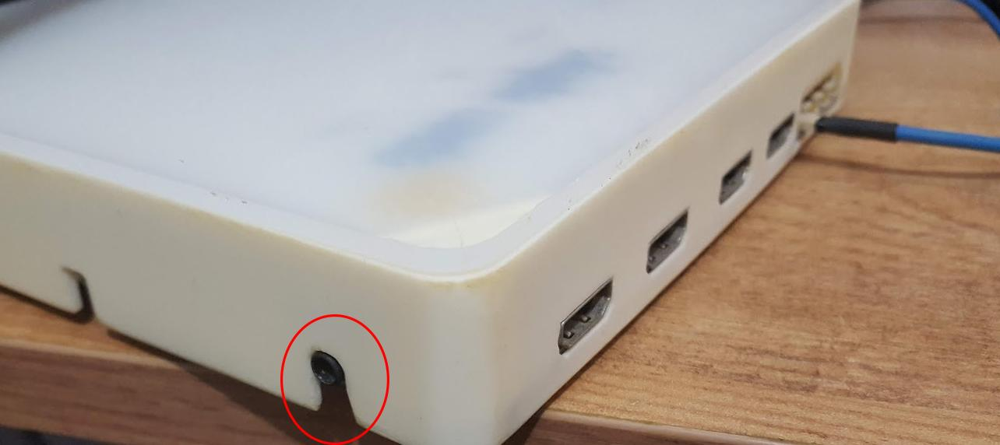

.. _rhythmfpga:
.. role:: raw-html-m2r(raw)
   :format: html

################
Rhythm Plugins
################

.. csv-table:: Streams data from any FPGA running Intan's "Rhythm" firmware. It is compatible with both the `Open Ephys acquisition board <https://open-ephys.org/acq-board>`__ and the `Intan RHD USB Interface Board <http://intantech.com/RHD_USB_interface_board.html>`__.
   :widths: 18, 80

   "*Plugin Type*", "Source"
   "*Platforms*", "Windows, Linux, macOS"
   "*Built in?*", "Yes"
   "*Key Developers*", "Josh Siegle, Aarón Cuevas López"
   "*Source Code*", "https://github.com/open-ephys/plugin-GUI/tree/master/Plugins/RhythmNode"

.. tip:: For more in-depth documentation on the Open Ephys Acquisition Board, please refer to the `Acquisition Board docs site <https://open-ephys.github.io/acq-board-docs/>`__.

Plugin configuration
====================

Data streams
############

On the left-hand side of the module, there are slots for each of 8 "data streams" (A1, A2, B1, B2, etc.). Each row corresponds to one 12-channel Omnetics connector on the input board (see the bottom right of the images of the acquisition board below; from left to right, there are A, B, C, and D), and each column corresponds to one headstage on that input. Up to two headstages can be connected to each input using a dual headstage adapter. The module will automatically detect headstages that are connected. However, if you add or remove headstages after the module has been loaded, you need to press the "RESCAN" button. Clicking on the button for one of the detected headstages will toggle it between 32-channel and 16-channel mode. This is necessary because the difference between 16-channel and 32-channel headstages cannot detected in software, and has to be selected manually.

Sample rate selection
#######################

Sample rates between 1 and 30 kHz can be selected with this drop-down menu. This will determine the sample rate for all headstages, digital inputs, and ADCs.

Bandwidth interface
#####################

Used to determine the settings for the analog high and low cut filters on the Intan chip. Because only certain values are possible for each, the number that appears may be different from the number you typed in; the chip will automatically select the nearest value, and that will be indicated in the GUI. 

.. note:: The default filter cut values are actually 1.1 and 7603.8 Hz, not 1 and 7500 Hz, as indicated by the interface when it's first initialized.

DSP button
###########

in addition to the analog filters, the Intan chips also have an on-chip DSP high-pass filter for removing the DC offset on each channel. This can be toggled on and off by clicking the "DSP" button (yellow = on), and the cutoff frequency can be changed by typing a value into the associated text box. Again, there are only certain values for the cutoff frequency; the chip will choose the one closest to what you selected and return this value to the GUI.

Audio output
#############

|

The "AUDIO OUT" interface will allow you select up to 2 channels to preview in real time, directly from the acquisition board/evaluation board.There is an audio jack (see the red circle in the picture below) that's mirrored to the first two analog output channels (CH1 and CH2 of the Digital & Analog I/O for L and R sound outputs when connected to HDMI port for analog output — it is the leftmost HDMI port; see a picture below). To select a channel for monitoring, click on one of the two "AUTIO OUT" buttons, then open the Channel Selector drawer on the right of the module. Make sure the "PARAM" tab is selected, and click on any of the available channels. This can be repeated for the other button, such that the left and right audio outputs can be set to different channel.

Noise slicer
##############

Sets the threshold for the noise slicer on the hardware audio outputs (sets any values below threshold to zero, to improve the signal-to-noise ratio). In practice, this doesn't work particularly well.

ADC selection
##############

Pressing the "ADC 1–8" button toggles the ADC inputs on and off. If the button is off (gray), the ADC channels on the acquisition board/evaluation board will be discarded. If the button is on (yellow), they will be sent as parallel data channels, with the same sampling rate as the neural data. A Digital & Analog I/O board needs to be connected to the second HDMI port from the left.

DAC TTLs
##########

*UNTESTED FEATURE*

DAC High-pass filter
######################
*UNTESTED FEATURE* Sets the high-pass filter cutoff for the DAC outputs

TTL settle
###########

*UNTESTED FEATURE* Ties one of the digital inputs on the acquisition board/evaluation board to the "fast-settle" functionality of the Intan chips. If the selected digital input channel goes high, it will trigger the reset of the amplifiers across all headstages.

Impedance testing
##################

To open the impedance testing interface, click the "window" or "tab" buttons at the top of the module. Clicking the "measure impedance" button will test the impedance for all of the channels. 

.. warning:: the GUI will appear to freeze while impedance testing is happening; this is something we know about and are working to fix.

