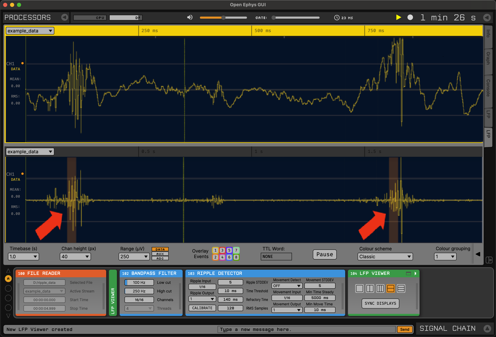

.. _rippledetector:
.. role:: raw-html-m2r(raw)
   :format: html

#####################
Ripple Detector
#####################

.. csv-table:: Emits a TTL event when a hippocampal ripple is detected on one continuous channel.
   :widths: 18, 80

   "*Plugin Type*", "Filter"
   "*Platforms*", "Windows, Linux, macOS"
   "*Built in?*", "No"
   "*Key Developers*", "Bruno Monteiro de Sousa"
   "*Source Code*", "https://github.com/open-ephys-plugins/ripple-detector"
   "*Publication DOI*", "`10.1088/1741-2552/ac857b <https://iopscience.iop.org/article/10.1088/1741-2552/ac857b>`__"

Installing and upgrading
###########################

The Ripple Detector plugin is not included by default in the Open Ephys GUI. To install, use **ctrl-P** or **⌘P** to access the Plugin Installer, browse to the "Ripple Detector" plugin, and click the "Install" button.

The Plugin Installer also allows you to upgrade to the latest version of this plugin, if it's already installed.

Recommended signal chain
#########################

The Ripple Detector must receive data that has been pre-filtered in the ripple frequency band (100-250 Hz). Be sure a :ref:`bandpassfilter` is placed in the signal chain upstream of this plugin.

To deliver closed-loop feedback based on ripples, a Sink plugin connected to a stimulation device (such as an :ref:`arduinooutput` or :ref:`pulsepal`) must be placed downstream.

The image below shows the Ripple Detector placed after a Bandpass Filter, with two LFP Viewers displaying the data before (top) and after (bottom) processing.

Plugin configuration
######################

.. note:: The parameters required for optimal ripple detection performance may vary according to the recording setup, noise level, electrode type, implant quality, and even between animals. Before running an experiment, we recommend testing various parameters using pre-recorded data read in through the File Reader.

- **Ripple Input:** continuous input channel on which ripples will be detected.

- **Ripple Out:** TTL line on which output events will be triggered.

- **Ripple STD:** the number of RMS standard deviations above the mean to calculate the amplitude threshold.

- **Time Thresh:** the minimum period (in ms) during which the RMS values must be above the amplitude threshold for ripples to be detected.

- **Refr Time:** (refractory time) the period (in ms) after each detection event in which new ripples cannot be detected.

- **RMS Samples:** number of samples used to calculate the RMS value.

- **Mov Detect:** the mode of movement detection. If "OFF" is selected, the mechanism of event blockage based on movement detection is disabled and ripples are not silenced. If "ACC" is selected, the RMS of all auxiliary channels are used to calculate the magnitude of the acceleration vector. If "EMG" is selected, an input channel is designated.

- **Mov Input:** the channel to use for movement detection (only affects "EMG" mode).

- **Mov Out:** (movement output) output TTL channel that indicates the period when ripple detection is silenced by movement (OFF if events are not blocked, 1 if events are blocked).

- **Mov Std:** number of RMS standard deviations above the mean used to calculate the amplitude threshold for movement detection based on EMG or accelerometer.

- **Min Time St:** (minimum time steady) the minimum period (in ms) of immobility (RMS below the amplitude threshold) required to enable ripple detection again after movement is detected.

- **Min Time Mov:** (minimum time of movement) the minimum period (in ms) during which the RMS values of EMG/accelerometer must be above the corresponding amplitude threshold for movement detection (and ripple silencing).

- **Calibrate:** recalculates the calibration parameters (RMS mean and standard deviation for both the ripple and movement data).

Ripple detection algorithm
############################

The ripple detection algorithm works in two steps:

**Calibration:** The calibration period takes 20 seconds and must be run prior to ripple detection. During this period, the incoming filtered data in the ripple frequency band is divided into blocks of *N* samples (:code:`RMS_SAMPLES` parameter). The RMS value is calculated for each block, so we have a total of (20 * sampleRate / *N*) RMS points. The final :code:`amplitudeThreshold` is function of the mean and standard deviation of all of these RMS points:

.. code:

  amplitudeThreshold = RMS_mean + RIPPLE_STD * RMS_standardDeviation

where :code:`RIPPLE_STD` is the number of standard deviations above the mean set in the plugin's editor (default = 5).

**Detection:** This is when ripples are identified online. The RMS value of each block is calculated and tested against the amplitude threshold. If this value stays above the amplitude threshold for the minimum time period defined by the :code:`TIME_THRESH` parameter, ripple events are generated. After an event is triggered, the detection of new ripple events is disabled for :code:`REFR_TIME` milliseconds. If the user selects EMG or ACC mode in the :code:`MOV_DETECT` drop-down menu, ripple events are not raised when movement is detected.

.. image:: ../../_static/images/plugins/rippledetector/rippledetector-03.png
  :alt: Ripple detector algorithm

More information
############################

A more detailed characterization of this plugin's performance can be found in the following publication:

Bruno Monteiro de Sousa, Eliezyer Fermino de Oliveira, Ikaro Jesus da Silva Beraldo, Rafaela Schuttenberg Polanczyk, João Pereira Leite, and Cleiton Lopes Aguiar (2022) `"An open-source, ready-to-use and validated ripple detector plugin for the Open Ephys GUI." <https://iopscience.iop.org/article/10.1088/1741-2552/ac857b>`__ *Journal of Neural Engineering* **19**: 046040.

If you use this plugin in your work, be sure to cite this article!

|
