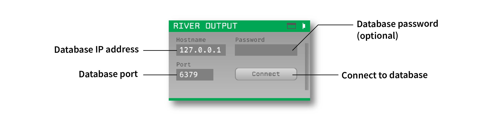

.. _riveroutput:
.. role:: raw-html-m2r(raw)
   :format: html

#####################
River Output
#####################

.. csv-table:: Streams spikes and events to a Redis database with very low latency.
   :widths: 18, 80

   "*Plugin Type*", "Sink"
   "*Platforms*", "Windows"
   "*Built in?*", "No"
   "*Key Developers*", "Paul Botros"
   "*Source Code*", "https://github.com/open-ephys-plugins/river-io"

Installing and upgrading
###########################

The River Output plugin is not included by default in the Open Ephys GUI. To install, use **ctrl-P** to access the Plugin Installer, browse to the "River Output" plugin, and click the "Install" button.

The Plugin Installer also allows you to upgrade to the latest version of this plugin, if it's already installed.

Background
######################

This plugin makes it possible to stream spike and event data to an in-memory database, which can be accessed by any number of local or remote processes. The data transmission uses the `River <https://pbotros.github.io/river/docs/index.html>`__ framework, an open-source library for streaming data to and from Redis databases. Although the streaming is currently unidirectional (out of Open Ephys), we eventually plan to add the ability to stream data from other sources into the Open Ephys signal chain.

Once the data has been entered into the database, reading it out is straightforward using the River Python bindings:

.. code-block:: Python

  import river
  r = river.StreamReader(river.RedisConnection("127.0.0.1", 6379))
  r.initialize("Purple-407", 10000) # 10000 = timeout ms
  data = r.new_buffer(1)
  with r:
    while True:
      num_read = r.read(data, 100) # 100 = timeout ms

See the `example Python script <https://github.com/open-ephys-plugins/river-io/blob/main/Resources/scripts/reading.py>`__ for more information.

Plugin configuration
######################

Database setup
-----------------

This plugin must be able to connect to an existing Redis database. Follow the instructions on `this page <https://redis.io/docs/getting-started/installation/>`__ to install Redis.

.. note:: Redis does not run natively on Windows, and requires Windows Subsystem for Linux (WSL). This only takes a few minutes to install, and shouldn't deter you from trying out this plugin. 

Creating a new table
---------------------

Once the database connection has been made, the plugin will automatically create a new table for streaming spikes. The table schema can be viewed by opening the plugin visualizer (buttons in the upper-right corner of the editor). To stream events instead of spikes, click the "Events" checkmark.

Each instance of the River Output plugin can only stream either spikes or events. To stream both simultaneously, you can drop a second plugin into the signal chain.

Reading data out
-----------------

When a consumer makes a connection to the database and requests the table entries, it will immediately receive all of the data sent up to that point. New data will be available as soon as it is streamed out of Open Ephys.

|

