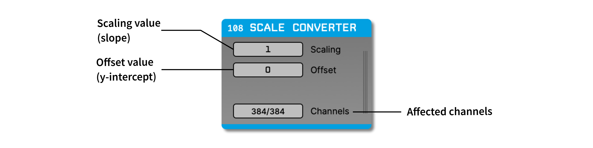

.. _scaleconverter:
.. role:: raw-html-m2r(raw)
   :format: html

#####################
Scale Converter
#####################

.. csv-table:: Applies scaling and offset operations to selected channels in the currently selected stream.
   :widths: 18, 80

   "*Plugin Type*", "Filter"
   "*Platforms*", "Windows, Linux, macOS"
   "*Built in?*", "No"
   "*Key Developers*", "Pavel Kulik"
   "*Source Code*", "https://github.com/open-ephys-plugins/scale-converter"

Installing and upgrading
###########################

The Scale Converter plugin is not included by default in the Open Ephys GUI. To install, use **ctrl-P** or **⌘P** to access the Plugin Installer, browse to the "Scale Converter" plugin, and click the "Install" button.

The Plugin Installer also allows you to upgrade to the latest version of this plugin, if it's already installed.

Overview
########

The Scale Converter plugin allows users to apply scaling and offset operations to selected channels in the currently selected stream. 
This is useful for converting between different units or adjusting signal ranges to match specific requirements.

Plugin configuration
######################

The plugin editor allows the user to set the following parameters:

- **Scaling:** The multiplication factor to apply to the input signal. This can be used to convert between different units or adjust the signal amplitude. Range is -1e32 to 1e32.

- **Offset:** The value to add to the scaled signal. This can be used to shift the signal baseline or adjust the DC offset. Range is -1e32 to 1e32.

- **Channels:** The subset of channels to apply the scaling and offset operations to. All channels are selected by default.
