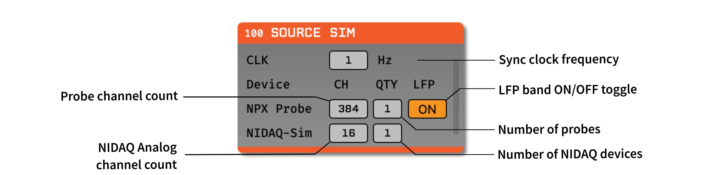

.. _sourcesim:
.. role:: raw-html-m2r(raw)
   :format: html

#####################
Source Sim
#####################

.. csv-table:: Simulates a modern ephys acquisition system using a variable number of Neuropixels probes and NIDAQ devices.
   :widths: 18, 80

   "*Plugin Type*", "Source"
   "*Platforms*", "Windows, Linux, macOS"
   "*Built in?*", "No"
   "*Key Developers*", "Pavel Kulik, Josh Siegle, Anjal Doshi"
   "*Source Code*", "https://github.com/open-ephys-plugins/source-sim"

Installing and upgrading
###########################

The Source Sim plugin is not included by default in the Open Ephys GUI. To install, use **ctrl-P** or **⌘P** to access the Plugin Installer, browse to the "Source Sim" plugin, and click the "Install" button.

The Plugin Installer also allows you to upgrade to the latest version of this plugin, if it's already installed.

Overview
########

The Source Sim plugin simulates a variable number of Neuropixels probes and NIDAQ devices with a shared TTL synchronization line. Each probe has an AP band at 30kHz and an optional LFP band at 2.5kHz when the LFP toggle is set to ON. The AP band contains the same synthetic spike waveforms at regular intervals across all channels and the LFP band contains a fixed period sine wave across all channels. Each NIDAQ device is simulated as a series of analog channels with a 50% duty cycle square wave at the sync clock frequency across all channels. The amplitude of all generated data attenuates linearly with time to help validate temporal integrity in recordings. This plugin primarily serves as a proxy for benchmarking and testing signal chains without requiring a physical hardware setup.

Plugin configuration
######################

The plugin editor allows the user to set the following parameters:

- **Sync clock frequency:** The frequency of the sync clock signal (in Hz). 0 Hz = no sync clock.

- **Probe channel count:** The number of channels per Neuropixels stream.

- **LFP band ON/OFF toggle:** Adds/removes the LFP band to/from each probe.

- **NIDAQ Analog channel count:** The number of analog channels per NIDAQ device.

- **Number of NIDAQ devices:** The number of NIDAQ devices to simulate.