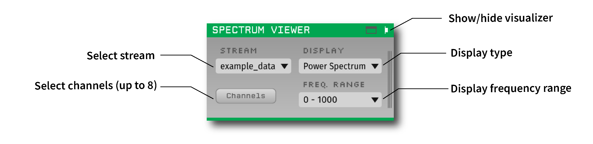
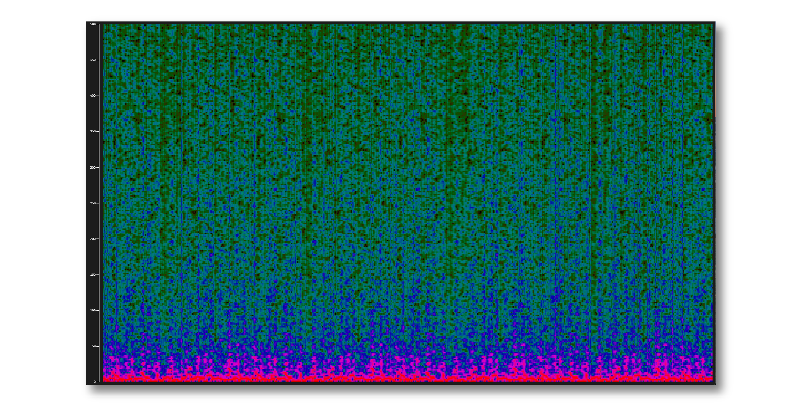

.. _spectrumviewer:
.. role:: raw-html-m2r(raw)
   :format: html

################
Spectrum Viewer
################

.. csv-table:: Displays the real-time power spectrum for up to 8 continuous channels.
   :widths: 18, 80

   "*Plugin Type*", "Sink"
   "*Platforms*", "Windows, Linux, macOS"
   "*Built in?*", "No"
   "*Key Developers*", "Sumedh Nagrale, Mark Schatza, Josh Siegle, Anjal Doshi"
   "*Source Code*", "https://github.com/open-ephys-plugins/spectrum-viewer"

Installing and upgrading
###########################

The Spectrum Viewer plugin is not included by default in the Open Ephys GUI. To install, use **ctrl-P** to access the Plugin Installer, browse to the "Spectrum Viewer" plugin, and click the "Install" button.

The Plugin Installer also allows you to upgrade to the latest version of this plugin, if it's already installed.

Plugin Configuration
######################

.. note:: The Spectrum Viewer plugin may take a few seconds to initialize, so please be patient!

First, make sure the correct stream is selected in the plugin editor. Then, select channels to display (up to 8). A color legend is shown next to the Power Spectrum plot which displays the colors mapped to each channel along with the channel name.

You can also change the display type to Spectogram display which will show the spectrogram of the first selected channel.

The frequency range can be changed between 4 options: :code:`0 - 100Hz`, :code:`0 - 500Hz`, :code:`0 - 1000Hz` (default), and the last option is the maximum frequency range possible for the selected stream.

You can update the selected channels, and the display type, but not the selected stream or the display frequency range, while acquisition is active.

Visualization
##############

The Spectrum Viewer analyzes the incoming data in 250 ms segments, and plots the resulting power spectra. The power is plotted on a log scale.

Power Spectrum
---------------

.. image:: ../../_static/images/plugins/spectrumviewer/spectrumviewer-02.png
  :alt: Power Spectrum display example

By default, Spectrum Viewer display type is set to plot the power spectra of incoming data. The incoming data is processed and the resulting power data is sampled at the rate of 50Hz.  When plotting, the power data is first filtered using a low-pass Butterworth filter, and then an averaging filter is applied across frequencies which results in a smoother plot.

Spectrogram
------------

Spectrum Viewer can also display the incoming data from the first selected channel as a three-dimensional spectrogram in the time (x-axis), frequency (y-axis) and power (colour) domains.

|