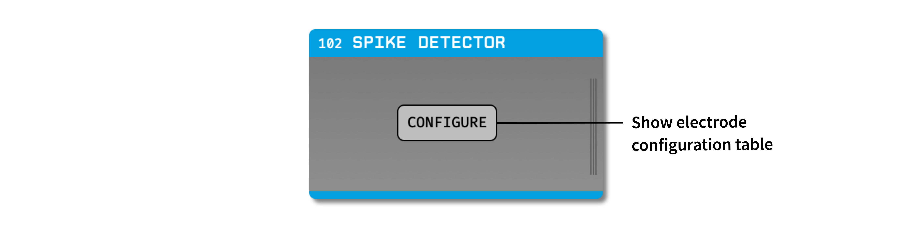
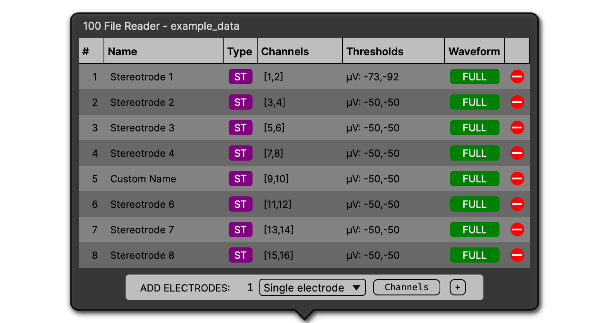
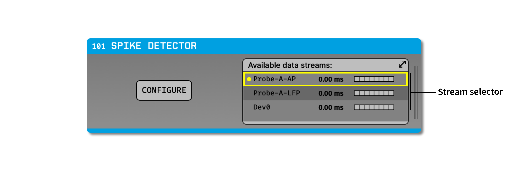

.. _spikedetector:
.. role:: raw-html-m2r(raw)
   :format: html

################
Spike Detector
################

.. csv-table:: Detects spikes in continuous data and packages them as events that can be read by downstream processors.
   :widths: 18, 80

   "*Plugin Type*", "Filter"
   "*Platforms*", "Windows, Linux, macOS"
   "*Built in?*", "Yes"
   "*Key Developers*", "Josh Siegle"
   "*Source Code*", "https://github.com/open-ephys/plugin-GUI/tree/development-juce6/Plugins/BasicSpikeDisplay/SpikeDetector"

.. note:: The Spike Detector has changed significantly in GUI version 0.6.0+. Be sure to read the documentation carefully to understand the new user interface.

Plugin configuration
######################

Recommended signal chain
-------------------------

The Spike Detector works best on bandpass-filtered data. Therefore, it should always be placed to the right of a :ref:`bandpassfilter`. This, in turn, should be placed to the right of a Record Node so the original, unfiltered data can be written to disk:

Source → Record Node → Bandpass Filter → **Spike Detector** → Audio Monitor → Spike Viewer

The Audio Monitor and Spike Viewer must be placed to the *right* of the Spike Detector in order to receive data generated by its electrodes.

Creating electrodes
-------------------

In the Spike Detector, an "Electrode" represents a group of continuous channels across which spikes are detected simultaneously. The Spike Detector supports three types of electrodes:

#. **Single electrodes** - 1 channel
#. **Stereotrodes** - 2 channels
#. **Tetrodes** - 4 channels

The Spike Detector can be configured with an arbitrary number of electrodes of any type, which may or may not share continuous channels with one another.

To create new electrodes, first click on the "Configure" button to bring up the "Add electrode" menu:

Before creating electrodes, there are 3 parameters that can be configured:

#. **Electrode count** - Use the text box on the left to type in the number of electrodes you want to create (max: 384). Electrodes can be easily added and deleted later on.

#. **Electrode type** - Use the combo box to select the type of electrodes you want to create (single electrode, stereotrode, or tetrode).

#. **Electrode start channel indices** - (Optional) Use the "Channels" button to determine the start channels for each electrode. By default, the first available continuous channels will be selected. To create a custom channel configuration, select a new set of start channel indices in the popup window. For example, if you want to create single electrodes on every 4th channel out of 128, type in :code:`1:4:128` into the text box and click the "RANGE" button. Start channels can also be selected and de-selected manually.

Once these values look correct, click the **"+"** button to add your electrodes.

Adjusting parameters
---------------------

The electrode parameter table contains 7 columns:

1. **#** - The index of the electrode. Ctrl/⌘-click or shift-click in this column to select multiple electrodes (or use Ctrl/⌘-A to select all electrodes).

2. **Name** - The name of the electrode. Double-click on an electrode's name to edit it.

3. **Type** - The type of the electrode (SE = single electrode, ST = stereotrode, TT = tetrode). Once an electrode is created, its type cannot be changed.

4. **Channels** - The continuous channels used by this electrode. These can be changed when acquisition is stopped by clicking on the channel values to bring up the popup channel selection interface. If an electrode does not have enough continuous channels, or the channels do not exist, the electrode's row will turn red.

5. **Thresholds** - The thresholds used for spike detection on each channel. To adjust the thresholds for one electrode, click on the threshold values to bring up the following interface:

6. **Waveform** - The type of waveform (FULL vs. PEAK) for this electrode. The Spike Detector currently only supports FULL waveforms.

7. **Delete** - The buttons on the right-hand side of the table can be used to remove electrodes. If multiple electrodes are selected, they will all be removed as soon as the delete button is pressed. Once an electrode is deleted, it cannot be recovered.

Thresholding algorithms
------------------------

The Spike Detector includes three different thresholding algorithms that can be applied to any type of electrode:

1. **uV** - Detects a spike whenever the signal on one of the electrode channels passes below a microvolts threshold. This is the default algorithm, and the same one that was used in the Spike Detector in GUI versions prior to 0.6.0.

2. **STD** - Automatically sets the threshold based on a multiple of the standard deviation of each channel. This method will find a reasonable spike detection threshold without the need for any manual intervention.

3. **MED** - Automatically sets the threshold based on a multiple of the median value of each channel. This method is more robust to outliers (like very large-amplitude spikes) than the STD method. See `Quian Quiroga et al. <https://pubmed.ncbi.nlm.nih.gov/15228749/>`__ for more details.

To change the thresholding algorithm for multiple (or all) electrodes at once, use the **#** column (or Ctrl/⌘-A) to select multiple electrodes. Then, any changes to once electrode's threshold settings will propagate to all other selected electrodes.

Working with multiple data streams
-----------------------------------

When the Spike Detector has multiple data streams as input, electrodes must be configured separately for each stream. For example, if you are recording with multiple Neuropixels probes, there will be up to two data streams for each probe (AP and LFP). Make sure the correct probe (and stream) is active when you're creating new electrodes.

To change the active stream, click on the vertical bars on the right-hand side of the Spike Detector editor to bring up the Stream Selector. Use the arrow buttons or popup menu to select the stream of interest before creating electrodes:

If you create electrodes for multiple streams, only the electrodes for the active stream will be visible in the configuration table.