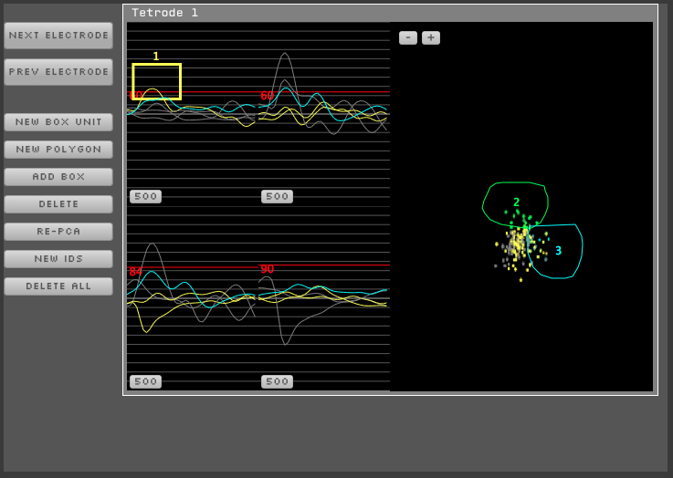

.. _spikesorter:
.. role:: raw-html-m2r(raw)
   :format: html

################
Spike Sorter
################

.. image:: ../../_static/images/plugins/spikesorter/spikesorter-01.png
  :alt: Annotated Spike Sorter settings interface

|

.. csv-table:: Detects spikes in continuous data and packages them as events that can be read by downstream processors. Makes it possible to assign IDs to individual units using box sorting and PCA methods.
   :widths: 18, 80

   "*Plugin Type*", "Filter"
   "*Platforms*", "Windows, Linux, macOS"
   "*Built in?*", "Yes"
   "*Key Developers*", "Shay Ohayon"
   "*Source Code*", "https://github.com/open-ephys/plugin-GUI/tree/master/Plugins/SpikeSorter"

.. note:: The Spike Sorter's functionality is a superset of the :ref:`spikedetector`. In addition to detecting spikes from continuous signals. The Spike Detector will stick around for a while, but there's nothing that it can do that the Spike Sorter can't.

Plugin configuration
#####################

To initialize the spike sorter, you must configure the electrode layout. Here are the steps to follow:

#. Use the arrow buttons to select the number of electrodes you want to add.

#. Click on the plus button and select the type of electrodes you want (single electrodes, stereotrodes, or tetrodes).

#. Use the buttons in the upper-right to open the Spike Sorter display in a tab (left icon) or new window (right icon):

|

Within the Spike Sorter display, you can change thresholds (by dragging the red threshold lines) You can also add "Box Units" (e.g., unit #1 in the image above) in the waveform display and "Polygon Units" (e.g. unit #2 and unit #3) in PCA space. The image above is a bad example, since these do not define actual well-isolated clusters.

To send a given electrode to the Audio Output, click the "Monitor" button.

As with the Spike Detector, spikes will only be saved if a Record Node is downstream of this plugin.

The advancer and DAC output functions are not currently supported.

