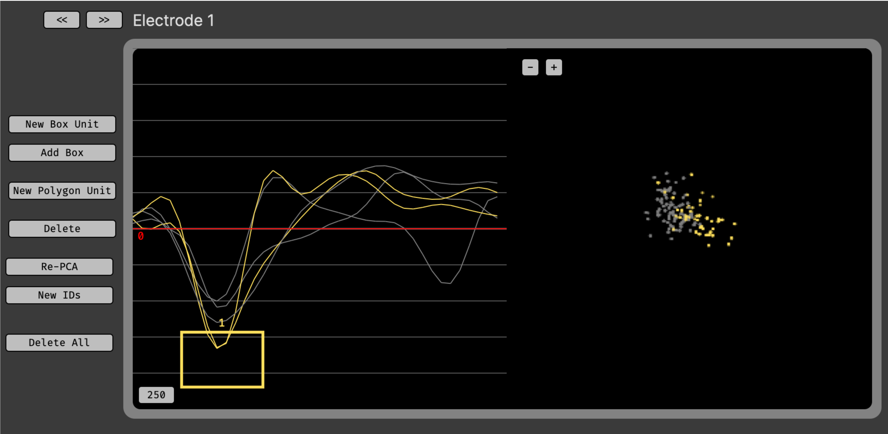

.. _spikesorter:
.. role:: raw-html-m2r(raw)
   :format: html

################
Spike Sorter
################

.. image:: ../../_static/images/plugins/spikesorter/spikesorter-01.png
  :alt: Annotated Spike Sorter settings interface

.. csv-table:: Sorts spikes based on manually drawn boxes in waveform space, or boundaries in PCA space. Must be used in combination with a plugin that generates spikes, such as the :ref:`spikedetector`.
   :widths: 18, 80

   "*Plugin Type*", "Filter"
   "*Platforms*", "Windows, Linux, macOS"
   "*Built in?*", "Yes"
   "*Key Developers*", "Shay Ohayon, Josh Siegle"
   "*Source Code*", "https://github.com/open-ephys-plugins/spike-sorter/tree/main"

.. note:: As of GUI version 0.6.0, the Spike Sorter no longer detects spikes on its own. Instead, it must be placed downstream of the :ref:`spikedetector`, allowing it to apply sorted IDs to the incoming spikes. This change was made in order to prevent the need for redundant functionality between these two plugins.

Installing and upgrading
###########################

The Spike Sorter plugin is not included by default in the Open Ephys GUI. To install, use **ctrl-P** or **⌘P** to open the Plugin Installer, browse to the "Spike Sorter" plugin, and click the "Install" button.

The Plugin Installer also allows you to upgrade to the latest version of this plugin, if it's already installed.

Plugin configuration
#####################

In order to use the Spike Sorter, you must have at least upstream plugin that generates spikes. Currently, the only plugin capable of generating spikes is the :ref:`spikedetector`. Please refer to that plugin's documentation page to understand how to create and configure electrodes.

Downstream plugins will be able to access the :code:`sortedId` for all spikes that pass through the Spike Sorter. Note that these IDs will only be written to disk by Record Nodes that are placed to the *right* of the Spike Sorter.

All of the Spike Sorter configuration happens inside its visualizer. This can be accessed by clicking the "window" or "tab" buttons in the upper right of the Spike Sorter editor:

To select an electrode to configure, either use the drop-down menu in the Spike Sorter editor, or press the **<<** and **>>** buttons to browse through consecutive electrodes.

The Spike Sorter visualizer contains two main sections:

1. On the left is the waveform view, which shows the waveforms of incoming spikes on the active electrode.

2. On the right is the PCA view, which represents each waveform as a dot in 2D principal component space.

The Spike Sorter includes the following tools:

* **New Box Unit** - Creates a new Box Unit in the waveform view. Any spikes with waveforms that cross through this box will be assigned to this unit. The boundaries of the box can be dragged freely, or the entire box can be dragged. For multi-channel electrodes (e.g. stereotrodes or tetrodes), Box Units can only be configured for the first channel.

* **Add Box** - Add an additional box to the currently selected Box Unit. Spikes will only be assigned to this unit if their waveforms pass through *all* boxes.

* **New Polygon Unit** - Creates a new Polygon Unit in the PCA view. After pressing this button, click and drag in the PCA view to define the boundaries of this unit. Once a Polygon Unit is created, it can be dragged in PCA space, but its boundaries cannot be modified. Note that polygons can only be drawn *after* the initial PCs have been calculated (this usually takes a few seconds after acquisition begins).

* **Delete** - Deletes the currently selected (Polygon or Box) unit.

* **Re-PCA** - Re-calculates the principal components from scratch.

* **New IDs** - Generates new unique IDs for units across all electrodes.

* **Delete All** - Deletes all units on the active electrode. 

|

