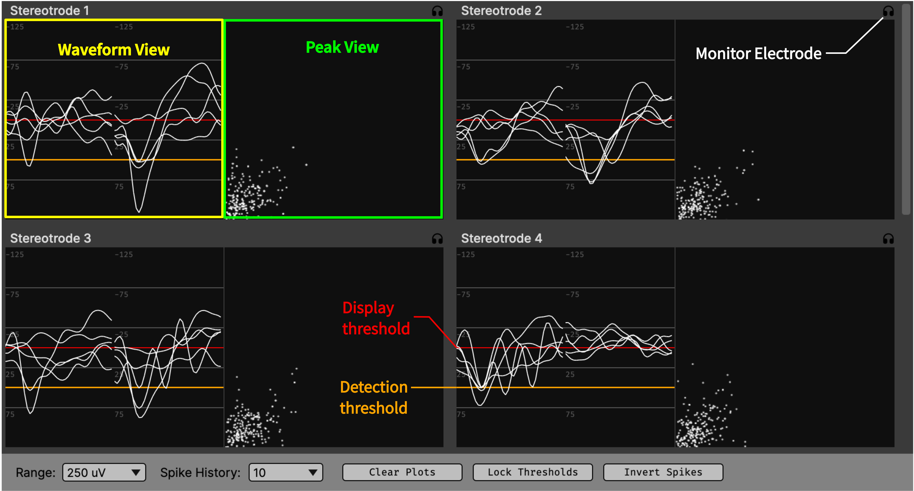

.. _spikeviewer:
.. role:: raw-html-m2r(raw)
   :format: html

################
Spike Viewer
################

.. image:: ../../_static/images/plugins/spikeviewer/spikeviewer-01.png
  :alt: Annotated Spike Viewer settings interface

.. csv-table:: Displays spikes that have been detected by an upstream plugin.
   :widths: 18, 80

   "*Plugin Type*", "Sink"
   "*Platforms*", "Windows, Linux, macOS"
   "*Built in?*", "Yes"
   "*Key Developers*", "Josh Siegle"
   "*Source Code*", "https://github.com/open-ephys/plugin-GUI/Plugins/BasicSpikeDisplay/SpikeDisplayNode"

Recommended signal chain
#########################

The Spike Viewer cannot detect any spikes on its own; instead, it displays spikes that have been detected by upstream plugins. Currently, the only plugin capable of doing this is the :ref:`spikedetector`. As of version 0.6.0, the :ref:`spikesorter` is used to assign spikes to particular clusters, but it cannot detect spikes on its own. Therefore, the Spike Viewer will not be operational unless a Spike Detector with at least one electrode can be found to the left of it in the signal chain.

Plugin configuration
######################

To bring up visualizer, click the tab or window buttons in the upper-right corner of the editor. Any valid electrodes that have been created in the :ref:`spikedetector` will automatically appear in the Spike Viewer. This is true regardless of which stream they originated from; electrodes for all streams will be visible within the same Spike Viewer interface. The visualizer for four stereotrodes looks like this:

Each electrode has a **Waveform View** and (for stereotrodes and tetrodes) a **Peak View**. The Waveform View displays the incoming spike waveforms for all channels within each electrode. The Peak View displays the comparison between spike waveform peak amplitudes across all pairs of channels. If a :code:`sortedID` is available for a given spike, the waveform and peak will appear in color; otherwise they will be white.

In the **Waveform View**, you can change the range of the display in microvolts by clicking the numeric button in the lower left (default = 250). You can also drag the horizontal red line to change the *display threshold* for a given channel. The *detection threshold* appears in orange and is based on the threshold that was used to detect the original spike. The display threshold only affects what appears in the Spike Viewer; by lowering the display threshold to more negative values, you can limit the number of spikes that are shown without affecting what is detected or recorded.

There are three buttons along the bottom that control the global settings:

* **Clear Plots**: Clears the spike waveforms and peaks currently being displayed.

* **Lock Thresholds**: Locks the display thresholds for all waveform views to a single shared value.

* **Invert Spikes**: By default, the spikes are displayed with a non-inverted axis, so the "peak" points downward. Clicking this button will invert the y-axis of the waveform view, causing the peaks to point upwarde.

Audio Monitor
--------------

Each electrode display has a button in the upper right labeled "MON." If there is an :ref:`audiomonitor` in the signal chain, clicking this button will select the first channel of this electrode to be monitored.

Changing electrode display size
--------------------------------

The Spike Viewer editor only has one parameter interface, which controls the size of the individual spike displays. Clicking the **+** and **-** buttons will increase or decrease the size of the displays, respectively. Because the displays are auto-scaled to fit the width of the Spike Viewer, sometimes clicking these buttons will have no effect.

|

