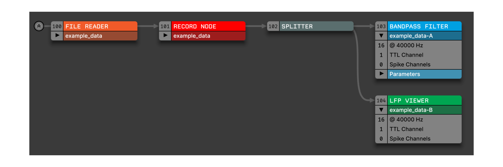

.. _splitter:
.. role:: raw-html-m2r(raw)
   :format: html

################
Splitter
################

.. csv-table:: Creates a copy of all incoming continuous channels, spikes, and events, allowing data to be processed independently along two branches of the signal chain.
   :widths: 18, 80

   "*Plugin Type*", "Utility"
   "*Platforms*", "Windows, Linux, macOS"
   "*Built in?*", "Yes"
   "*Key Developers*", "Josh Siegle, Aarón Cuevas López"
   "*Source Code*", "https://github.com/open-ephys/plugin-GUI/Source/Processors/Splitter"

Recommended usage
######################

Splitters make it possible to process data in parallel along two independent branches; any changes to the data on one branch will have no effect on the other. The classic use case is to apply two separate filtering operations to the same data, one high-pass filter for spike detection, and one low-pass filter for viewing the local field potential. However, there is significant overhead involved in splitting the signal chain, since all of the incoming data needs to be copied into a new buffer. Therefore, it's recommended to avoid using Splitter unless they are required for your use case.

In an earlier version of the GUI, "sink" plugins had to terminate a signal chain, which meant that Splitters were required in any cases in which multiple sinks were used. That is no longer the case; now that sinks can be placed anywhere in a signal chain (except the very beginning), data can be processed in more flexible ways without the need for Splitters.

.. caution:: It is not currently possible to use a :ref:`merger` to reconnect split branches of a signal chain. Once the signal chain has been split, it cannot be merged back together.

Plugin configuration
######################

The Splitter is first dropped into the signal chain to the left of the point at which the data should be split. Then, the two output paths are selected by clicking the arrow buttons on the Splitter editor. Additional plugins can be dropped to the right of either output path. If a Splitter is only connected to one output, it will have no effect on the signal chain.

The names of the data streams in each branch of the signal chain will be appended with "**-A**" or "**-B**" to indicate that they have passed through a Splitter:

