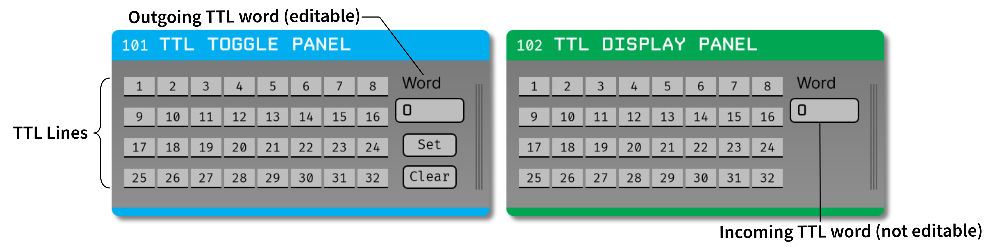
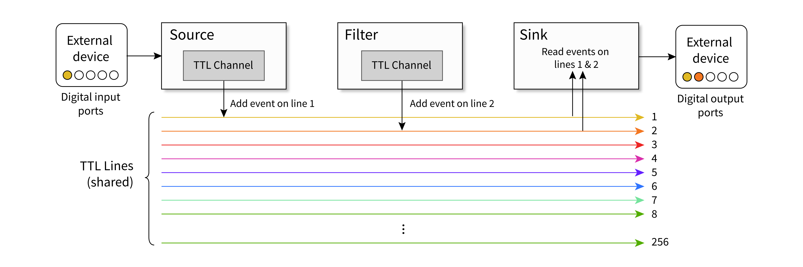

.. _ttlpanels:
.. role:: raw-html-m2r(raw)
   :format: html

################
TTL Panels
################

.. csv-table:: .
   :widths: 18, 80

   "*Plugin Type*", "Filter, Sink"
   "*Platforms*", "Windows, Linux, macOS"
   "*Built in?*", "No"
   "*Key Developers*", "Christopher Thomas"
   "*Source Code*", "https://github.com/open-ephys-plugins/spectrum-viewer"

.. note:: Provides toggle and display panels for debugging TTL events.

Installing and upgrading
###########################

The TTL Panels plugin is not included by default in the Open Ephys GUI. To install, use **ctrl-P** to access the Plugin Installer, browse to the "TTL Panels" plugin, and click the "Install" button.

The Plugin Installer also allows you to upgrade to the latest version of this plugin, if it's already installed.

Understanding TTL events
###########################

TTL (transistor–transitor logic) events are the primary way that data sampled at irregular intervals is transmitted between plugins. Each TTL event has a *state* (on or off), a *line* (1-256), and a *stream* associated with it. Each plugin that generates events will have a unique TTL channel (in order to help trace the origin of these events), but channels on the same data stream will share the same set of TTL lines. This makes it possible for a plugin to respond to an event on Line 1 in the same way whether this event was triggered by an external piece of hardware and added by a Source plugin or, or generated by a Filter plugin further down the signal chain. In addition, the states of the first 64 lines can be combined to form a *TTL word*, with each line representing a different bit in an unsigned 64-bit integer.

It's important to keep this nomenclature in mind, because in previous versions of the GUI, the terms "channel," "line," and "bit" were often used interchangeably. Now, they have distinct meanings that will hopefully make TTL events easier to work with.

Plugin Usage
######################

TTL Toggle Panel
---------------------

The **TTL Toggle Panel** is a Filter plugin that adds events to incoming data streams. Each numbered button represents an individual TTL *line* for the active stream. Clicking on the button will toggle the state of the associated TTL line (1-32). If acquisition is active, these "on" and "off" events will be sent immediately to downstream plugins. If acquisition is paused, the current state of the TTL panel will trigger events the next time acquisition begins.

It's also possible to toggle events by specifying a TTL word. The TTL Toggle Panel includes an editable text box that can be used to type a custom number. Pressing the **"set"** button will toggle the TTL lines needed to form this word.

Pressing the **"clear"** button will set all lines to to "off."

TTL Display Panel
---------------------

The **TTL Display Panel** is a Sink plugin that reads events from incoming data streams. Unlike the TTL Toggle Panel, this plugin does not generate events, but instead passively received them from upstream plugins. Each numbered button represents an individual TTL *line* for the active stream. The button state is linked to the state of the TTL lines for that stream.

The TTL Display Panel also includes a (non-editable) label that displays the latest TTL word on the active stream.

Working with multiple data streams
###################################

When a TTL Panel plugin has multiple data streams as input, it will create a separate set of buttons for each incoming stream. Because the sample numbers for individual streams are independent, the TTL events must be as well. Therefore, triggering a TTL event on one stream will have no effect on the other streams.

To change the active stream, click on the vertical bars on the right-hand side of the TTL Toggle Panel or TTL Display Panel editor to bring up the Stream Selector. Use the arrow buttons or popup menu to select the stream of interest. The toggle buttons should immediately update to reflect the state of the TTL lines on the selected stream.

