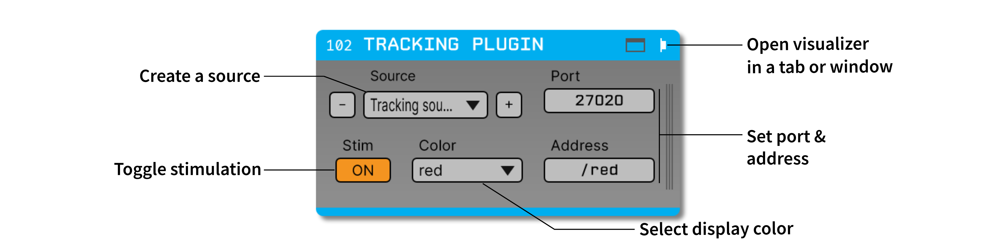

.. _trackingplugin:
.. role:: raw-html-m2r(raw)
   :format: html

#####################
Tracking Plugin
#####################

.. csv-table:: Enables closed-loop stimulation based on position information streamed from Bonsai.
   :widths: 18, 80

   "*Plugin Type*", "Source, Filter, and Sink"
   "*Platforms*", "Windows, Linux, macOS"
   "*Built in?*", "No"
   "*Key Developers*", "Alessio Buccino"
   "*Source Code*", "https://github.com/open-ephys-plugins/tracking-plugin"

.. note:: The Tracking Plugin is not yet available for GUI version 0.6.X.

Installing and upgrading
###########################

The Tracking Plugin is not included by default in the Open Ephys GUI. To install, use **ctrl-P** to access the Plugin Installer, browse to  "Tracking Plugin", and click the "Install" button.

The Plugin Installer also allows you to upgrade to the latest version of this plugin, if it's already installed.

Plugin Configuration
######################

.. note:: This documentation is adapted from the `CINPLA wiki <https://github.com/CINPLA/tracking-plugin/wiki>`__). More information about the Tracking Plugin can be found in `this publication <https://iopscience.iop.org/article/10.1088/1741-2552/aacf45/meta>`__.

|

.. image:: ../../_static/images/plugins/trackingplugin/system_overview.png
  :alt: Overview of the components needed to use the Tracking Plugin effectively.

This figure shows a block diagram of the system needed to use the Tracking Plugin effectively. It assumes there is a subject (a freely moving animal) outfitted with **recording electrodes and two LEDs**. The electrophysiology data are acquired with the Open Ephys GUI. In this case, the Open Ephys acquisition board is used as the data interface, but any compatible recording system would also work. 

A **camera** is positioned above the environment to capture the location of the LEDs on the subject's head. The images are streamed to Bonsai, which extracts the position of the LEDs in real-time and streams this information to the Open Ephys GUI, using the OSC (Open Sound Control) protocol. A PointGrey camera is used in this example, but any camera that is compatible with Bonsai (including webcams) would also work. Synchronization between the camera and electrophysiology data is performed by recording the camera shutter events using the Open Ephys I/O board.

To deliver closed-loop feedback as a function of position, the Open Ephys GUI must be connected to a **stimulation device**, such as an Arduino (or in this example) as Pulse Pal. The outputs of the stimulation device are used to optical or electrical stimulation to the brain, and the timing of any output pulses are also recorded using the Open Ephys I/O board.

Setting up the camera
----------------------

These instructions assume you have a FLIR `Flea3 <https://www.flir.com/products/flea3-usb3/>`__ (formerly Point Grey) camera. Configuration for other cameras may differ.

.. warning:: The Bonsai FlyCapture package has combatibility issues with the FlyCapture SDK version >2.11. Therefore, we recommend installing SDK v2.11 from this `link on the Bonsai forum <https://groups.google.com/forum/#!msg/bonsai-users/Wq2Bo1DnCD8/jb0BfvIVAgAJ>`__

From the FlyCapture software, you can activate GPIO triggers that can be recorded with the Open Ephys board for precise synchronization, and also change the frame rate.

Setting up Bonsai
------------------

If you haven't already, `install Bonsai <https://bonsai-rx.org/docs/articles/installation.html>`__. After opening Bonsai, find the package manager and install the **Vision**, **Vision Design**, **PointGrey**, **OSC**, **OSC Design**, and **Scripting** packages.

Once everything is installed, download and unzip the files in `this directory <https://github.com/open-ephys-plugins/tracking-plugin/raw/master/Resources/tracking-plugin-bonsai.zip>`__. Then, open the :code:`tracking.bonsai` workflow file in Bonsai.

If you don't have a PointGrey camera available, replace the :code:`FlyCapture` operator with one that's compatible with your camera.

The directory contains a configuration file :code:`osc.config` that sets up two OSC ports:

* :code:`RedPort`: port = 27020, address = :code:`/red`, ip_address = :code:`localhost`
* :code:`GreenPort`: port = 27021, address = :code:`/green`, ip_address = :code:`localhost`

To start the workflow, press the "Play" button within Bonsai. This will start acquiring camera frames, extracting LED positions (if available), and streaming position information via OSC.

Tracking Port
---------------

On the Open Ephys GUI side, the "Tracking Port" plugin receives tracking data from Bonsai. The data are streamed from an OSC (Open Sound Control) server and each packet contains 4 floats: x and y positions, width, and height of the field. You can add and delete new sources using the :code:`+` and :code:`-` buttons. The port, address, and color used to represent the incoming data can also be configured within the plugin's editor.

.. note:: The Tracking Port only support :code:`localhost` at the moment, so Bonsai must be running on the same computer as the Open Ephys GUI.

Tracking Stimulator
--------------------

The "Tracking Stimulator", when placed downstream from the "Tracking Port", allows the user to create regions of interest within the camera's field of view. Whenever the subject enters one of these regions, the plugin emits TTL events that can be used to trigger closed-loop feedback.

Regions of interest can manually drawn, dragged, resized (double click), copied (ctrl+c), pasted (ctrl+v), and deleted (del). Alternatively, the parameters for each circle (x_position, y_position, and radius from 0 to 1) can be entered using the editable labels on the right side of the visualizer. Each circle can be inactivated using the :code:`ON` toggle button.

On the top right of the visualizer, the user can select an input source as well as a TTL output channel for each circle.

Stimulation is triggered ONLY when the toggle button in the editor (bottom left) is set to :code:`ON`.

When within the selected circles, the tracking cue becomes red and TTL events are generated on the selected Output channel. There are two operation modes controlled by the buttons:

* **UNIFORM**: a TTL train with a constant frequency fmax (user-defined) is generated when the position is within selected regions. In this mode, the colors of the circles are uniformly orange/yellow.

* **GAUSSIAN**: the frequency of the TTL train is Gaussian modulated. When the position is in the center of each circle, the frequency is fmax, when it is on the border of a circle the frequency is sd * fmax. In the case displayed in the following figure, the frequency in the center is 2 Hz and the frequency on the borders is 0.5 * 2 = 1 Hz. In this mode, the colors of the circles are graded, darker in the center and lighter on the borders.

Tracking Visualizer
--------------------

The "Tracking Visualizer" displays the tracking data received from the "Tracking Port" (or any other plugin sending Tracking Data binary events) in real-time. The available Tracking Data sources are shown in the Sources list box on the left and multiple selection is allowed. The "clear" button clears the path trajectories.

The figure below shows a simulated spiral-like trajectory:

.. image:: ../../_static/images/plugins/trackingplugin/trackingvisualizer.png
  :alt: Screenshot of the Tracking Visualizer plugin.