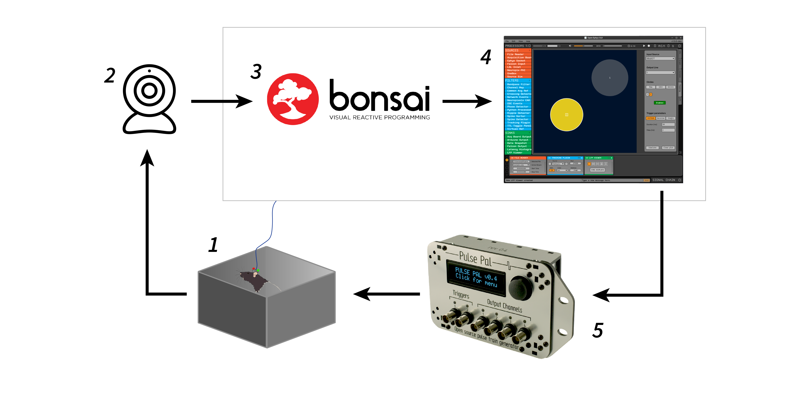
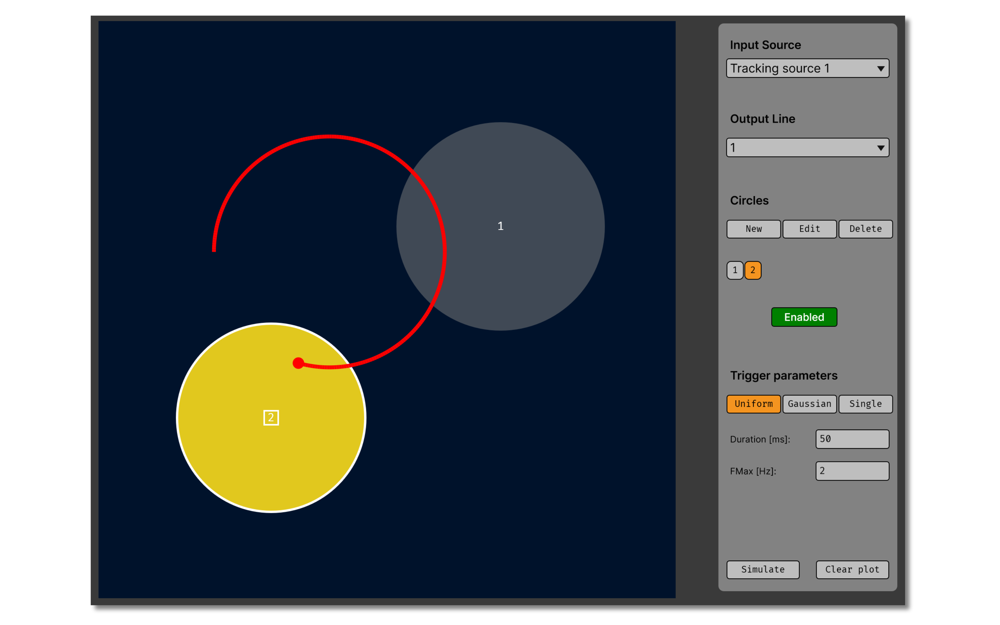

.. _trackingplugin:
.. role:: raw-html-m2r(raw)
   :format: html

#####################
Tracking Plugin
#####################

.. image:: ../../_static/images/plugins/trackingplugin/trackingplugin-01.png
  :alt: Annotated Tracking Plugin Editors

.. csv-table:: Enables closed-loop stimulation based on position information streamed from Bonsai.
   :widths: 18, 80

   "*Plugin Type*", "Filter"
   "*Platforms*", "Windows, Linux, macOS"
   "*Built in?*", "No"
   "*Key Developers*", "Alessio Buccino"
   "*Source Code*", "https://github.com/open-ephys-plugins/tracking-plugin"

.. note:: This documentation is adapted from the `CINPLA wiki <https://github.com/CINPLA/tracking-plugin/wiki>`__. More information about the Tracking Plugin can be found in `this publication <https://iopscience.iop.org/article/10.1088/1741-2552/aacf45/meta>`__.

Installing and upgrading
###########################

The Tracking Plugin is not included by default in the Open Ephys GUI. To install, use **ctrl-P** to access the Plugin Installer, browse to  "Tracking Plugin", and click the "Install" button.

The Plugin Installer also allows you to upgrade to the latest version of this plugin, if it's already installed.

.. note:: Although the Tracking Plugin can be installed on all three types of operating systems, it needs to be run on the same machine as Bonsai (which is currently Windows-only).

Plugin Configuration
######################

This figure shows the basic components needed to use the Tracking Plugin:

1. A freely moving subject outfitted with **one or more tracking LEDs**.

2. A Bonsai-compatible **camera** positioned above the environment to capture the location of the LEDs on the subject's head. 

3. A **Bonsai workflow** configured to package tracking points as OSC messages.

4. An instance of the **Open Ephys GUI with the Tracking Plugin installed** (on the same machine running Bonsai).

5. A **stimulation device**, such as an Arduino or Pulse Pal, used to deliver closed-loop feedback.

Setting up Bonsai
------------------

If you haven't already, `install Bonsai <https://bonsai-rx.org>`__. After opening Bonsai, find the package manager and install the **Vision**, **Vision Design**, **OSC**, **OSC Design**, and **Scripting** packages. If your camera isn't a USB webcam, you'll also need to install the appropriate Bonsai package to interface with it (e.g. **Spinnaker**, **Pylon**, **Vimba**).

Once everything is installed, download and open the `tracking-camera.bonsai <https://github.com/open-ephys-plugins/tracking-plugin/blob/main/Resources/Bonsai/tracking-camera.bonsai>`__ workflow. If necessary, replace the **CameraCapture** node with one that's compatible with your camera.

To start the workflow, press the "Play" button within Bonsai. This will start acquiring camera frames, extracting red and green LED positions (if available), and streaming position information.

The data are streamed via OSC (Open Sound Control), with each packet containing 4 float values: 

1. Relative x position of the tracked point (as a fraction of the overall width of the image)
2. Relative y position of the tracked point (as a fraction of the overall height of the image)
3. Image width (in pixels)
4. Image height (in pixels)

.. important:: The tracking points will not be recorded by the Open Ephys GUI; if you want to save these, you should do it on the Bonsai side (a **CsvWriter** node is recommended).

Tracking sources
--------------------

.. important:: These instructions apply to the Tracking Plugin for GUI version 0.6.x and higher. All of the functionality is now contained in a single Filter plugin, as opposed to the separate Source, Filter, and Sink plugins that were used previously.

After adding the Tracking Plugin to the Open Ephys signal chain, you first need to define at least one "tracking source." You can add and delete new sources using the :code:`+` and :code:`-` buttons. The port number, OSC address, and color used to represent the incoming data can also be configured within the plugin's editor. Make sure these match the OSC settings in Bonsai (which must be running on the same computer).

To enable stimulation, the user must select an input tracking source as well as an associated TTL output channel in the plugin's visualizer. Stimulation is triggered ONLY when the toggle button in the editor is set to :code:`ON`.

Creating ROIs 
--------------

The Tracking Plugin visualizer allows the user to create regions of interest (ROIs) within the camera's field of view. Whenever the subject enters one of these regions, the plugin emits TTL events that can be used to trigger closed-loop feedback. There are three operation modes for ROIs:

* **UNIFORM**: a TTL train with a constant, user-defined frequency is generated when the position is within any ROI.

* **GAUSSIAN**: the frequency of the TTL train is Gaussian modulated. When the position is in the center of any ROI, the frequency is equal to fmax (the user-defined frequency), and when it is on the border of a circle the frequency is sd * fmax.

* **SINGLE**: the plugin emits a single pulse of the specified duration immediately when the position enters an ROI.

Circular regions of interest can manually drawn, dragged, resized, and deleted. The parameters for each circle (x_position, y_position, and radius) can be entered using the popup menus accessible via the "New" and "Edit" buttons. Each circle can be inactivated or reactivated using the :code:`Enabled` toggle button, or removed using the "Delete" button:

