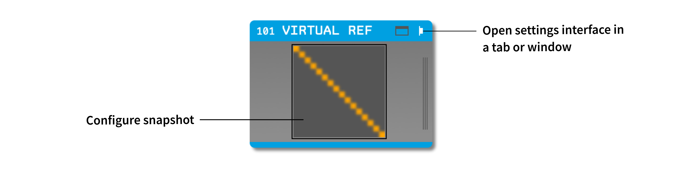
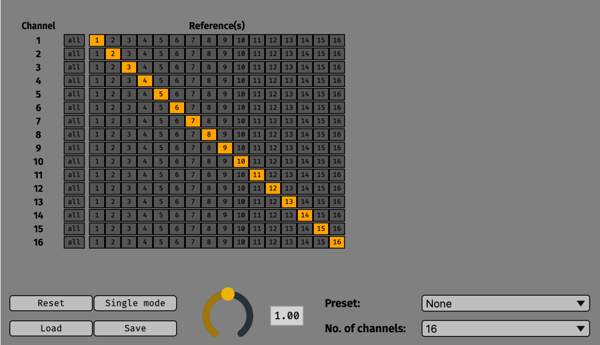

.. _virtualreference:
.. role:: raw-html-m2r(raw)
   :format: html

#####################
Virtual Reference
#####################

.. csv-table:: Makes it possible to reference any combination of channels to any other.
   :widths: 18, 80

   "*Plugin Type*", "Filter"
   "*Platforms*", "Windows, Linux, macOS"
   "*Built in?*", "No"
   "*Key Developers*", "Arne Meyer"
   "*Source Code*", "https://github.com/open-ephys-plugins/VirtualReferencePlugin"

Installing and upgrading
###########################

The Virtual Reference plugin is not included by default in the Open Ephys GUI. To install, use **ctrl-P** to access the Plugin Installer, browse to the "Virtual Reference" plugin, and click the "Install" button.

The Plugin Installer also allows you to upgrade to the latest version of this plugin, if it's already installed.

Plugin Configuration
######################

.. note:: Due to limitations of the settings interface, it's not recommended to use this plugin with more than 128 input channels.

|

All of the configuration occurs inside the plugin's visualizer. To access it, click on one of the buttons in the upper right of the plugin editor to open the settings interface in a tab or window.

The main settings interface consists of a matrix with one row for each input channel and one column for each potential reference channel. Selecting all the channels in a row is equivalent to using a common average reference for that input channel. Selecting only one channel in a row is the equivalent of using a single digital reference. When no channels are selected in a row, the data for the incoming channel will be unchanged.

The bottom of the settings interface presents several additional options:

* **RESET**: Removes all reference settings, restoring the plugin to its default state.
* **SINGLE MODE**: Allows only one channel per row to be selected at a time.
* **SAVE**: Saves the reference settings to a config file.
* **LOAD**: Loads the reference settings from a config file.
* **Gain slider**: Changes the multiplier used on the reference channels before subtracting from the input channel (default = 1).
* **Preset**: Select from several useful pre-defined configurations.
* **# channels**: Sets the maximum number of channels used for the preset configurations.