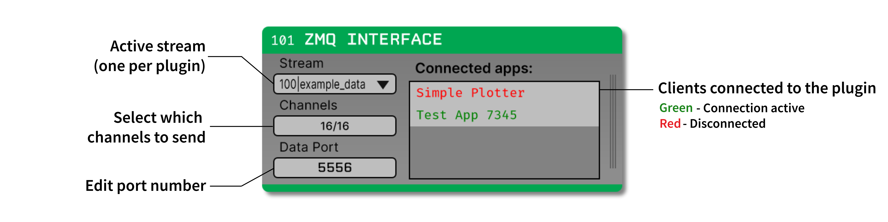

.. _zmqinterface:
.. role:: raw-html-m2r(raw)
   :format: html

################
ZMQ Interface
################

.. csv-table:: Sends continuous data, events, and spikes to external applications using the ZeroMQ library, making it possible to create advanced visualization and monitoring add-ons, such as `OPETH <https://github.com/hangyabalazs/opeth>`__ 
   :widths: 18, 80

   "*Plugin Type*", "Sink"
   "*Platforms*", "Windows, Linux, macOS"
   "*Built in?*", "No"
   "*Key Developers*", "Francesco Battaglia, András Széll, Anjal Doshi"
   "*Source Code*", "https://github.com/open-ephys-plugins/zmq-interface/tree/main"

.. tip:: The client application may be written in any language/platform supporting ZeroMQ.

Installing and upgrading
###########################

The ZMQ Interface plugin is not included by default in the Open Ephys GUI. To install, use **ctrl-P** or **⌘P** to access the Plugin Installer, browse to the "ZMQ Interface" plugin, and click the "Install" button.

The Plugin Installer also allows you to upgrade to the latest version of this plugin, if it's already installed.

Plugin Configuration
#####################

The plugin editor contains three editable parameters:

#. **Stream:** Select an incoming data stream to use. Each ZMQ Interface plugin can only send one stream at a time. To send data from multiple streams, place several plugins in series.

#. **Channels:** The continuous data channels to send (all are selected by default).

#. **Data Port:** Port number for the ZMQ socket.

The editor also shows a list of clients connected to the plugin via the listening port (5557). If a client is successfully connected, then its name will show up in green in the list once acquisition has started. If the client disconnects while acquisition is active, its name will turn red.

Data Packets
################

The ZMQ Interface send multi-part ZMQ messages. Each message consists of three parts:

Message Envelope
-----------------
Contains the type of message being received (:code:`data`, :code:`spike`, or :code:`event`), as well as the index of the message (:code:`message_num`).

Message Header
-----------------
A JSON string containing information about the incoming data packet.

Continuous data
================

.. code-block::
  
    "stream" : stream name
    "channel_num" : local channel index
    "num_samples": num of samples in this buffer
    "sample_num": index of first sample
    "sample_rate": sampling rate of this channel

Event data
================

.. code-block::

    "stream" : stream name
    "source_node" : processor ID that generated the event
    "type": specifies TTL vs. message,
    "sample_num": index of the event

Spike data
================

.. code-block::

    "stream" : stream name
    "source_node" : processor ID that generated the spike
    "electrode" : name of the spike channel
    "sample_num" : index of the peak sample
    "num_channels" : total number of channels in this spike
    "num_samples" : total number of samples in this spike
    "sorted_id" : sorted ID (default = 0)
    "threshold" : threshold values across all channels

Message Data
-------------

  .. csv-table::
   :widths: 15, 50

   "**Continuous**", "Continuous data from one channel"
   "**TTL Event**", "Event data (in order) = {1Byte\: 'Event Line', 1 Byte\: 'Event state(0 or 1)', 8 Bytes:'TTL Word'}"
   "**Spike**", "Spike waveform"

Example Code
#############

The example code for receiving continuous data is written in Python, although in principle it should be possible from any language supporting ZeroMQ. 

In the **Resources** directory of the plugin repository, there is an example Python client called :code:`simple_plotter_zmq.py`` which plots the continuous data received from the Open Ephys GUI over a network port (see image below).

.. image:: ../../_static/images/plugins/zmqinterface/zmqinterface-02.png
  :alt: ZMQ Client in Python

In addition to receiving and processing data, each client app must use a heartbeat protocol to maintain the connection with the ZMQ Interface plugin.

|

