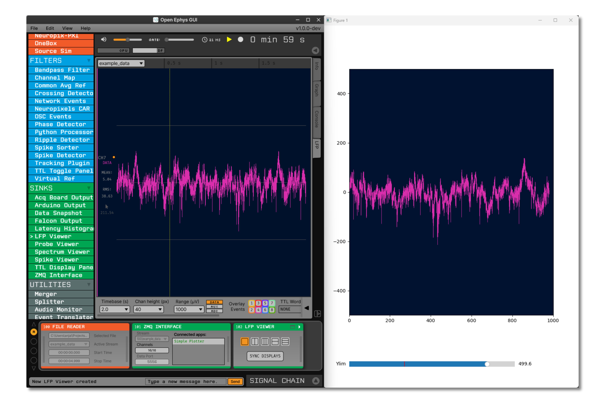

.. _zmqinterface:
.. role:: raw-html-m2r(raw)
   :format: html

################
ZMQ Interface
################

.. image:: ../../_static/images/plugins/zmqinterface/zmqinterface-01.png
  :alt: ZMQ interface

|

.. csv-table:: Sends continuous data and events to external applications, making it possible to create advanced visualization and monitoring add-ons, such as `OPETH <https://github.com/hangyabalazs/opeth>`__ 
   :widths: 18, 80

   "*Plugin Type*", "Filter"
   "*Platforms*", "Windows, Linux, macOS"
   "*Built in?*", "No"
   "*Key Developers*", "Francesco Battaglia, András Széll"
   "*Source Code*", "https://github.com/open-ephys-plugins/ZMQInterface"

.. tip:: The client application may be written in any language/platform supporting ZeroMQ.

Usage
########

The example code for receiving continuous data is written in Python, although in principle it should be possible from any language supporting ZeroMQ. 
Currently, ZMQInterface doesn’t support handling event data. If you want to send or receive event data in Open Ephys using ZMQ, use the NetworkEvents and EventBroadcaster plugins from the ZMQPlugins repo.

In the python_clients/ZMQPlugins directory of the original repo, you'll find an example python client called simple_plotter_zmq.py which plots the continuous data received from the Open Ephys GUI over a network port (see image below).

There are two important things that needs to be taken care of by the client app. One is, setup a heartbeat protocol to maintain connection between Open Ephys GUI and the client app. The other is receiving the continuous data from the GUI and handling it on the client app. 

Data Packets
################

The data packets sent by ZMQInterface are multipart messages divided into three parts

#. **Message Envelope:** The type of message being received, either DATA or EVENT.

#. **Message Header:** An array of message header attributes and its values: message number, type (data, spike, or event), number of channels, number of samples, number of real samples, timestamp, and the sample rate.

#. **Message Data:** The actual continuous data.

