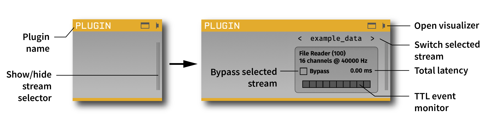
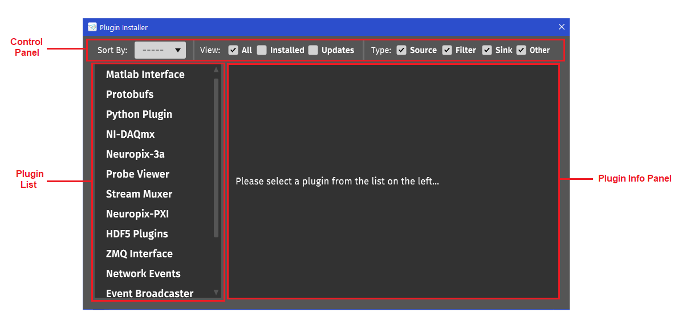
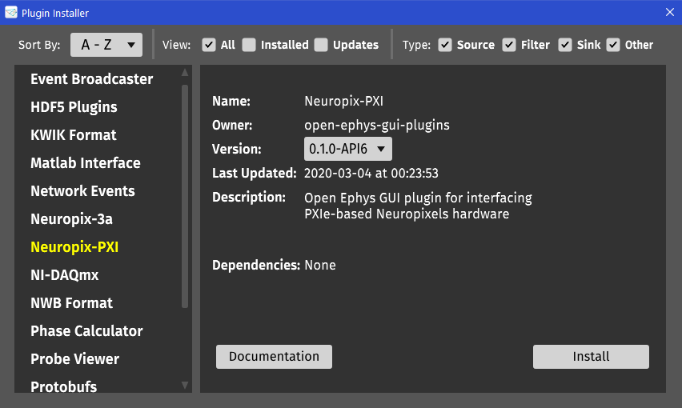
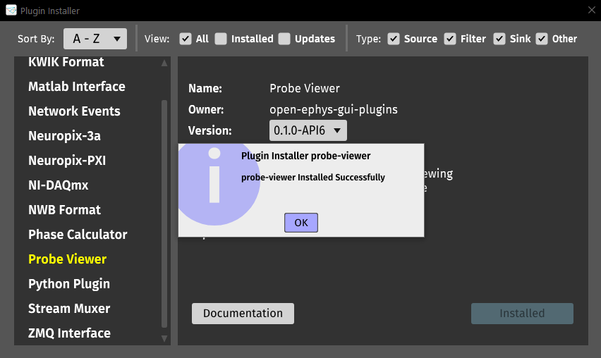

.. _plugins:

Plugins
===============

Plugins are the heart of the GUI's functionality. They make it possible to swap in different data sources, rapidly reconfigure real-time processing pipelines, and add features without needing to learn about the entire application. Now, with the addition of the Plugin Installer, it's easier than ever to incorporate new plugins into your signal chains.

The GUI comes with a number of "built-in" plugins, which appear automatically when you launch the GUI. Other officially supported plugins are hosted in a centralized repository, and can be downloaded and upgraded via the Plugin Isntaller. This is how we want to distribute all plugins in the future, to make it easier to upgrade individual plugins whenever new changes become available.

A list of third-party plugins is available on the `Open Ephys wiki <https://open-ephys.atlassian.net/wiki/spaces/OEW/pages/47841283/Third-party+plugin+repositories>`__. We plan to migrate many of these to the centralized repository in the near future. To learn how to build your own plugin, check out :ref:`creatinganewplugin`.

General Plugin Features
########################

Plugins interact with one another in two primary ways:

#. Prior to starting data acquisition, plugins pass configuration objects through the signal chain, so downstream plugins know what type of data to expect. Plugins can generate continuous data or events (including TTL events, messages, and spikes).

#. While acquisition is active, plugins can modify continuous data buffers or add to the event data buffers. The size of these buffers (in ms) is determined by the computer's audio card, and can be configured through the Audio Settings interface in the GUI's main control panel.

Plugins can also display information to the user via the Message Center.

Each plugin has a 3-digit ID number, as well as a single-digit number to identify each of its subprocessors. A subprocessor is a set of channels that are sampled synchronously, and which are guaranteed to have the same number of samples in each buffer. Most source plugins contain only one subprocessor, but some plugins (such as Neuropixels) contain separate subprocessors for data streams (e.g., individual probes) that may have slightly different sample rates.

When you drop a plugin onto the signal chain, you'll see an editor for any user-configurable settings. The generic plugin settings editor interface looks like this:

The blank region usually includes widgets for changing available settings. All plugins contain a "channel drawer" for selecting subsets of channels for parameter updates or audio monitoring.

The behavior of the selected channels in "PARAM" mode depends on the plugin. In "AUDIO" mode, the selected channels will be sent to the computer's audio output for monitoring. However, in the near future audio monitoring will  be configured through a separate plugin, similar to the Record Node.

Types of Plugins
#################

* **Sources**: bring data into the signal chain. Acquisition won't start unless every signal chain has at least one source.

* **Filters**: alter the data in some way, either by changing the continuous data or adding TTL events, messages, or spikes to the event buffer.

* **Sinks**: send data to an external source, such as a display, stimulator, etc., without altering the underlying data streams. Data should pass through Sinks unchanged.

* **Utilities**: allow the signal chain to be split or merged, or to control the recording state by intercepting TTL events.

* **Record Engines**: define new data formats. These plugins do not appear in the processor list, but instead show up in drop-down menus inside the global record options panel or individual Record Nodes.

Plugin Installer
#################

The Plugin Installer is a simple graphical user interface that allows the user to download and install plugins that are not included by default. All available plugins are hosted in the `Open Ephys Plugins GitHub Account`_. All the plugins on here are either developed by the Open Ephys team or community-developed plugins that have been forked.

To open Plugin Installer, go to File > Plugin Installer, or press the shortcut keys Ctrl+P (Cmd+P on macOS). This brings up the interface below:

Layout
------

The top bar of the Plugin Installer that allows the user to:

* Sort the plugins alphabetically in ascending (A to Z) or descending (Z to A) order. 

* Filter plugins by those that are available, plugins that are installed by Plugin Installer, or the installed plugins that have updates available.

* Filter the plugins by type: Source, Filter, Sink, or Other.

Next is the plugin list, which, as the name implies, shows the list of plugins available on the basis of the selections made in the control panel.

Lastly, the plugin information panel gives information regarding the plugin selected from the plugin list. This information includes the name of the plugin, owner, list of (compatible) versions available, last updated, description, and any external dependencies.

Installing Plugins
-------------------

To install a plugin, simply select the desired plugin from the plugin list, the plugin info panel will fetch the information of that plugin and display it. Then, select the desired version of that plugin from the drop-down menu, and click on Install. If everything works fine, a success message should pop-up saying that the plugin installed successfully. Now, the plugin should be loaded in the GUI, and it will show up in the Processor List of the main GUI window. If there is an error while installing the plugin, an error message should pop-up saying what kind of error it was. The error message will also be outputted to the console, if it is open.

.. note:: Plugins downloaded via Plugin Installer won’t load into the main GUI if plugin-GUI is built from source in Debug mode. Please make sure plugin-GUI is built in Release mode before installing any plugins.

Upgrading / Downgrading
-----------------------------

To check if any of the installed plugins have a newer version available, click on the Updates checkbox in the control panel. To upgrade that plugin, select the newest version of that plugin in the info panel, and the “Installed” button should change to “Upgrade“. Click on Upgrade, and this should upgrade the plugin to the version that you selected. 

To downgrade a plugin to an older version (if available), click on the "Installed" checkbox in the Plugin Installer control panel, click on the plugin you want to downgrade, select the older version from the "Version" drop-down menu. This should change the “Installed” button text to “Downgrade”. Click on Downgrade, and this should downgrade the plugin to the version that you selected.

Uninstalling Plugins
----------------------

Currently, Plugin Installer doesn’t support uninstalling a plugin directly from the GUI. To do that manually, go to the plugins directory which is at the same level as the open-ephys executable (for macOS, the plugins directly used by Plugin Installer is at :code:`${YOUR_HOME_DIR}/Library/Application Support/open-ephys/plugins)`. Find the :code:`.dll` / :code:`.so` / :code:`.bundle` file of the plugin you want to remove, and delete it. The next time you open Plugin Installer, you should be able to see that plugin as not installed. 

.. toctree::
    :hidden:
    :maxdepth: 5

    Arduino Output
    Bandpass Filter
    Channel Map
    Common Average Reference
    Event Broadcaster
    Event Triggered Average
    File Reader
    Intan Recording Controller
    LFP Viewer
    MATLAB Interface
    Merger
    Network Events
    Neuropixels 3a
    Neuropixels PXI
    NIDAQmx
    Phase Calculator
    Phase Detector
    Probe Viewer
    Pulse Pal
    Record Control
    Rectifier
    Rhythm FPGA
    Serial Port
    Spike Detector
    Spike Sorter
    Spike Viewer
    Splitter
    Stream Muxer
    ZMQ Interface
    
    

.. role:: raw-html-m2r(raw)
   :format: html

.. _Open Ephys Plugins GitHub Account: https://github.com/open-ephys-plugins?tab=repositories