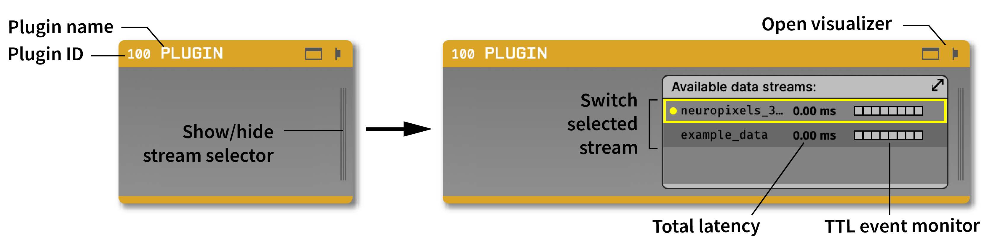

.. _plugins:

Plugins
===============

Plugins are the heart of the GUI's functionality. They make it possible to swap in different data sources, rapidly reconfigure real-time processing pipelines, and add features without needing to learn about the entire application. Now, with the addition of the Plugin Installer, it's easier than ever to incorporate new plugins into your signal chains.

The GUI comes with a number of "built-in" plugins, which appear automatically when you launch the GUI. Other officially supported plugins are hosted in a centralized repository, and can be downloaded and upgraded via the Plugin Installer. This is how we want to distribute all newly created plugins in the future, to make it easier to upgrade individual plugins whenever new changes become available.

To learn how to build your own plugin, check out :ref:`creatinganewplugin`.

Types of Plugins
#################

Processor Plugins
------------------

**Sources** bring data into the signal chain. Acquisition won't start unless every signal chain has at least one source.

Officially supported Source plugins include :ref:`acquisitionboard`, :ref:`onebox`, :ref:`intanrhdusb`, :ref:`rhdreccontroller`, :ref:`ephyssocket`, :ref:`filereader`, :ref:`lslinlet`, :ref:`neuropixelspxi`, :ref:`NI-DAQmx`

**Filters** alter the data in some way, either by modifying the continuous data or adding TTL events, broadcast messages, or spikes to the event buffer.

Officially supported Filter plugins include :ref:`bandpassfilter`, :ref:`channelmap`, :ref:`cnnripple`, :ref:`commonaveragereference`, :ref:`crossingdetector`, :ref:`matlabinterface`, :ref:`meanspikerate`, :ref:`multibandintegrator`, :ref:`networkevents`, :ref:`neuropixelscar`, :ref:`oscevents`, :ref:`phasecalculator`, :ref:`phasedetector`, :ref:`rippledetector`, :ref:`spikedetector`, :ref:`spikesorter`, :ref:`trackingplugin`, :ref:`ttlpanels`, :ref:`virtualreference`

**Sinks** send data to an external source, such as a display, stimulator, etc., without altering the underlying data streams. Data should pass through Sinks unchanged.

Officially supported Sink plugins include :ref:`arduinooutput`, :ref:`datasnapshot`, :ref:`eventbroadcaster`, :ref:`falconoutput`, :ref:`latencyhistogram`, :ref:`lfpviewer`, :ref:`multibandintegrator`, :ref:`onlinepsth`, :ref:`probeviewer`, :ref:`pulsepal`, :ref:`spectrumviewer`, :ref:`spikeviewer`, :ref:`zmqinterface`

**Utilities** perform miscellaneous functions related to the signal chain. 

Officially supported Utility plugins include :ref:`audiomonitor`, :ref:`eventtranslator`, :ref:`merger`, :ref:`recordcontrol`, :ref:`splitter`

Record Engines
---------------

Record Engines define new data formats that can be saved by a Record Node. These plugins do not appear in the processor list, but instead show up in drop-down menus inside the global record options panel or individual Record Nodes.

Officially supported Record Engines: :ref:`binaryformat`, :ref:`openephysformat`, :ref:`nwbdataformat`

File Sources
-------------

File Sources allow the File Reader to read data in different formats. These plugins do not appear in the processor list, but instead specify the file extensions that the File Reader can accept (e.g., :code:`.nwb` or :code:`.oebin`).

Officially supported File Sources: :ref:`binaryformat`, :ref:`openephysformat`, :ref:`nwbdataformat`

General Plugin Features
########################

Processor plugins interact with one another in two primary ways:

#. Prior to starting data acquisition, processor plugins pass configuration objects through the signal chain, so downstream plugins know the number of incoming channels to expect. Plugins can generate continuous data or events (including TTL events, messages, and spikes).

#. While acquisition is active, processor plugins can modify continuous data buffers or add to the event data buffers. The size of these buffers (in ms) is determined by the computer's audio card, and can be configured through the Audio Settings interface in the GUI's main control panel.

Each plugin has a 3-digit identifier, starting at 100. Channels processed by individual plugins are grouped into **streams**, a set of channels that are sampled synchronously, and which are guaranteed to have the same number of samples in each buffer. Most source plugins generate only one stream, but some plugins (such as Neuropixels) have separate streams for different devices (e.g., individual probes) that may have slightly different sample rates.

When you drop a plugin onto the signal chain, you'll see an editor for any user-configurable settings. The generic plugin settings editor interface looks like this:

The blank region usually includes widgets for changing available settings. All plugins contain a "stream selector" containing information about all streams that pass through the plugin. For many plugins, the active parameters will only be applied to the currently selected stream.

Plugin Installer
#################

The Plugin Installer is a simple graphical user interface that allows the user to download and install plugins that are not included by default. All available plugins are hosted in the `Open Ephys Plugins GitHub Account`_. All the plugins on here are either developed by the Open Ephys team or community-developed plugins that have been forked, polished, and released.

To open Plugin Installer, go to **File > Plugin Installer**, or press the shortcut keys Ctrl+P (⌘P on macOS). This brings up the interface below:

.. note:: The Plugin Installer requires a network connection in order to function. You will not be able to install plugins unless you have access to the internet.

The top bar of the Plugin Installer allows the user to:

* Sort the plugins alphabetically in ascending (A to Z) or descending (Z to A) order. 

* Filter plugins by those that are available, plugins that are installed by Plugin Installer, or the installed plugins that have updates.

* Filter the plugins by type: Source, Filter, Sink, or Other.

Next is the plugin list, which, as the name implies, shows the list of plugins available on the basis of the selections made in the control panel.

Lastly, the plugin information panel gives information regarding the selected plugin. This information includes the name of the plugin, owner, list of (compatible) versions available, last updated, description, and any external dependencies.

Installing Plugins
-------------------

To install a plugin, simply select the desired plugin from the plugin list, the plugin info panel will fetch the information of that plugin and display it. Then, select the desired version of that plugin from the drop-down menu, and click on Install. If everything works fine, a success message will appear. Now, the plugin should be loaded in the GUI, and it will show up in the Processor List of the main GUI window. If there is an error while installing the plugin, an error message should pop-up saying what kind of error it was. The error message will also be printed to the debug console.

.. note:: Plugins downloaded via Plugin Installer won’t load into the main GUI if plugin-GUI is built from source in Debug mode. Please make sure plugin-GUI is built in Release mode before installing any plugins.

Upgrading / Downgrading
-----------------------------

To check if any of the installed plugins have a newer version available, click on the Updates checkbox in the control panel. To upgrade that plugin, select the newest version of that plugin in the info panel, and the “Installed” button should change to “Upgrade“. Click on Upgrade, and this should upgrade the plugin to the version that you selected. 

To downgrade a plugin to an older version (if available), click on the "Installed" checkbox in the Plugin Installer control panel, click on the plugin you want to downgrade, select the older version from the "Version" drop-down menu. This should change the “Installed” button text to “Downgrade”. Click on Downgrade, and this should downgrade the plugin to the version that you selected.

Uninstalling Plugins
----------------------

To remove a plugin, simply click the "Uninstall" button. This will delete the plugin binary file, and remove the plugin from the Processor List.

|

.. toctree::
    :hidden:
    :maxdepth: 5

    Acq-Board-Output
    Acquisition-Board
    Arduino-Output
    Audio-Monitor
    Bandpass-Filter
    Channel-Map
    Common-Average-Reference
    Commutator-Control
    CNN-Ripple
    Crossing-Detector
    Data-Snapshot
    Ephys-Socket
    Event-Broadcaster
    Event-Translator
    Falcon-Output
    File-Reader
    Intan-RHD-USB
    Latency-Histogram
    LFP-Viewer
    LSL-Inlet
    MATLAB-Interface
    Mean-Spike-Rate
    Merger
    Multiband-Integrator
    Network-Events
    Neuropixels-CAR
    Neuropixels-PXI
    NIDAQmx
    OneBox
    Onix-Source
    Online-PSTH
    OSC-Events
    Phase-Calculator
    Phase-Detector
    Probe-Viewer
    Pulse-Pal
    Python-Processor
    Rec-Controller-Output
    Record-Control
    Record-Node
    RHD-Rec-Controller
    Ripple-Detector
    Scale-Converter
    Source-Sim
    Spectrum-Viewer
    Spike-Detector
    Spike-Sorter
    Spike-Viewer
    Splitter
    Tracking-Plugin
    TTL-Panels
    Virtual-Reference
    XDAQ-OE
    ZMQ-Interface
    
    

.. role:: raw-html-m2r(raw)
   :format: html

.. _Open Ephys Plugins GitHub Account: https://github.com/open-ephys-plugins
