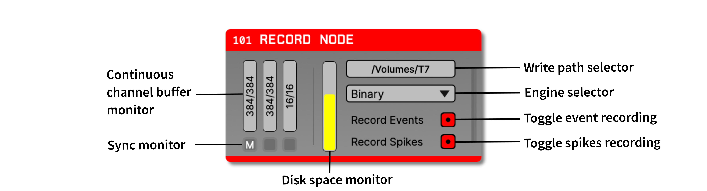
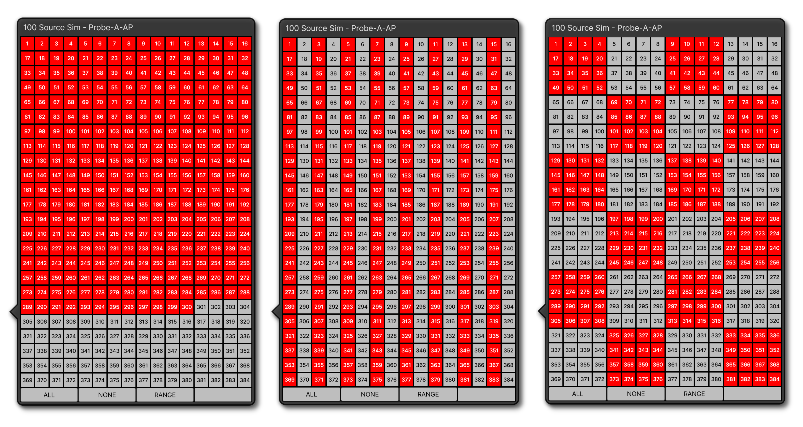

.. _recordingdata:

Recording data
===============

The GUI provides a great deal of flexibility when it comes to recording data. It's possible to write data from any point in the signal chain, using separate data directories or even different data formats. However, it's important to be sure that your recording settings are configured properly, to ensure that you don't lose valuable data.

As of version 0.5.0, the GUI won’t save data unless you have at least one Record Node in your signal chain. This is somewhat different from how things worked previously, when every plugin had its own recording selection tab, and all data was streamed to a central data writing interface. This centralization created some unwanted inefficiencies and bottlenecks, which is why the Record Node now behaves like a separate plugin.

Just like any Filter processor, the Record Node can be placed anywhere except at the very start of a signal chain. However, Record Nodes do not modify the data passing through them, but instead copy and redirect the data to memory using a background thread. Individual Record Nodes inherit settings from the global recording options in the GUI's control panel, but these settings can be overridden locally.

Global recording options
#########################

.. image:: ../_static/images/recordingdata/global_record_options-01.png
  :alt: The global recording options interface

The GUI's main control panel contains a collapsible panel with the global recording options. These include:

* The default data format (see next section for more information)

* The default location for recording data (can be overridden by individual Record Nodes)

* A button for changing the data directory naming scheme:

  * **Prepend:** A string at the start of the directory name; can be "None", "Auto" (:code:`001_`, :code:`002_`, etc.), or "Custom"

  * **Main:** The main directory name; can be "Custom" or "Auto" (:code:`YYYY-MM-DD_HH-MM-SS` format)

  * **Append:** A string at the end of the directory name; can be "None", "Auto" (:code:`_001`, :code:`_002`, etc.), or "Custom"

.. image:: ../_static/images/recordingdata/global_record_options-02.png
  :alt: The global recording options interface

* A button for creating a new directory for the next recording

.. note:: To prevent data from being overwritten, files are grouped by "experiments" and "recordings". Whenever acquisition is stopped, the GUI begins a new experiment; whenever recording is stopped (without stopping acquisition), the GUI begins a new recording. Pressing the **+** button will generate a new data directory the next time recording is started, and the "experiment" and "recording" counters will be reset to 1.

Using the Record Node
#####################

The Record Node, found in the "Recording" section of the Processor List, controls how data is written to disk. Every signal chain requires at least one Record Node in order to save data.

Adding a Record Node into a signal chain brings up the following interface:

General Configuration
---------------------

On the top-right of the Record Node editor is the **write path selector** which opens up an explorer window to navigate to the desired write directory. Use this to set the root path of where the data files generated from this Record Node will be stored. By default, each Record Node will inherit its data directory from the one indicated in the global recording options interface.

Directly below, the **engine selector** pull-down lists the available recording formats. By default, only the Binary format is available. The Open Ephys Format and NWB Format are available via the Plugin Installer.

.. note:: All Record Nodes must be removed from the signal chain before installing a new data format plugin.

To the left of the engine selector is the **disk space monitor**, which indicates the amount of free space available at the path shown by the write path selector.

Recording Continuous Channels
-----------------------------

The continuous channel configuration interfaces accessed by clicking on the "continuous channel buffer monitors" on the left of the Record Node interface. Hovering over each monitor will display the name of its corresponding data stream (a block of channels that are sampled synchronously).

The continuous channel buffer monitors track the state of the recording buffer for each subprocessor. If these start to fill up, it indicates that your computer can't keep up with disk writing. When they become 90% full, recording will automatically stop to prevent data corruption. If this occurs, you can try reducing the number of channels being recorded, or split the disk writing duties across multiple record nodes (see below).

Clicking on one of the continuous channel buffer monitors opens up a **channel selector interface** as shown below. By default, the interface has every channel set to record. Through the interface, you can toggle individual channels on/off, select ALL or NONE, or indicate a custom range of channels using Matlab-style slicing, as shown in these examples:

Click anywhere outside the channel selector or use the ESC key to exit.

Recording Events
-----------------

Below the engine selector is the **toggle event recording** button, which determines whether this Record Node will save incoming events. This will be turned on by default, and should only be turned off if you're sure events are being saved by another Record Node. Regardless of the toggle state, underlying events will not be modified by the Record Node.

Recording Spikes
------------------

The **toggle spikes recording** button will enable/disable recording of any spike data coming into this Record Node. In order for spikes to be detected by the Record Node, you must have a spike-generating processor somewhere upstream of the Record Node in your signal chain.

Adding Multiple Record Nodes
-------------------------------

There are several cases in which it's useful to have multiple Record Nodes in the same signal chain:

* **Recording raw data and spikes**: It's strongly recommended to record the data exactly as it comes out of each source node, which means placing a Record Node directly to the right of each source in the signal chain. After that, the data can be bandpass filtered to extract spikes without affecting the original signals. If a :ref:`spikedetector` is used, then a separate Record Node will be needed to record the spike waveforms. This Record Node can optionally have all of the continuous channels disabled, as these have already been written to disk by the upstream Record Node.

* **Recording in multiple data formats**: It may be useful to store the continuous data in Binary format to maximize compatibility, but spikes and events in NWB format to facilitate interactions with particular offline analysis tools. This can easily be accomplished by choosing a different data format for different Record Nodes. **NOTE:** Since the HDF5 library is not thread safe, there can only be one Record Node using NWB format at a time.

* **Distributing data across multiple drives:** If your computer is having trouble saving all incoming channels, or you can't fit all the data for a single session on a single drive, you can use multiple Record Nodes, each with a base directory located on a different drive. You can then disable non-overlapping subsets of channels within each Record Node.

.. role:: raw-html-m2r(raw)
   :format: html
