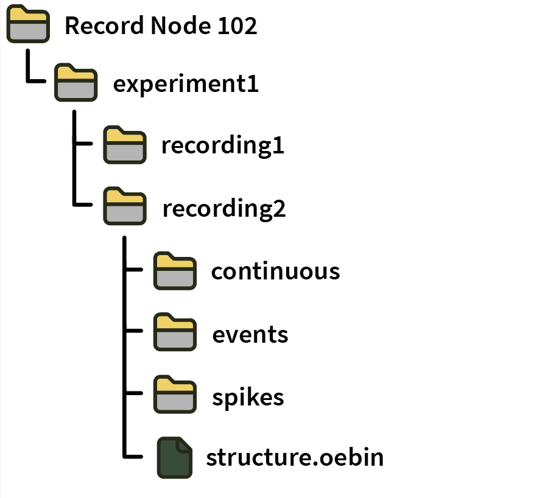
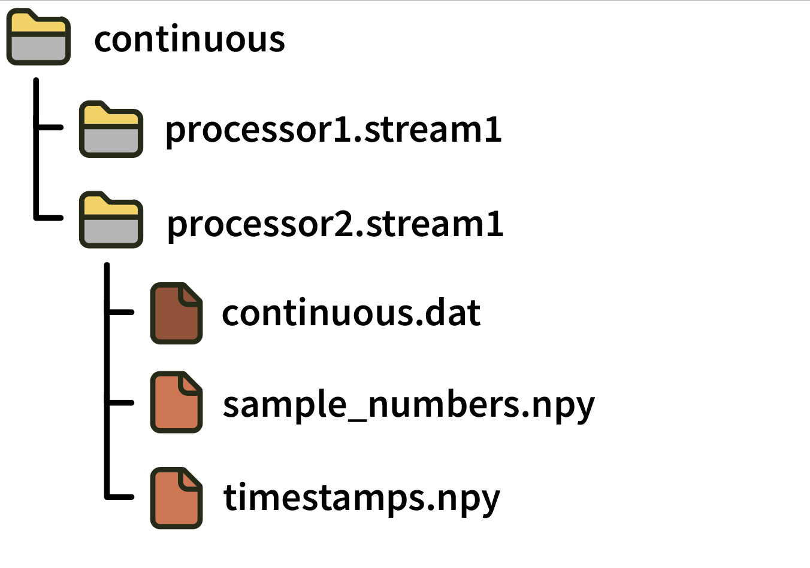
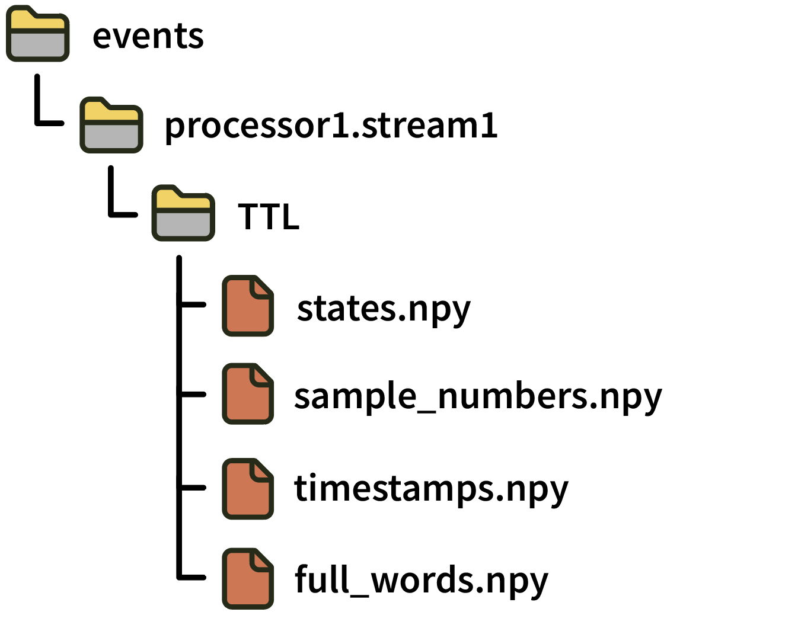
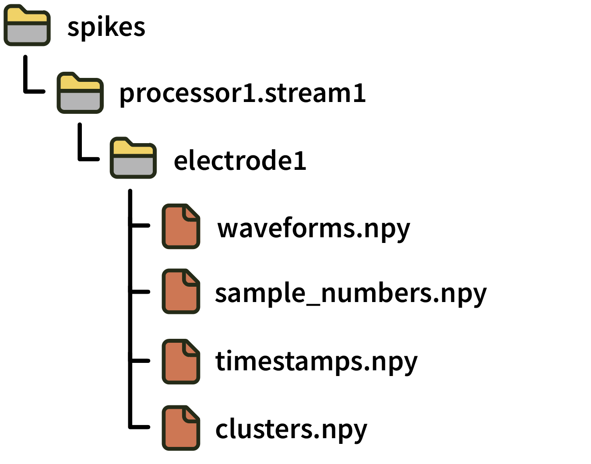

.. _binaryformat:
.. role:: raw-html-m2r(raw)
   :format: html

Binary Format
========================

.. csv-table:: This is the default format for the Open Ephys GUI. Continuous data is stored in flat binary files, and everything else is in JSON / numpy format. Takes advantage of widely used open standards to maximize compatibility with existing and future analysis tools.
   :widths: 18, 80

   "*Platforms*", "Windows, Linux, macOS"
   "*Built in?*", "Yes"
   "*Key Developers*", "Aarón Cuevas López, Josh Siegle"
   "*Source Code*", "https://github.com/open-ephys/plugin-GUI/tree/master/Source/Processors/RecordNode/BinaryFormat"

**Advantages**

* Continuous data is stored in a compact format of tiled 16-bit integers, which can be memory mapped for efficient loading.

* Additional files are stored as JSON or NumPy data format, which can be read using :code:`numpy.load` in Python, or the `npy-matlab <https://github.com/cortex-lab/npy_matlab>`__ package.

* The format has no limit on the number of channels that can be recorded simultaneously.

* Continuous data files are immediately compatible with most spike sorting packages.

**Limitations**

* Requires slightly more disk space because it stores two 64-bit timestamps for every sample.

* Continuous files are not self-contained, i.e., you need to know the number of channels and the "bit-volts" multiplier in order to read them properly.

* It is not robust to crashes, as the NumPy file headers need to be updated when recording is stopped.

File organization
####################

Within a Record Node directory, data for each **experiments** (stop/start acquisition) is contained in its own sub-directory. Experiment directories are further sub-divided for individual **recordings** (stop/start recording).

A recording directory contains sub-directories for **continuous**, **events**, and **spikes** data. It also contains a :code:`structure.oebin`, which is a JSON file detailing channel information, channel metadata, and event metadata descriptions.

Format details
################

Continuous
----------------

Continuous data is written separately for each stream within a processor (a block of synchronously sampled channels):

Each **continuous** directory contains the following files:

* :code:`continuous.dat`: A simple binary file containing *N* channels x *M* samples 16-bit integers in little-endian format. Data is saved as :code:`ch1_samp1, ch2_samp1, ... chN_samp1, ch1_samp2, ch2_samp2, ..., chN_sampM`. The value of the least significant bit needed to convert the 16-bit integers to physical units is specified in the :code:`bitVolts` field of the relevant channel in the :code:`structure.oebin` JSON file. For "headstage" channels, multiplying by :code:`bitVolts` converts the values to microvolts, whereas for "ADC" channels, :code:`bitVolts` converts the values to volts.

* :code:`sample_numbers.npy`: A numpy array containing *M* 64-bit integers that represent the index of each sample in the :code:`.dat` file since the start of acquisition. **Note:** This file was called :code:`timestamps.npy` in GUI version 0.5.X. To avoid ambiguity, "sample numbers" always refer to integer sample index values starting in version 0.6.0.

* :code:`timestamps.npy`: A numpy array containing *M* 64-bit floats representing the global timestamps in seconds relative to the start of the Record Node's main data stream (assuming this stream was synchronized before starting recording). **Note:** This file was called :code:`synchronized_timestamps.npy` in GUI version 0.5.X. To avoid ambiguity, "timestamps" always refer to float values (in units of seconds) starting in version 0.6.0.

Events
-------

Event data is organized by stream and by "event channel" (typically :code:`TTL`). Each event channel records the states of multiple TTL lines.

Directories for TTL event channels include the following files:

* :code:`states.npy`:  numpy array of *N* 16-bit integers, indicating ON (+CH_number) and OFF (-CH_number) states **Note:** This file was called :code:`channel_states.npy` in GUI version 0.5.X. 

* :code:`sample_numbers.npy` Contains *N* 64-bit integers indicating the sample number of each event since the start of acquisition. **Note:** This file was called :code:`timestamps.npy` in GUI version 0.5.X. To avoid ambiguity, "sample numbers" always refer to integer sample index values starting in version 0.6.0.

* :code:`timestamps.npy` Contains *N* 64-bit floats indicating representing the global timestamp of each event in seconds relative to the start of the Record Node's main data stream (assuming this stream was synchronized before starting recording). **Note:** This file did not exist in GUI version 0.5.X. Synchronized (float) timestamps for events first became available in version 0.6.0.

* :code:`full_words.npy`: Contains *N* 64-bit integers containing the "TTL word" consisting of the current state of *all* lines when the event occurred

Text events
^^^^^^^^^^^^

Text events are routed through the GUI's Message Center, and are stored in a directory called :code:`MessageCenter`. They contain the following files:

* :code:`text.npy`: numpy array of *N* strings

* :code:`sample_numbers.npy` Contains *N* 64-bit integers indicating the sample number of each text event on the Record Node's main data stream. **Note:** This file was called :code:`timestamps.npy` in GUI version 0.5.X. To avoid ambiguity, "sample numbers" always refer to integer sample index values starting in version 0.6.0.

* :code:`timestamps.npy` Contains *N* 64-bit floats indicating representing the global timestamp of each text event in seconds relative to the start of the Record Node's main data stream. **Note:** This file did not exist in GUI version 0.5.X. Synchronized (float) timestamps for events first became available in version 0.6.0.

Spikes
--------

Spike data is organized first by stream and then by electrode.

Each **electrode** directory contains the following files:

* :code:`waveforms.npy`: numpy array with dimensions *S* spikes x *N* channels x *M* samples containing the spike waveforms

* :code:`sample_numbers.npy`: numpy array of *S* 64-bit integers containing the sample number corresponding to the peak of each spike. **Note:** This file was called :code:`timestamps.npy` in GUI version 0.5.X. To avoid ambiguity, "sample numbers" always refer to integer sample index values starting in version 0.6.0.

* :code:`timestamps.npy`: numpy array of *S* 64-bit floats containing the global timestamp in seconds corresponding to the peak of each spike (assuming this stream was synchronized before starting recording). **Note:** This file did not exist in GUI version 0.5.X. Synchronized (float) timestamps for spikes first became available in version 0.6.0.

* :code:`clusters.npy`: numpy array of *S* unsigned 16-bit integers containing the sorted cluster ID for each spike (defaults to 0 if this is not available).

More detailed information about each electrode is stored in the :code:`structure.oebin` JSON file.

Reading data in Python
#######################

* **(recommended)** Create a :code:`Session` object using the `open-ephys-python-tools <https://github.com/open-ephys/open-ephys-python-tools>`__ package. The data format will be automatically detected.

* Create a :code:`File` object using the `pyopenephys <https://github.com/CINPLA/pyopenephys>`__ package.

* Use the :code:`DatLoad()` method from :code:`Binary.py` in the `open-ephys/analysis-tools <https://github.com/open-ephys/analysis-tools/blob/master/Python3/Binary.py>`__ repository.

Reading data in Matlab
#######################

* Use the `open-ephys-matlab-tools` <https://github.com/open-ephys/open-ephys-matlab-tools>`__ library.

