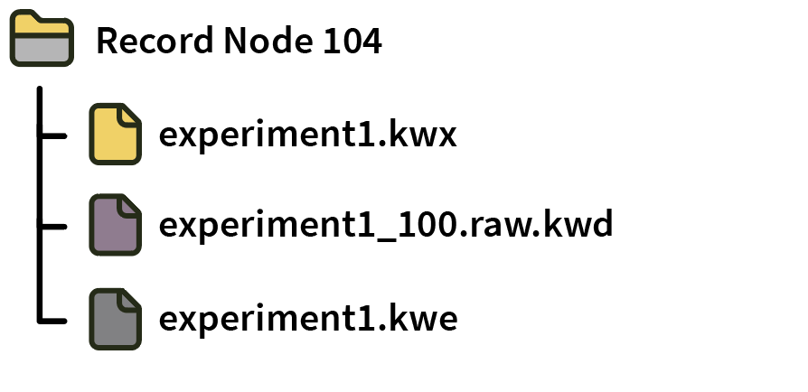
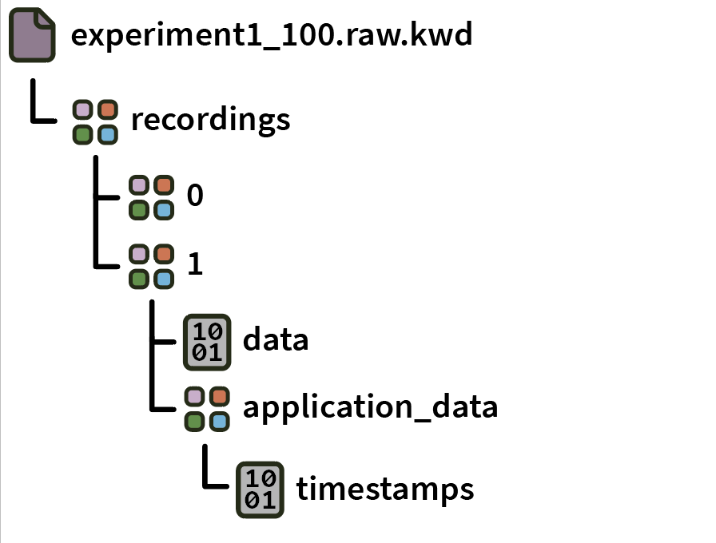
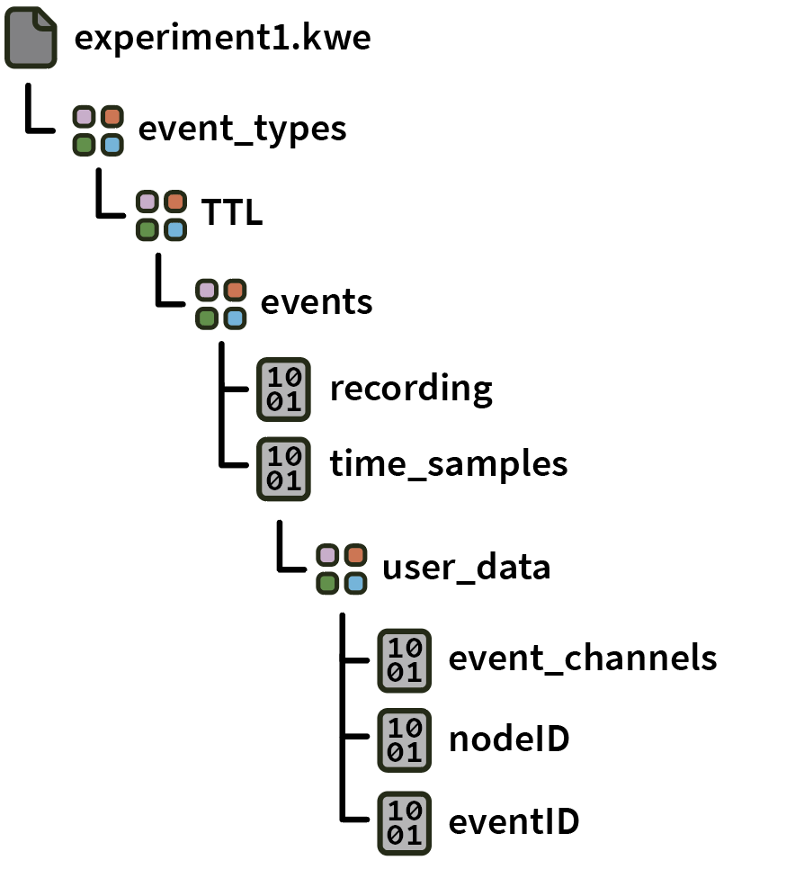
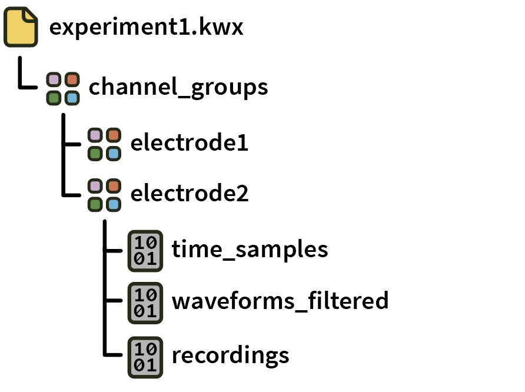

.. _kwikdataformat:
.. role:: raw-html-m2r(raw)
   :format: html

KWIK format
=====================

|

.. csv-table:: This format stores data in separate HDF5 files for continuous, spikes, and events. The complete KWIK specification (created by Ken Harris' lab at UCL) can be found `here <https://github.com/klusta-team/kwiklib/wiki/Kwik-format>`__. Since it is not available by default, it must be downloaded via the GUI's Plugin Installer.
   :widths: 18, 80

   "*Platforms*", "Windows, Linux, macOS"
   "*Built in?*", "No"
   "*Key Developers*", "Aarón Cuevas López"
   "*Source Code*", "https://github.com/open-ephys-plugins/KWIKFormat"

.. caution:: The KWIK format has been deprecated, and is not recommended for use with the Open Ephys GUI. It will be removed in a future version of the GUI.

**Advantages**

* Data is stored across three HDF5 files, with self-documenting internal structure.

* Can be read using standard HDF5 tools, such as `HDFView <https://www.hdfgroup.org/downloads/hdfview/>`__.

**Limitations**

* HDF5 files must be closed gracefully, so data may be irrecoverable if the GUI crashes during acquisition.

* The KWIK format has been deprecated, and will not be developed further.

* The HDF5 C++ library is not thread-safe, so you cannot write to the KWIK format from multiple Record Nodes simultaneously, or use it in combination with the NWB format.

* The KWIK format does not support processors that generate multiple asynchronous data streams (i.e., subprocessors). Therefore, it cannot be used to record Neuropixels data.

File organization
####################

Within a Record Node directory, data for each **experiment** (stop/start acquisition) is stored across three separate HDF5 files. Individual **recordings** are stored in separate groups inside each file.

|

|

Continuous data is stored in **.kwd** files (one per processor), event data is stored in **.kwe** files, and spike data is stored in **.kwx** files.

Format details
################

Continuous
----------------

Inside the **.kwd** file for a particular processor, continuous data is grouped by recording number (0, 1, etc.):

|

|

The group for each recording contains the following datasets:

* :code:`data`: *N* channels x *M* samples of 16-bit integers.

* :code:`application_data/timestamps`: *M* 64-bit integers that represent the timestamps for each sample.

Events
-------

Inside the **.kwe** file, event data is organized by event type (e.g., :code:`TTL`). All events of a particular type (regardless of the processor they originated from) are stored together. The **.kwe** file is an Open Ephys-specific file that was not defined in the original KWIK format specification.

|

|

The top-level **events** group contains the following datasets:

* :code:`recording`: the recording index for each event (0, 1, etc.)

* :code:`time_samples`: 64-bit timestamps for each event

There is a sub-group called :code:`user_data` that contains additional datasets:

* :code:`event_channls`: the virtual channels for each event

* :code:`eventID`: the ON/OFF state for each event

* :code:`nodeID`: the ID of the processor that generated each event

Spikes
--------

Inside the **.kwx** file, data is organized by electrode.

|

|

Each electrode group contains the following datasets:

* :code:`waveforms_filtered`: array with dimensions *S* spikes x *N* channels x *M* samples containing the spike waveforms

* :code:`time_samples`: 64-bit integers containing the timestamps corresponding to the peak of each spike

* :code:`recordings`: the recording index of each spike

Reading data in Python
#######################

* **(recommended)** Create a :code:`Session` object using the `open-ephys-python-tools <https://github.com/open-ephys/open-ephys-python-tools>`__ package. The data format will be automatically detected.

* Use the :code:`load` method from :code:`Kwik.py` in the `open-ephys/analysis-tools <https://github.com/open-ephys/analysis-tools/blob/master/Python3/Kwik.py>`__ repository.

Reading data in Matlab
#######################

For now, use Matlab's :code:`h5read` method to open datasets within a KWD, KWE, or KWX file, e.g.:

.. code-block:: matlab

   data = h5read(filename, dataset)

Kwik-specific loading functions are coming soon.

