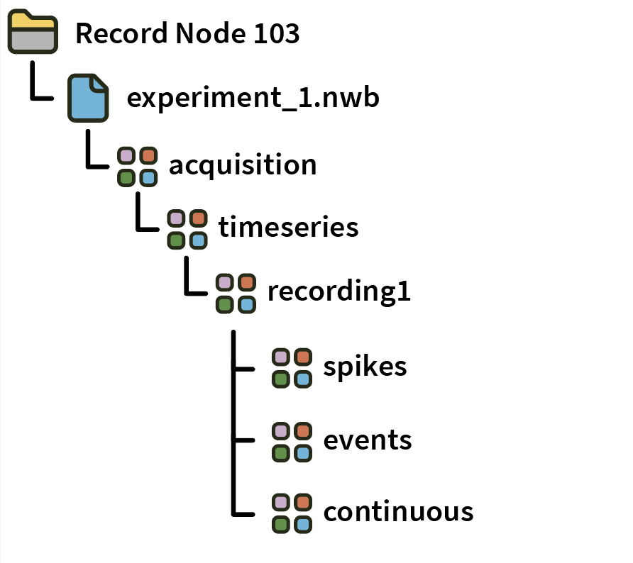
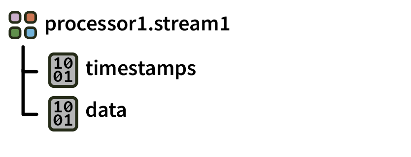
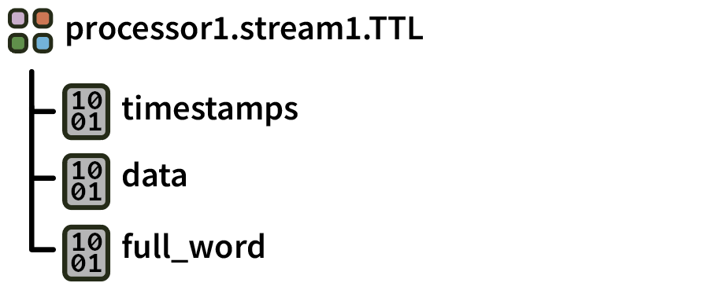
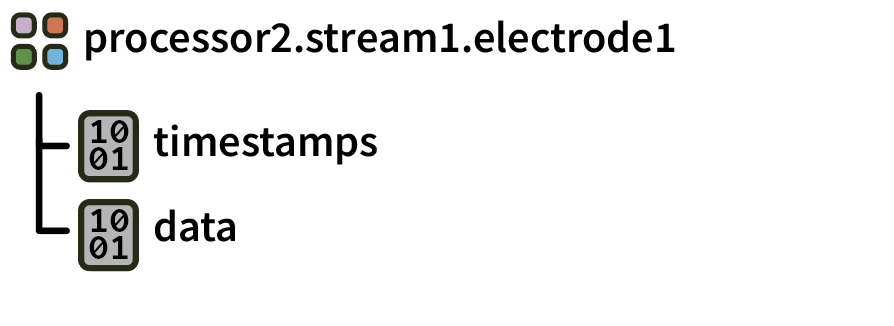

.. _nwbdataformat:
.. role:: raw-html-m2r(raw)
   :format: html

NWB Format
=====================

.. csv-table:: This is a data format based on the `NWB 2.X specification <https://nwb-schema.readthedocs.io/en/latest/format.html>`__. It replaces the deprecated NWB 1.0 format. Since it is not available by default, it must be downloaded via the GUI's Plugin Installer.
   :widths: 18, 80

   "*Platforms*", "Windows, Linux, macOS"
   "*Built in?*", "No"
   "*Key Developers*", "Aarón Cuevas López, Pavel Kulik, Josh Siegle"
   "*Source Code*", "https://github.com/open-ephys-plugins/NWBFormat"

**Advantages**

* NWB is a widely used format for sharing data among neuroscience labs.

* Data is stored in a single HDF5 file with self-documenting internal structure.

* Files can be read using the `pynwb <https://pynwb.readthedocs.io/en/stable/index.html>`__ or `matnwb <https://github.com/NeurodataWithoutBorders/matnwb>`__ libraries, or with the growing number of high-level tools that support the NWB format.

**Limitations**

* HDF5 files must be closed gracefully, so data may be irrecoverable if the GUI crashes during acquisition.

* The HDF5 C++ library is not thread-safe, so you cannot write to the NWB format from multiple Record Nodes simultaneously.

File organization
####################

Within a Record Node directory, data for each **experiment** (stop/start acquisition) is contained in a separate NWB file. Individual **recordings** are appended to datasets stored inside the "acquisition" group.

Each NWB file also contains the following information:

* :code:`/file_create_date`: date + time in ISO format (text array)
* :code:`/identifier`: string identifier for this file (text array)
* :code:`/nwb_version`: '2.4.0' (text attribute)
* :code:`/session_start_time`: date + time in ISO format (text array)

Format details
################

Continuous
----------------

Continuous data is grouped by stream (a block of synchronously sampled channels):

Each **continuous** group is an NWB *ElectricalSeries* containing the following datasets:

* :code:`data`: *N* channels x *M* samples of 16-bit integers. The :code:`channel_conversion` dataset stores the "bitVolts" value required to convert these values into volts.

* :code:`timestamps`: *M* 64-bit floats representing the timestamps (in seconds) for each sample.

Events
-------

Event data is organized by stream and event channel (eusually named :code:`TTL`). Each event channel can contain data for multiple TTL lines.

Each **events** group is an NWB *TimeSeries* containing the following datasets:

* :code:`timestamps`: *N* 64-bit float representing the timestamps (in seconds) for each event

* :code:`data`: *N* event codes indicating ON (+CH_number) and OFF (-CH_number) states

* :code:`full_words`: *N* 64-bit integers representing the state of the first 64 TTL lines when each event occurred.

Spikes
--------

Spike data is organized by stream and electrode.

Each **spikes** group is an NWB *SpikeEventSeries* containing the following datasets:

* :code:`data`: array with dimensions *S* spikes x *N* channels x *M* samples containing the spike waveforms. The :code:`channel_conversion` attribute stores the "bitVolts" value required to convert these values into microvolts (headstage channels) or volts (ADC channels).

* :code:`timestamps`: *S* 64-bit floats containing the timestamps (in seconds) corresponding to the peak time of each spike.

Reading data in Python
#######################

* Create a :code:`Session` object using the `open-ephys-python-tools <https://github.com/open-ephys/open-ephys-python-tools>`__ package. The data format will be automatically detected.

Reading data in Matlab
#######################

For now, use Matlab's :code:`h5read` method to open datasets within an NWB file, e.g.:

.. code-block:: matlab

   data = h5read(filename, dataset)

NWB-specific loading functions are coming soon.

|

