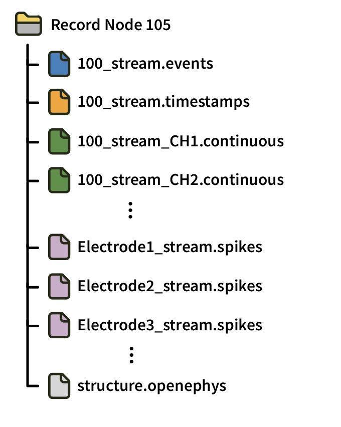
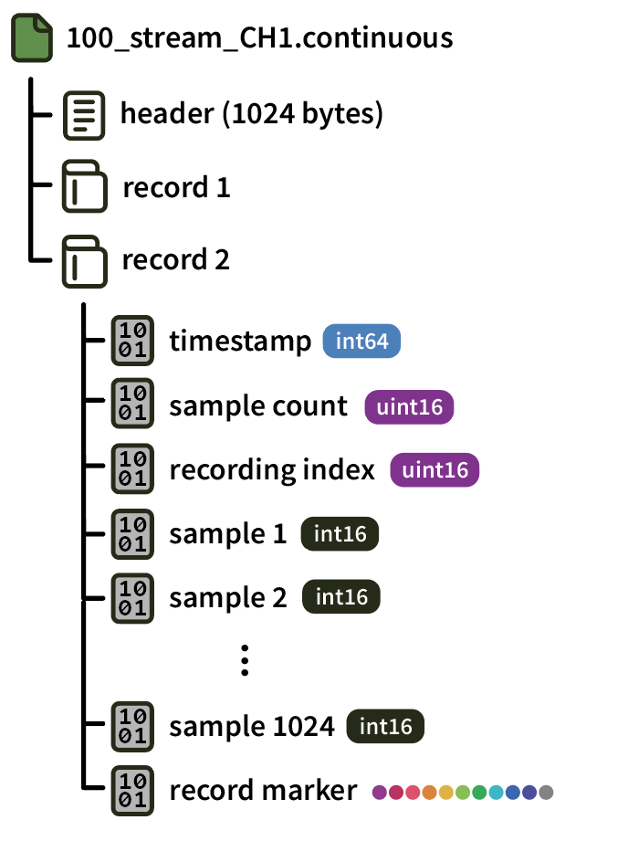
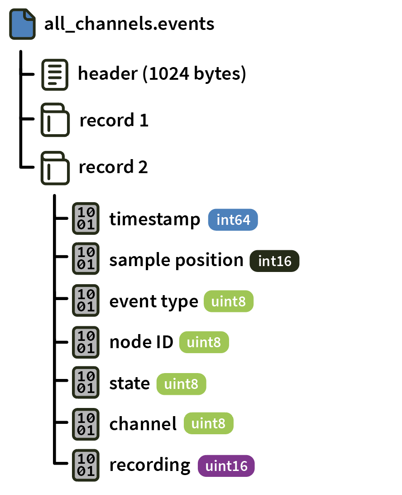
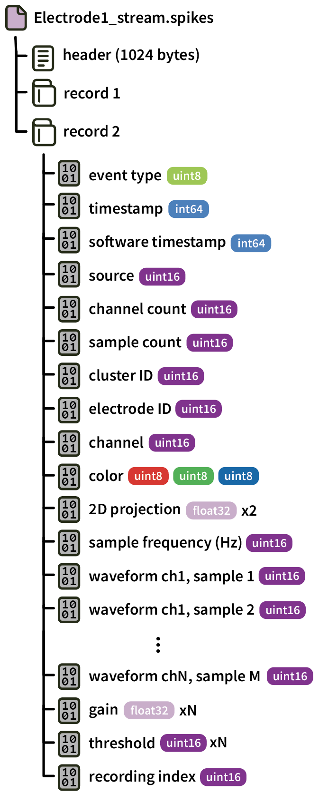

.. _openephysformat:
.. role:: raw-html-m2r(raw)
   :format: html

Open Ephys format
========================

.. csv-table:: This is the original format used by the Open Ephys GUI. It is designed with redundancy in mind, so that data can be readily recovered even if the GUI crashes during acquisition. However, because data for each electrode is stored in a separate file, it doesn't scale to high channel count recordings. All files are stored in a single directory, with the file names used to identify the data source.
   :widths: 18, 80

   "*Platforms*", "Windows, Linux, macOS"
   "*Built in?*", "Yes"
   "*Key Developers*", "Josh Siegle, Aarón Cuevas López"
   "*Source Code*", "https://github.com/open-ephys/plugin-GUI/tree/master/Source/Processors/RecordNode/OpenEphysFormat"

**Advantages**

* Data is stored in blocks with well-defined record markers, meaning data recovery is possible even if files are truncated.

* The file header contains all the information required to load the file.

**Limitations**

* Operating systems impose a limit on the number files that can be written to simultaneously, meaning the Open Ephys format is not compatible with high-channel-count recordings (>256 channels).

* In order to achieve robustness, files contain redundant information, meaning they use extra space and take longer to load.

File organization
####################

All data files are stored within the same Record Node directory, with a completely flat hierarchy. Files for different **experiments** have a number appended after an underscore (starting with :code:`_2` for the second experiment in a session). Data from different **recordings** is distinguished by the :code:`recording index` values within each :code:`.spikes`, :code:`continuous`, or :code:`.events` file.

Each Record Node directory also contains :code:`Continuous_Data.openephys`, an XML file with metadata about the :code:`.continuous` files, and :code:`messages.events`, a text file containing text events saved by the GUI.

Format details
################

Headers
---------

All headers are 1024 bytes long, and are written as a MATLAB-compatible string with the following fields and values:

* format = 'Open Ephys Data Format'

* version = 0.4

* header_bytes = 1024

* description = '(String describing the header)'

* date_created = 'dd-Mmm-yyyy hhmmss'

* channel = '(String with channel name)'

* channelType = '(String describing the channel type)'

* sampleRate = (integer sampling rate)

* blockLength = 1024

* bufferSize = 1024

* bitVolts = (floating point value of microvolts/bit)

For those not using MATLAB, each header entry is on a separate line with the following format:

* field names appear after a "header." prefix

* field names and values are separated by " = "

* the value of the field is in plain text, with intended strings enclosed in single quotes (as demonstrated above)

* each line is terminated with a semicolon

Continuous
----------------

Continuous data for each channel is stored in a separate :code:`.continuous` file, identified by the processor ID (e.g. :code:`100`) and channel name (e.g. :code:`CH0`). After the 1024-byte header, continuous data is organized into "records," each containing 1024 samples.

Each record is 2070 bytes long, and is terminated by a 10-byte record marker (0 1 2 3 4 5 6 7 8 255).

Events
-------

Event from all processors is stored in :code:`all_channels.events`. Each "record" contains the data for an individual event stored according to the following scheme:

Spikes
--------

Data from each electrode is saved in a separate file. The filename is derived from the electrode type (:code:`SE` = single electrode, :code:`ST` = stereotrode, :code:`TT` = tetrode), the source processor (e.g., :code:`p104.0`), and the electrode index (e.g., :code:`n0`, :code:`n1`, etc.).

Each record contains an individual spike event (saved for one or more channels), and is written in the following format:

Since the samples are saved as 16-bit unsigned integers, converting them to microvolts involves subtracting 32768, dividing by the gain, and multiplying by 1000.

Reading data in Python
#######################

* **(recommended)** Create a :code:`Session` object using the `open-ephys-python-tools <https://github.com/open-ephys/open-ephys-python-tools>`__ package. The data format will be automatically detected.

* Create a :code:`File` object using the `pyopenephys <https://github.com/CINPLA/pyopenephys>`__ package.

* Use the :code:`loadContinuous`, :code:`loadEvents`, or :code:`loadSpikes` methods from :code:`OpenEphys.py` in the `open-ephys/analysis-tools <https://github.com/open-ephys/analysis-tools/blob/master/Python3/OpenEphys.py>`__ repository.

Reading data in Matlab
#######################

* Use :code:`load_open_ephys_data.m` from the `open-ephys/analysis-tools <https://github.com/open-ephys/analysis-tools/blob/master/load_open_ephys_data.m>`__ repository.