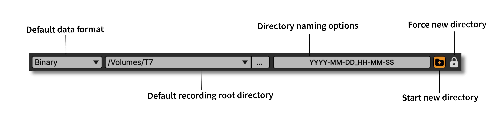
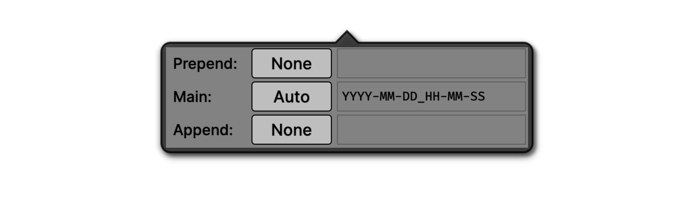
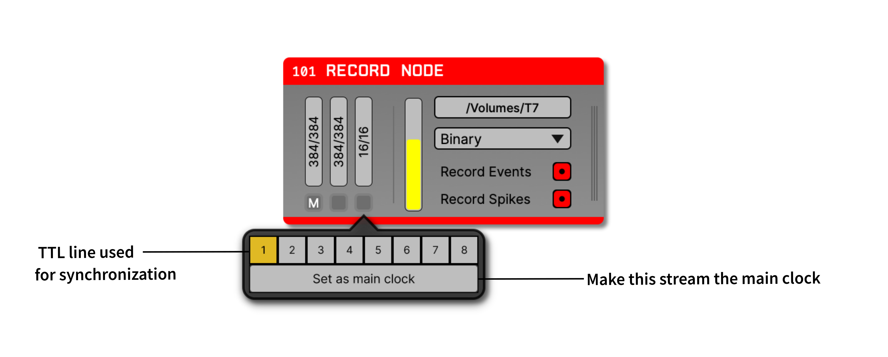

.. _recordingdata:

Recording data
===============

The GUI provides a great deal of flexibility when it comes to recording data. It's possible to write data from any point in the signal chain, using separate data directories or even different data formats. However, it's important to be sure that your recording settings are configured properly, to ensure that you don't lose valuable data.

As of version 0.5.0, the GUI won’t save data unless you have at least one Record Node in your signal chain. This is somewhat different from how things worked previously, when every plugin had its own recording selection tab, and all data was streamed to a central data writing interface. This centralization created some unwanted inefficiencies and bottlenecks, which is why the Record Node now behaves like a separate plugin.

Just like any Filter processor, the Record Node can be placed anywhere except at the very start of a signal chain. However, Record Nodes do not modify the data passing through them, but instead copy and redirect the data to memory using a background thread. Individual Record Nodes inherit settings from the global recording options in the GUI's control panel, but these settings can be overridden locally.

Global recording options
#########################

The GUI's main control panel contains a collapsible panel with the global recording options. These include:

* The default data format (see next section for more information)

* The default location for recording data (can be overridden by individual Record Nodes)

* A button for changing the data directory naming scheme:

  * **Prepend:** A string at the start of the directory name; can be "None", "Auto" (:code:`001_`, :code:`002_`, etc.), or "Custom"

  * **Main:** The main directory name; can be "Custom" or "Auto" (:code:`YYYY-MM-DD_HH-MM-SS` format)

  * **Append:** A string at the end of the directory name; can be "None", "Auto" (:code:`_001`, :code:`_002`, etc.), or "Custom"

* A button for creating a new directory for the next recording

.. note:: To prevent data from being overwritten, files are grouped by "experiments" and "recordings". Whenever acquisition is stopped, the GUI begins a new experiment; whenever recording is stopped (without stopping acquisition), the GUI begins a new recording. Pressing the **+** button will generate a new data directory the next time recording is started, and the "experiment" and "recording" counters will be reset to 1.

Available data formats
#######################

The GUI currently supports the following data formats:

* :ref:`binaryformat` (default format) stores the data as an array of samples in the following order: ch1 sample1, ch2 sample 1, ch3 sample 1, ..., chN sample 1, ch1 sample 2, ch2 sample 2, etc. It's the most compact format, and therefore can be loaded very quickly. Extra data, like timestamps or events are stored in `NumPy`_ format, which can be easily read using standard libraries. Metadata about the recording, such as sample rates or channel counts are stored in an easy-to-parse JSON file.

* :ref:`openephysformat` (available via the Plugin Installer) stores data in files that contains both the data samples and markers that allow data to be recovered if any part of the file becomes corrupted. Each channel is stored in a separate file, which can be convenient or inconvenient for analysis, depending on what you need to do. It's the first format that was used by the GUI, so it's been around for the longest amount of time. However, it's specific to Open Ephys, and will likely need to be converted to be compatible with most analysis tools.

* :ref:`nwbdataformat` (available via the Plugin Installer) stores data inside an HDF5 file, according to the specification defined by the `Neurodata Without Borders`_ project. It's based on a one-file-per-experiment philosophy, and aims to ensure that the data is self-documenting and easy to share. It comes with all the baggage of HDF5, including the need for a large library to access the data, and the inability to read any of the data if the file becomes corrupted. NWB files written by the GUI are compatible with the NWB 2.0 standard and can be read by the `pynwb`_ library.

Using the Record Node
#####################

The Record Node, found in the "Recording" section of the Processor List, controls how data is written to disk. Every signal chain requires at least one Record Node in order to save data.

Adding a Record Node into a signal chain brings up the following interface:

.. image:: ../../_static/images/recordingdata/recordnode-01.png
  :alt: The Record Node interface

General Configuration
---------------------

On the top-right of the Record Node editor is the **write path selector** which opens up an explorer window to navigate to the desired write directory. Use this to set the root path of where the data files generated from this Record Node will be stored. By default, each Record Node will inherit its data directory from the one indicated in the global recording options interface.

Directly below, the **engine selector** pull-down lists the available recording formats. By default, only the Binary format is available. The Open Ephys Format and NWB Format are available via the Plugin Installer.

.. note:: All Record Nodes must be removed from the signal chain before installing a new data format plugin.

To the left of the engine selector is the **disk space monitor**, which indicates the amount of free space available at the path shown by the write path selector.

Recording Continuous Channels
-----------------------------

The continuous channel configuration interfaces accessed by clicking on the "continuous channel buffer monitors" on the left of the Record Node interface. Hovering over each monitor will display the name of its corresponding data stream (a block of channels that are sampled synchronously).

The continuous channel buffer monitors track the state of the recording buffer for each subprocessor. If these start to fill up, it indicates that your computer can't keep up with disk writing. When they become 90% full, recording will automatically stop to prevent data corruption. If this occurs, you can try reducing the number of channels being recorded, or split the disk writing duties across multiple record nodes (see below).

Clicking on one of the continuous channel buffer monitors opens up a **channel selector interface** as shown below. By default, the interface has every channel set to record. Through the interface, you can toggle individual channels on/off, select ALL or NONE, or indicate a custom range of channels using Matlab-style slicing, as shown in these exaxmples:

.. image:: ../../_static/images/recordingdata/recordnode-04.png
  :alt: Channel selection options

Click anywhere outside the channel selector or use the ESC key to exit.

Recording Events
-----------------

Below the engine selector is the **toggle event recording** button, which determines whether this Record Node will save incoming events. This will be turned on by default, and should only be turned off if you're sure events are being saved by another Record Node. Regardless of the toggle state, underlying events will not be modified by the Record Node.

Recording Spikes
------------------

The **toggle spikes recording** button will enable/disable recording of any spike data coming into this Record Node. In order for spikes to be detected by the Record Node, you must have a spike-generating processor somewhere upstream of the Record Node in your signal chain.

Multiple Record Nodes
----------------------

There are several cases in which it's useful to have multiple Record Nodes in the same signal chain:

* **Recording raw data and spikes**: It's strongly recommended to record the data exactly as it comes out of each source node, which means placing a Record Node directly to the right of each source in the signal chain. After that, the data can be bandpass filtered to extract spikes without affecting the original signals. If a :ref:`spikedetector` is used, then a separate Record Node will be needed to record the spike waveforms. This Record Node can optionally have all of the continuous channels disabled, as these have already been written to disk by the upstream Record Node.

* **Recording in multiple data formats**: It may be useful to store the continuous data in Binary format to maximize compatibility, but spikes and events in NWB format to facilitate interactions with particular offline analysis tools. This can easily be accomplished by choosing a different data format for different Record Nodes. **NOTE:** Since the HDF5 library is not thread safe, there can only be one Record Node using NWB format at a time.

* **Distributing data across multiple drives:** If your computer is having trouble saving all incoming channels, or you can't fit all the data for a single session on a single drive, you can use multiple Record Nodes, each with a base directory located on a different drive. You can then disable non-overlapping subsets of channels within each Record Node.

Synchronizer
-------------

The Record Node has a built-in synchronizer module which can perform real-time alignment of samples from asynchronous data sources. If the Record Node is only processing one data stream (e.g., from the Open Ephys Acquisition Board), then you don't need to worry about synchronization. However, if there are multiple streams (e.g. from Neuropixels probes), then proper synchronization requires that each data stream has a TTL channel connected to the same physical digital input line. These shared events can be used to align the samples of each data stream to another stream that has been selected as the "main" clock.

.. note:: What is the best type of digital signal to use for online synchronization? The only restriction is that it should not have any pulses less than 100 ms in duration. Otherwise, a regular signal (such as the 1 Hz pulse generated by the Neuropixels PXI basestation) will work fine, although this can create issues when it's recorded by other software running in parallel, as the start/stop times are ambiguous. For that reason, the ideal signal is one that has an average frequency of around 1 Hz, but randomized intervals between the pulses. Such a signal can be generated by an Arduino or other programmable hardware device capable of emitting 5V digital signals.

Synchronization can be performed offline if desired, but it's also straightforward to do online using the Record Node. Each time a new event comes in to the Record Node (either a rising or falling edge), the synchronizer will update its estimate of the true sample rate of each subprocessor, based on the total number of samples that have been received since the first event. When using the Binary format, the Record Node will generate a :code:`timestamps.npy` file for each data stream containing the timestamps (in seconds) relative to the time of the first event. As long as all incoming streams are synchronized, these timestamps will be globally consistent.

Below each continuous channel buffer monitor is a **sync channel monitor** which provides an interface for designating an input stream as the main clock, as well as selecting a sync TTL line for each stream. All of the TTL lines used for synchronization must be connected to the same physical digital input line in order for the synchronizer to work properly. There can only be one sync channel per data source and the active sync channel is always indicated with an orange background.

The main stream will be indicated by a letter ‘M' on its sync channel monitor. This stream will be used as the reference clock, to which all other streams will be synchronized.

Once the synchronizer has been configured, starting data acquisition will automatically start the synchronizer. Each sync channel monitor will change from gray to orange to indicate the synchronizer is running. Once a stream has been synchronized to the main clock, the corresponding sync channel monitor will turn green.

.. image:: ../../_static/images/recordingdata/recordnode-06.png
  :alt: View of the record node when synchronized

Aligning continuous and event data
####################################

Within a given data stream, events and/or spikes can be aligned to samples in the continuous data by finding the index at which the sample numbers match. For example, if the continuous data sample numbers range from 100 to 1000, a TTL event that occurred at sample number 500, would be aligned with the 400th sample in the continuous data. The same principle applies to spikes. The matching index can also be found by subtracting the first continuous data sample number from the event's sample number. Using the stream start sample numbers found in :code:`sync_messages.txt` is no longer recommended for this, as it is less accurate.

In order to align events and continuous data from different streams, these streams must be synchronized first. If data streams have been synchronized online, the timestamps can be used without modification, as these represent global times in seconds. Since different streams are likely sampled at slightly different times, a method such as :code:`numpy.searchsorted` should be used to find the continuous data timestamp that most closely matches that of the event. 

If the streams were not synchronized online, they can be synchronized offline assuming all streams share at least one event line in common. See the :ref:`datasynchronization` tutorial for more information about synchronizing data streams.

.. _NumPy: https://numpy.org/
.. _Neurodata Without Borders: https://www.nwb.org/
.. _pynwb: https://pynwb.readthedocs.io/en/stable/

.. toctree::
    :hidden:
    :maxdepth: 5

    Binary-format
    Open-Ephys-format
    NWB-format

.. role:: raw-html-m2r(raw)
   :format: html
