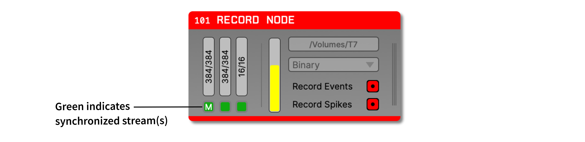

.. _synchronization:
.. role:: raw-html-m2r(raw)
   :format: html

.. role:: red

.. role:: green

Synchronization
=====================

An important facet of any electrophysiology experiment is synchronization. Before performing any offline analysis, it's critical to ensure that every event can be aligned at very high precision (ideally within one sample). 

A unique feature of the Open Ephys GUI its ability to synchronize data streams in real time, such that the timestamps written to disk don't have to be re-aligned prior to downstream analysis. This is done using the  :ref:`recordnode`'s built-in synchronizer

If the Record Node is only processing one data stream (e.g., from the Open Ephys :ref:`acquisitionboard`), then you don't need to worry about synchronization. For asynchronous data sources (e.g. multiple Neuropixels probes from IMEC's :ref:`neuropixelspxi` system or :ref:`onebox`), proper synchronization requires that each data stream has a TTL line receiving the same digital signal. The shared events across these lines can be used to automatically align the samples of each data stream to another stream that has been designated as the "main" clock.

.. tip:: As of GUI v1.0, almost any type of digital signal can be used for synchronization. The only restriction is that it cannot be include a train of uniform pulses higher than about 20 Hz, and there should be one pulse at least every 60 seconds. Pulses of as low as 1 ms are fine, as long as there is some variation in the pulse interval or width.

Configuration
###############

Below each continuous channel buffer monitor is a **sync channel monitor** which provides an interface for designating an input stream as the main clock, as well as selecting a sync TTL line for each stream. All of the TTL lines used for synchronization must be connected to the same physical digital input line in order for the synchronizer to work properly. There can only be one sync channel per data source.

The main stream will be indicated by a letter :code:`M` on its sync channel monitor. This stream will be used as the reference or "main" clock, to which all other streams will be synchronized.

.. image:: ../_static/images/recordingdata/recordnode-05.png
  :alt: View of the synchronizer interface

Once the synchronizer has been configured, starting data acquisition will automatically start the synchronizer. Each sync channel monitor will change from gray to orange to indicate the synchronizer is running. Once a stream has been synchronized to the main clock, the corresponding sync channel monitor will turn green.

Synchronization algorithm
##############################

The :ref:`recordnode` and :ref:`eventtranslator` plugins use the same synchronization algorithm, which works as follows:

* All TTL events on the designated sync line (default = line 1) are sent to the synchronizer
* Pairs of on/off events are grouped into pulses; each pulse has a start time, a duration, and an interval from the previous pulse
* If the synchronizer finds three pulses in a row with the same software start time (within 85 ms), duration (within 2 ms), and interval (within 2 ms), they are considered matching. The reason there is a larger window for the software start times is that sometimes events that are synchronous in hardware can arrive in different software buffers.
* The sample numbers of matching pulses are used to compute the start time and sample rate scaling of each stream relative to the main clock. The start time is fixed as long as data is being acquired. The sample rate scaling is recalculated every 10 seconds based on the latest incoming events, and will become more accurate over time.
* Once the start time and sample rate scaling have been computed, any future sample numbers can be aligned to the main clock. In the Binary format, :code:`timestamps.npy` file will contain these synchronized timestamps. If synchronization is not possible (as a result of no shared hardware events), all timestamp values will be -1.

Streams with hardware timestamps
####################################

Some data sources (such as the :ref:`acquisitionboard` with Open Ephys FPGA) generate data with precisely aligned hardware timestamps across all data streams. In most cases, you'll want to record these timestamps without modifications. However, if you want to synchronize these streams to other asynchronous sources (e.g. Neuropixels), you'll need to override the harware timestamps with timestamps generated by the Record Node's synchronizer.

By default, streams with hardware timestamps appear dark blue in the Record Node's sync monitors:

Once acquisition begins, these sync monitors will turn bright blue, and the Record Node won't try to synchronize them with other incoming streams:

.. image:: ../_static/images/recordingdata/synchronization-02.png
  :alt: Hardware sync'd streams v2

To override these hardware timestamps, simply select a sync line in a stream's sync monitor. This will disable the writing of hardware timestamps and signal to the synchronizer that it should attempt to find matching sync pulses between this stream and the main stream.

To revert to using hardware timestamps, when they are available, deselect the sync line in the sync monitor. It is not possible to deselect a sync line for streams that don't have hardware timestamps.

Confirming synchronization status
####################################

Simplest way is to check the sync monitors:
- :red:`**Gray**` = no data acquired
- Blue = hardware timestamps are available
- Orange = not synchronized
- Green = synchronized

More details about the synchronization status be observed by clicking the double arrow button to expand the stream selector:

This displays the following information about each stream:

* **Start** - when did this stream start relative to the main clock? Sometimes these can differ by a few hundred ms, based on how quickly the hardware starts sending data after the start of acquisition
* **Tolerance** - for each new matching pulse, the difference between the time of that pulse on the main clock and the estimated time on each stream based on the start time and scaling. Indicates how well timestamps on the non-main stream can be understood to align with the main stream. Ideally around 0.1 ms or less (for 30 kHz streams). If this is higher than 1 ms, it means that the synchonization is off.
* **Last Sync** - time since the last matching sync pulse was received. Turns orange if more than 1 minute has passed, and red if more than 5 minutes have passed. Less frequent sync intervals are not necessarily a problem, but it prevents the sample rate estimate from being updated.

Benchmarking
###############

The left plot show the offset between event times on the main stream (a Neuropixels probe acquired by a :ref:`OneBox`) and the synchronized stream (OneBox ADCs), over the course of a 68-hour continuous recording. The offset remains stable within 0.1 ms, demonstrating the effectiveness of the synchronization algorithm over long durations. This level of precision ensures that events and data acquired from different streams can be accurately aligned for downstream analysis, without the need for additional offline corrections.

The right plot show the offset between events that have been translated from the OneBox ADCs to the Neuropixels data stream using the :ref:`eventtranslator` plugin, over the same 68-hour continuous recording. Again, the offset stays within 0.1 ms over the entire duration. The Event Translator uses the same synchronization algorithm as the Record Node, but operates independently, so you can select a different "main" stream for this plugin.

.. image:: ../_static/images/recordingdata/synchronization-04.png
  :alt: Expanded stream selector

Considerations for offline analysis
##################################################

If data streams have been synchronized online, the timestamps saved by the GUI can be used without modification, as these represent global times in seconds. Since different streams are likely sampled at slightly different times, a method such as :code:`numpy.searchsorted` should be used to find the continuous data timestamp that most closely matches that of the event.

If data has not been synchronized, events and/or spikes can be aligned to samples in the continuous data by finding the index at which the sample numbers match. For example, if the continuous data sample numbers range from 100 to 1000, a TTL event that occurred at sample number 500, would be aligned with the 400th sample in the continuous data. The same principle applies to spikes. The matching index can also be found by subtracting the first continuous data sample number from the event's sample number. Using the stream start sample numbers found in :code:`sync_messages.txt` is no longer recommended for this, as it is less accurate.

|