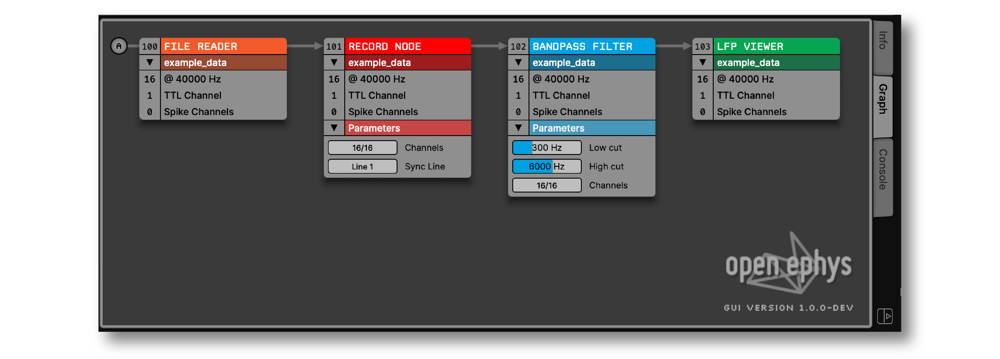
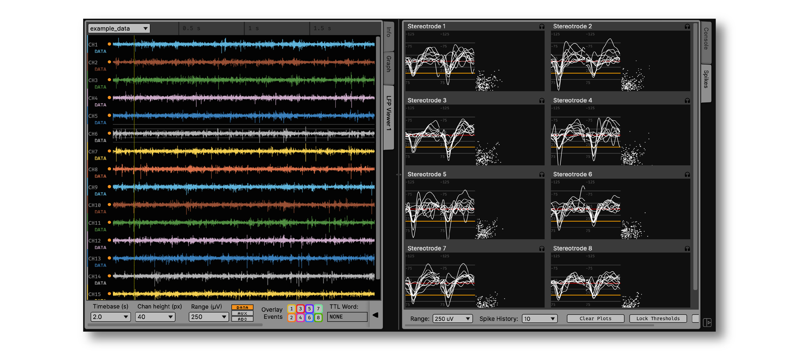
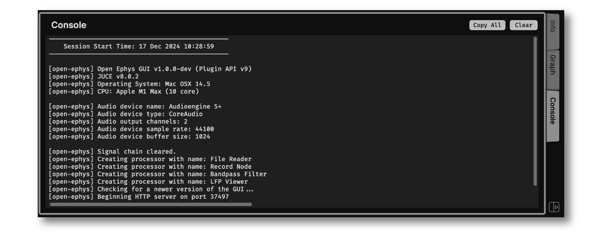
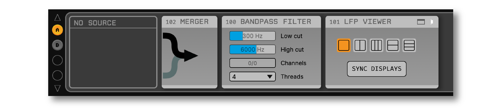
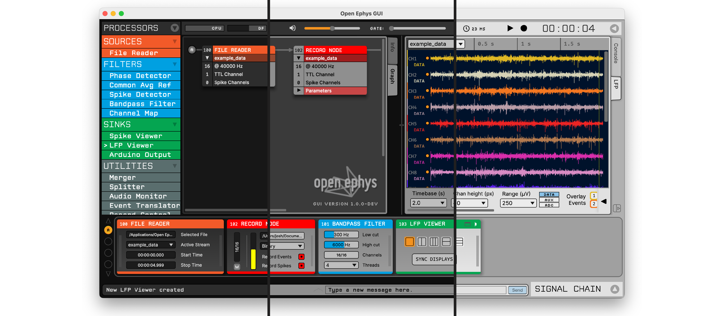

.. _whatsnewinv100:
.. role:: raw-html-m2r(raw)
   :format: html

############################
What's new in version 1.0
############################

The Open Ephys GUI has been under continuous development for more than a decade, and it has been used to collect high-quality electrophysiology data for hundreds of publications (see `open-ephys.org/publications <https://open-ephys.org/publications>`_ for some examples). Nevertheless, the developers did not feel ready to call a release "version 1.0" until now. This release is the result of many years of polishing, streamlining, and testing. It should feel familiar to any long-time users of the software, while also being more approachable for anyone trying it out for the first time.

This page documents the major changes that will be available in this release. Importantly, there are many things that we did not change, such as the data format, HTTP server commands, and :code:`settings.xml` files. So configurations from v0.6.x can be loaded in version 1.0, and any code written to interface with the GUI or its output files will continue to work as expected, with a few minor exceptions. 

User interface enhancements
============================

While the overall layout of the GUI has not changed in version 1.0, many graphical elements have been updated to improve clarity and consistency of the user interface. New fonts, icons, and labels should make it easier to navigate the software. For example, the 3-digit processor ID is now shown in every plugin editor, and all buttons for opening and closing panels have the same look and feel.

In addition, key UI elements have been added or significantly transformed:

Graph Viewer 
-------------

The Graph Viewer provides an overview of the connections between all of the plugins that are currently processing data, making it easier to navigate signal chains with multiple source nodes or branch points. In version 1.0, the Graph Viewer connections flow from left to right (rather than top to bottom), mirroring the layout of plugins in the editor viewport at the bottom of the window. In addition, plugin parameters are now accessible via the Graph Viewer, and all parameters are linked to the widgets in the plugin editor. For example, the low and high cutoffs of the Bandpass Filter can be changed *either* via the Graph Viewer or the plugin editor. This makes it easier to check the state of parameters across multiple data streams, and even makes it possible to conduct all interactions with the signal chain via the Graph Viewer alone.

Data Viewport
--------------

The Data Viewport, which holds the Graph Viewer as well as plugin visualizers, can now be split vertically, allowing multiple visualizers to appear side by side. To add a second column of tabs, simply click the "new tab" button in the lower right of the viewport. Any new tabs that are created will appear in the right column, and tabs can be dragged and dropped between columns. Tabs can also be reordered and renamed. If the "Info" or "Graph" tabs are closed, they can be reopened via the "View" menu or by pressing shift-I or shift-G.

Built-in console
----------------

The Open Ephys console is now embedded in the main GUI window. Previously, the console would automatically launch in a separate window on Windows, but would not appear on Mac or Linux unless the GUI was run via a terminal. The new embedded console can be activated via the "View" menu, or by pressing shift-C. The console output is automatically written to a log file wherever the GUI's configuration files are stored. Console messages can be copied by pressing the "Copy All" button or selected a subset of text in the console window.

Message Window
----------------

Custom text annotations can now be saved via a pop-up window. Assuming recording is active, these annotations will be timestamped and written automatically by all Record Nodes. One advantage of using the message window (as opposed to the message bar at the bottom of the GUI's main window) is that the message will be tagged with the time the window was opened, rather than the time the "send" button is pressed. Thus, the window can be launched when an interesting event occurs, and the user can take as much time as needed to enter custom text describing the event.

More extensive undo/redo support
----------------------------------

The GUI's undo manager now keeps track of parameter changes as well as modifications to the signal chain. This includes changing input files, selecting channels, and adding/removing electrodes from the Spike Detector. Whenever an undoable action is executed, a message will appear in the bottom left of the main window, so it's obvious that something has changed. When acquisition is active, select parameter changes can be undone, but most undoable actions will be blocked until acquisition is paused.

Empty processors
----------------------------------

When a signal chain is missing a source node, an empty processor labeled "No source" will appear. This should make it more obvious how to fix a signal chain when acquisition is blocked due to a missing source. 

Color themes
-------------

The GUI now includes dark, medium, and light color themes. These can be changed via the "View > Theme" menu.

Performance improvements
=========================

There are at least three areas where performance has improved in version 1.0:

- **Faster rendering, especially on Windows.** Thanks to upgrades to the JUCE library that the GUI is built upon, all visualizers now update more smoothly. This is especially noticeable when scrolling through hundreds of channels in the :ref:`lfpviewer`.

- **More efficient data transfer from source plugins.** The time spent copying data into the overall signal chain has been reduced, allowing source plugins such as :ref:`neuropixelspxi` and :ref:`acquisitionboard` to use less CPU cycles during acquisition.

- **Multithreaded filtering.** The :ref:`bandpassfilter` now uses 4 threads by default, and this number can be increased to 64. Filtering is typically the biggest contributor to processing latency. In version 1.0, the impact of filter nodes on the CPU meter will be greatly reduced.

Online synchronization
=======================

The GUI's :ref:`recordnode` in version 1.0 uses a new real-time synchronization algorithm that is more accurate and robust. Previously, synchronization pulses less than 50 ms in duration could confuse the algorithm, making it necessary to revert to offline synchronization to align multiple data streams. Now, pulses as short as 1 ms can be detected, meaning "barcode"-like signals can now be reliably used for online synchronization. The new algorithm may take a bit longer to synchronize, but it will be far less likely to become desychronized over time.

In addition, the following synchronization statistics for each stream can now be viewed in the Record Node's stream selector: relative start time, elapsed time since latest sync pulse was received, and the overall "sync tolerance" (maximum difference between the estimated and measured time of each sync pulse).

macOS application signing
==========================

The Open Ephys GUI application on macOS is now signed with an Apple Developer ID, so it will no longer need to be explicitly enabled via your system's Privacy and Security settings. As a consequence of this change, any plugins used on macOS must be added via the GUI's built-in plugin installer. To use custom plugins on this platform, you'll need to compile the GUI from scratch using Xcode.

New testing infrastructure
============================

To facilitate automated testing on cloud servers, the GUI now can run in "headless mode." This also works on your local machine by launching the GUI from the command line with the :code:`--headless` option. Interacting with the GUI in headless mode requires use of the built-in HTTP server.

The GUI now includes unit tests for key classes via the Google Test package, which are run before each new release. This will ensure critical functionality remains intact as new contributors are onboarded.

The `open-ephys-test-suite <https://github.com/open-ephys/open-ephys-test-suite>`_ package makes it easy to configure and run integration tests via Python. This package is used to confirm that different combinations of plugins work together reliably.

Plugins 
=========

All officially supported :ref:`plugins` have been updated to work with version 1.0 of the GUI. Plugins included in any loaded signal chains will be automatically installed; additional plugins can be added via the Plugin Installer.

.. note:: The Open Ephys plugin API has been updated for version 1.0, which means that plugins compiled for version 0.6.x won't work out of the box. Feel free to reach out to gui@open-ephys.org for help migrating any custom plugins to the latest API.

Renamed plugins
----------------

All versions of the Open Ephys acquisition board are now supported by one plugin, called "Acquisition Board." The "OE FPGA Acquisition Board" plugin is no longer needed. The "Intan RHD USB" plugin, which was previously included as one of the "Rhythm Plugins," due to its use of Intan's Rhythm API, must now be installed separately.

Deprecated plugins
--------------------

The River Output plugin has been removed from the plugin installer, as this was rarely used.

|