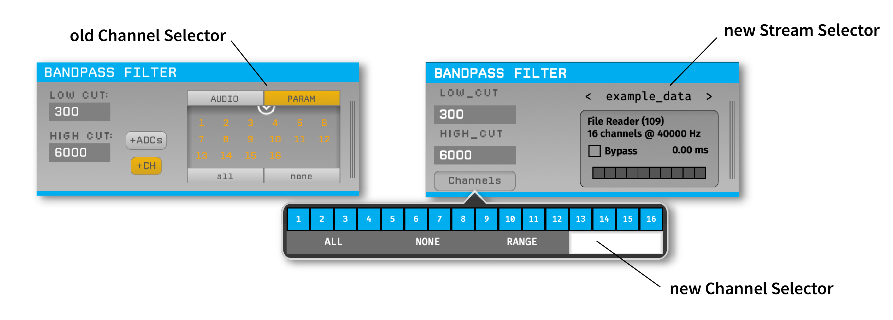
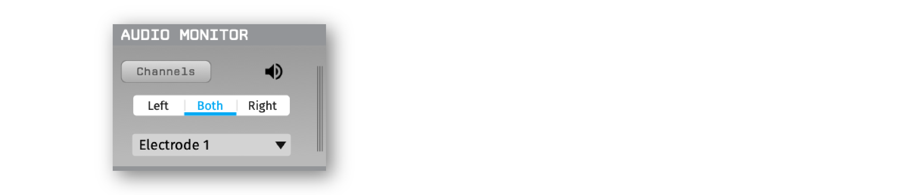

.. _whatsnew:
.. role:: raw-html-m2r(raw)
   :format: html

############################
What's new in version 0.6.X
############################

Version 0.6.0 (released in July 2022) is the biggest update in the GUI's history, with a number of changes designed to make the GUI more efficient and easier to use. This page explains some of the major updates in this release, to help you get up and running faster.

Stream-based processing
========================

The most important change in version 0.6.0 is that channels are now organized by "streams," which represent a group of continuous channels that are sampled synchronously. Previously, synchronously sampled channels were grouped together into "subprocessors," but there was minimal information available about subprocessors, and settings were still applied on a channel-by-channel basis. Now, each plugin includes a "stream selector" interface that replaces the old "channel selector" interface:

When a signal chain includes multiple streams (e.g., when using multiple Neuropixels probes, or multiple sources merged together), the user can browse through the streams that pass through downstream plugins and apply settings on a per-stream basis. For example, this makes it possible to have a separate :ref:`commonaveragereference` for each stream. The stream selector interface also includes a visualization of the state of all TTL lines for a given stream, as well as the overall processing delay introduced by the signal chain.

Default configurations
========================

The first time the GUI is launched (or after selecting "Load a default config" from the **File** menu), the user has the option to choose from up to three different default configurations:

#. **Acq. Board** - Streams data from the Open Ephys acquisition board (if available).

#. **File Reader** - Streams data from a file (useful if no acquisition hardware is available).

#. **Neuropixels** (Windows only) - Streams data from one or more Neuropixels PXI basestations.

Fewer built-in plugins
========================

In version 0.6.0, a number of plugins that were previously included by default have been moved to separate repositories. This includes the "Rhythm FPGA" plugin (now split in two and renamed "Acqusition Board" and "Intan RHD USB"), the :ref:`spikesorter`, and the :ref:`pulsepal`. Moving these plugins to their own repositories makes it possible to upgrade them via the Plugin Installer, instead of having to update the entire host application.

Audio Monitor plugin
========================

Previously, each plugin's editor had an "AUDIO" tab that made it possible to select channels to monitor. Now, all audio monitoring is configured via a dedicated plugin, found under the "Utilities" section of the Processor List. The advantage of using a separate :ref:`audiomonitor` plugin is that it makes it easier to track the selected channels, and also adds a built-in bandpass filter, so the monitored signals sound good no matter where in the signal chain you're listening to them:

The only restriction is that the Audio Monitor must be placed in the middle of the signal chain, rather than at the very end. The Audio Monitor does not affect any of the data that passes through it.

Event Translator plugin
============================

Events generated by one stream can now be copied to other streams, provided that all streams share a signal on at least one hardware TTL line. The :ref:`eventtranslator` plugin will use this shared signal to automatically compute the offset and scaling factor required to translate events across streams with unique sample clocks. Then, downstream plugins can access events generated across a different stream. These events can be used by the :ref:`lfpviewer` in triggered display mode, or the :ref:`onlinepsth`.
 

Settings file format
========================

The XML files that store the state of the Open Ephys signal chain are now much more compact and easier to read. Instead of storing the state of every single channel, they only include the minimal amount of information required to reproduce the signal chain. Because the settings file format has changed substantially, settings files saved by GUI version 0.5.X and lower cannot be opened by version 0.6.0+.

Built-in HTTP server
========================

Remote control of the GUI's state was previously handled by the Network Events plugin, which had to be installed separately from the host application. Now, the GUI automatically runs an HTTP server that listens for commands on port 37497 ("EPHYS" on a phone keypad). This can be used to get information about the current signal chain, change the recording directory, and start/stop acquisition and recording, among other things. 

The API is "RESTful", such that the resource URLs are:

- :code:`GET /api/status` : returns a JSON string with the GUI's current mode (**IDLE**, **ACQUIRE**, **RECORD**)

- :code:`PUT /api/status` : sets the GUI's mode, e.g.: :code:`{"mode" : "ACQUIRE"}`
 
- :code:`PUT /api/message` : sends a broadcast message to all processors, e.g.: :code:`{"text" : "Message content"}`
 
- :code:`GET /api/recording`` : returns a JSON string with information about recording parameters, including the IDs of the available Record Nodes.

- :code:`PUT /api/recording` : used to set the default recording options.
 
- :code:`PUT /api/recording/<processor_id>`` : used to set the options for a given Record Node.

|